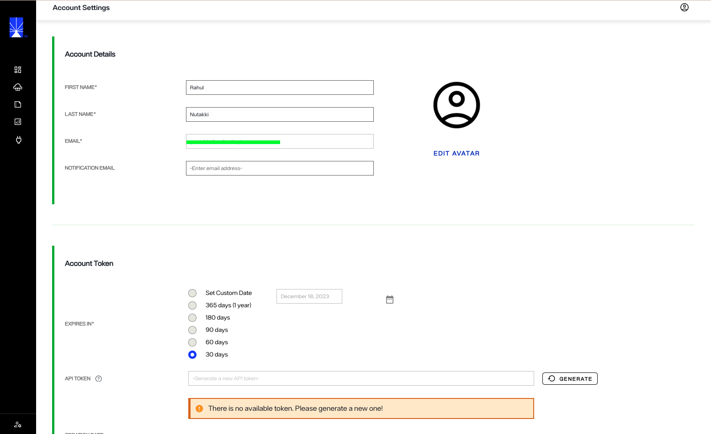
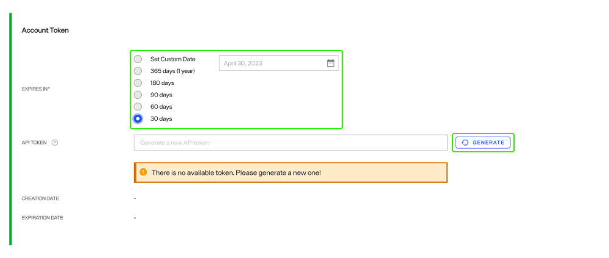

---
keywords:
title: Account Settings
description: Learn how to update your account settings and manage your API tokens. Users can generate API tokens for applications that are required to connect to Environment Operations Center without logging in.
---
# Account Settings

This guide provides an overview of how to update your account settings and manage your API tokens. Users can generate API tokens for applications that are required to connect to Environment Operations Center without logging in.

## Getting started

From any section or tab in Environment Operations Center, your account avatar will be visible in the upper right corner of the screen. To access your account settings, select the avatar icon to expand the account dropdown menu. From the dropdown menu, select **Account Settings** to open the *Account Settings* screen.

## Account settings

From the *Account Settings* screen you can update your user details including your first name, last name, email address associated with the account, and your profile image.

### Update user details

To update your first or last name, enter your information in the spaces provided and select **Save** to update.

> [!note] Only administrators can update email addresses. Please contact your administrator if you need to change the email associated with your Env Ops Center account.

### Update profile image

To update your profile image, select "Edit Avatar" and select an image from you local file system to upload.

## Manage API tokens

### Create an API token

To create a new API token, set the API expiration by selecting one of the **Expires In** radio buttons. Then select **Generate** to generate a new API token. A unique API token will populate in the *API token* input field.

A unique API token will populate in the *API token* input field and the creation and expiration dates will display below the token. Copy the token immediately and store in a safe place.

> [!warning] Once you leave the page, you can no longer view or copy the API token. Ensure you copy the token before saving.

You will receive a warning when your API token is close to expiring. A warning is displayed in your *Account Settings* next to the *Expiration Date* dropdown.
> [!warning] API token expiry cannot be extended. Once a token has expired, a new token must be generated.

### Delete an API token

Only one API token can be created at a time. If you need to create a new API token but one already exists, you must first delete the current token.

You can delete the API token by selecting the trash bin icon () located next to the *API Token* input field.

> [!warning] Deleting an API token is a permanent action and cannot be undone.

A confirmation message will appear to verify that you would like to delete the API token and reminding you that a new API token will need to be generated for future calls. Select **Confirm** to delete the token.

If the token is successfully deleted you will receive a confirmation message and the *API token* field will be empty. You can proceed to generate a new token or exit out of *Account Settings* without generating a new token by selecting **Save**.

## Next steps

After reading this guide you should have an understanding of how to update your account settings and manage your API tokens. For details on managing Environment Operations Center users, see the [create a new user](../user-management/create-user.md) or [edit an existing user](../user-management/edit-user.md) guides.
