---
keywords:
title: Admin Overview
description: Learn more about the administrative functions that can be performed in the Environment Operations Center. This includes how you can access tabs to manage your account settings, Environment Operation Center users, environment alerts and integrations, and monitor cluster health.
---
# Admin Overview

This guide provides an overview of the *Admin* home screen and its features. From the *Admin* screen, you can access tabs to manage your account settings, Environment Operation Center users, environment alerts and integrations, and monitor cluster health.

All Environment Operations Center users can access the *Admin* screen, but view and edit permissions differ depending on a user's assigned role. For details on role-based permissions, see the [role-based permissions](../role-based-permission/role-based-permissions.md) guide.

## Getting started

To navigate to the *Admin* screen, select **Admin** () located at the bottom of the left navigation.

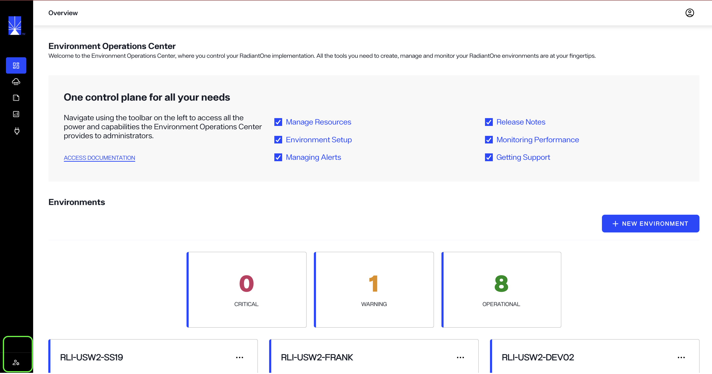

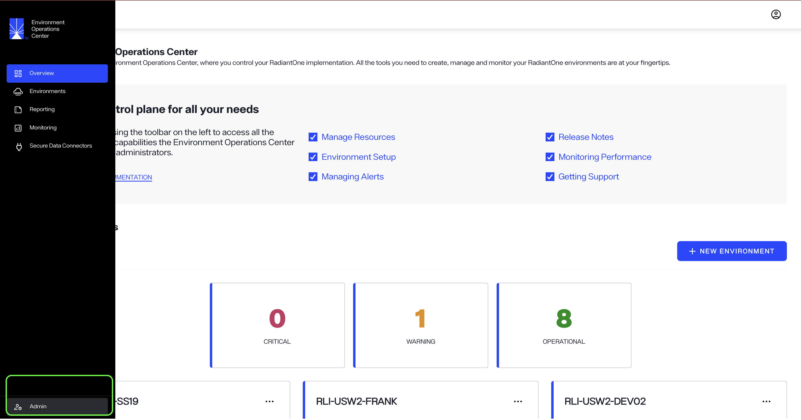

## Top navigation

A navigation bar is located at the top of the *Admin* home screen and is visible from all tabs in the *Admin* view. The top navigation allows you to access several account and user management tools through the following tabs:

- Users
- Integration
- Events
- Tasks
- Authentication
- Settings

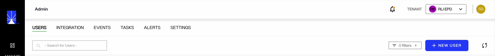

### Users

The *Users* tab allows you to manage all users within your Environment Operation Center instance. From here you can view a user's name, email address, and status.

For details on managing Environment Operation Center users, including their roles and permissions, see the [user management](user-management/create-user.md) guide.

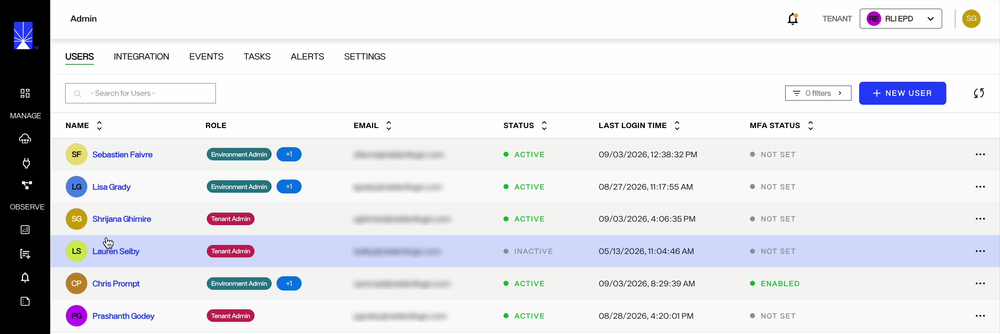

### Integration

From the *Integrations* page you can manage your connections to external applications to send alerts from Environment Operations Center. The *Integrations* tab displays the integration "Label", indicating the integrations purpose, and the "Integration", indicating the external application the integration is connected to.

For details on managing integrations, see the [managing integrations](integrations/manage-integrations.md) guide.

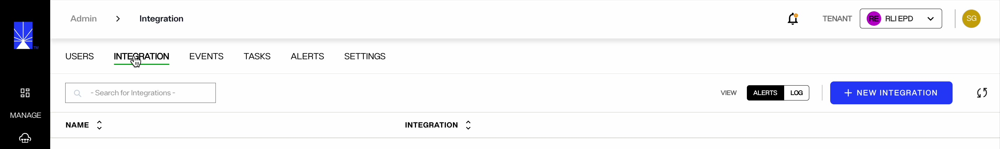

### Event

The *Event* page provides an overview of all create, update, and delete activities performed for all environments, including the action, environment, date and time stamp of the activity, and the user who performed the activity.

The Auth Method column indicates the authentication method a user used to sign in, such as GitHub, Microsoft, Google, Local (email address and password), or an external identity provider like Okta. A single user account may appear with different authentication methods across events, depending on how the user signed in for each session.

### Tasks

From the *Tasks* page, you can view information on the following EOC tasks.

- Create application
- Delete application
- Restart application
- Scale application
- Start application
- Stop application
- Update application
- Create backup
- Update backup settings
- Create environment
- Delete environment
- Enable endpoint
- Disable endpoint

Information on these tasks includes the environment and application the tasks was performed on, the task's start and end times, and the task's status. The search bar in the upper-left corner allows you to display tasks for specified environments. 

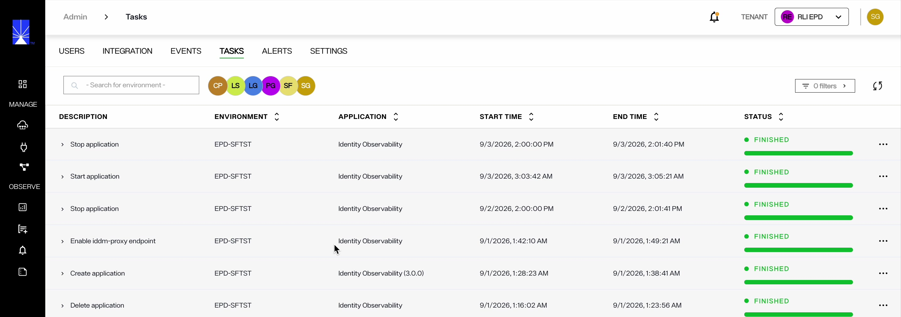

Clicking the arrow next to the task name reveals all actions related to the task and the status of each action.

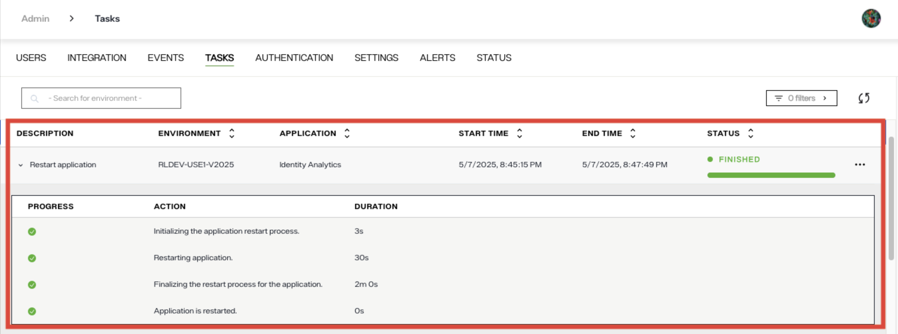

#### Filter tasks 

You can filter tasks by application type or task status. To see only the filtered tasks, click the filter icon in the top-right corner of the screen and choose your desired filters.

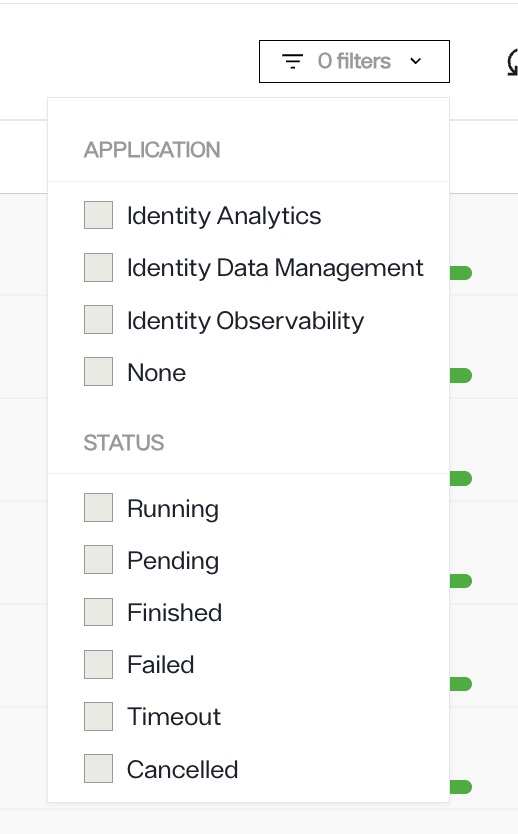

#### Actions related to a task 

Additionally, you can also perform the following actions on a task:
* **Rerun** a failed or timed-out task.
* **Cancel** a stuck task that is in a pending state. Prior to using this feature, review logs of the task. If you notice that the task has timed out or has encountered an issue, you can use this feature to cancel the task.
* **Fetch logs** of a task.

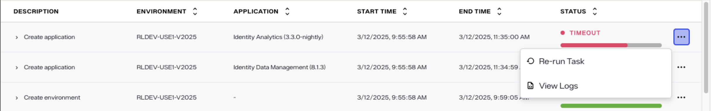

### Authentication

The *Authentication* page provies an overview of all authentication providers. To add an authentication provider, click **New Provider**. It also allows you to configure a OIDC provider and enable multi-factor authentication. 

### Settings

The **Settings** page provides options to configure release channels,  manage automatic or manual update checks for each channel, and define retention policy settings for Environment Operations Center data.

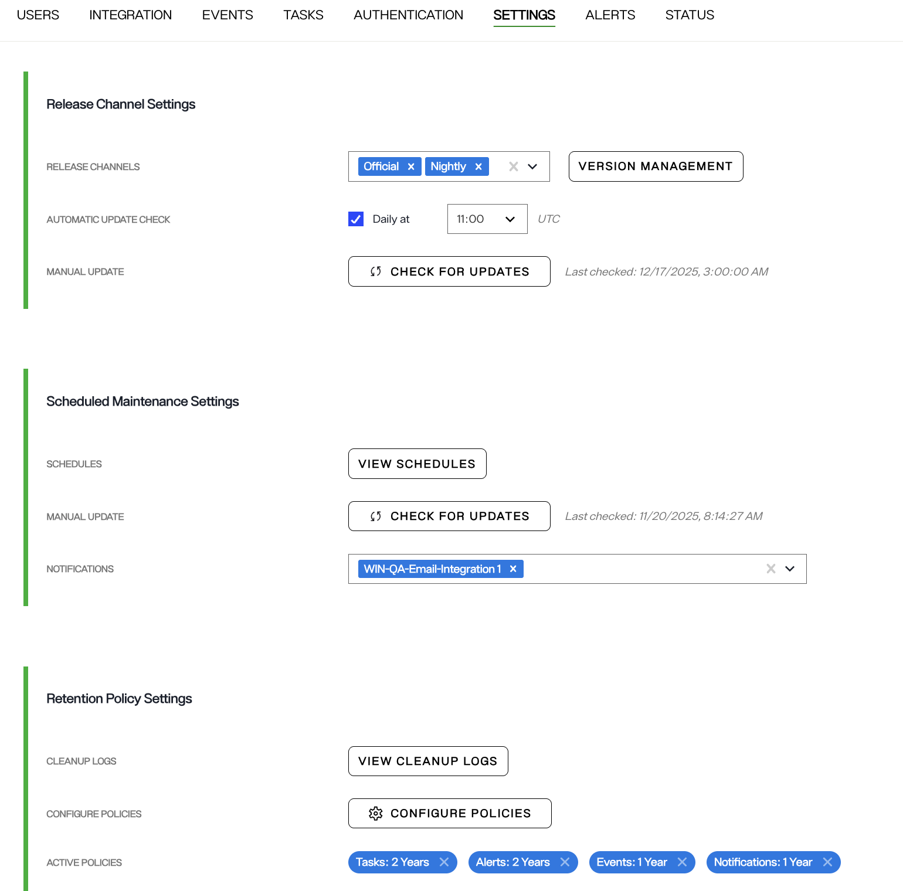

The Scheduled Maintenance Settings option lets you define the list of email recipients who will receive maintenance notifications. Refer to the steps listed [here](../getting-started/overview/#configure-email-recipients-list) to learn more. 

The Retention Policy Settings tab lets you define retention policies for logs, alerts, events, tasks, and notifications. Data associated with these object types is automatically deleted once the specified retention period expires.

### Status 

The Status page provides an overview of the operational health of all system services. It allows administrators to quickly verify whether core components are running normally.

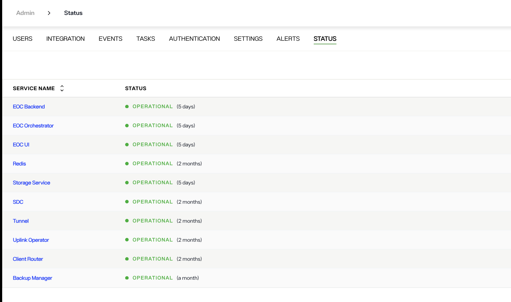

The page displays a table of services with the following columns:

* Service Name – The name of the system component.

* Status – The current health state of the service and the duration for which it has been in that state.

Each service is accompanied by a status indicator. A green indicator labeled “Operational” shows that the service is functioning normally. The duration displayed next to the status indicates how long the service has been continuously operational.

Typical services listed on this page include backend components, user interface services, storage services, networking components, and supporting infrastructure such as caching or backup services.

Admins can use this page to quickly confirm that all services are running as expected and to identify any services that may require attention if their status changes.

## Next steps

After reading this guide you should be able to navigate the *Admin* home screen and understand its main features including the top navigation. For details on updating your account settings, review the [account settings](../getting-started/account-settings/update-account.md) guide. To learn how to create a new user, review the [create a new user](user-management/create-user.md) guide.

