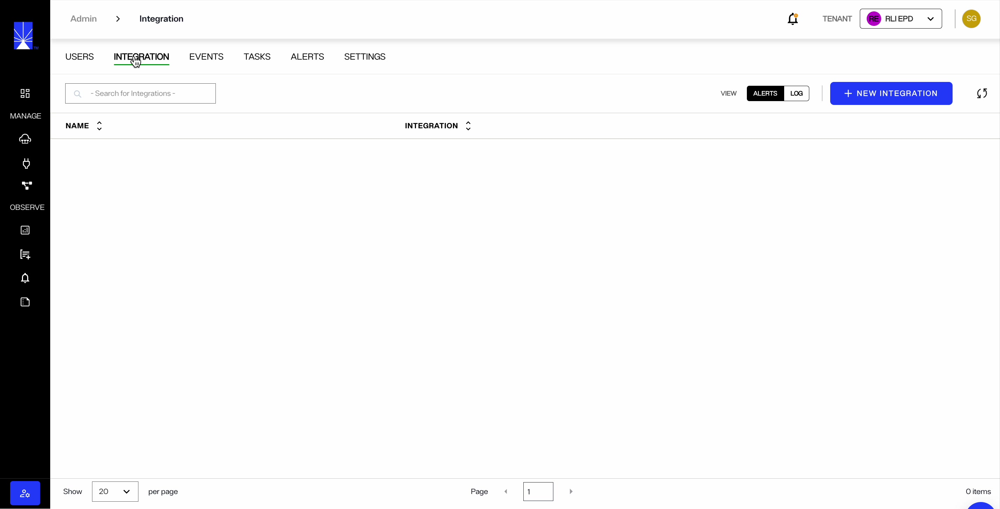
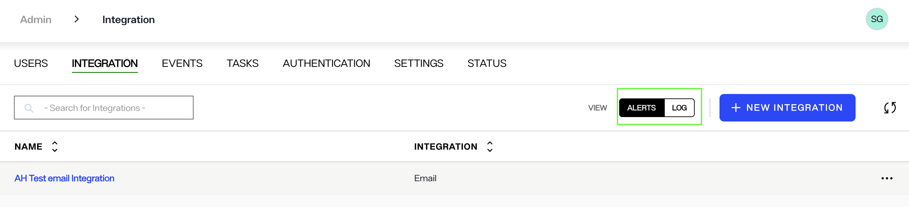
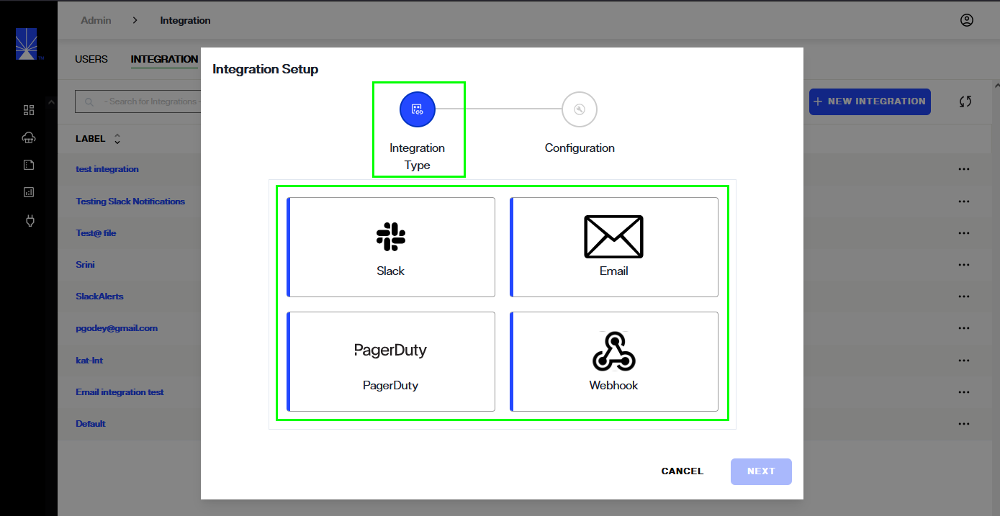
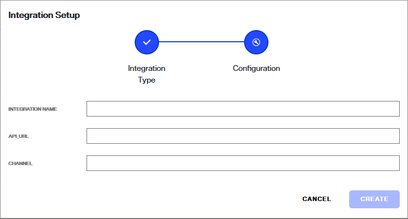
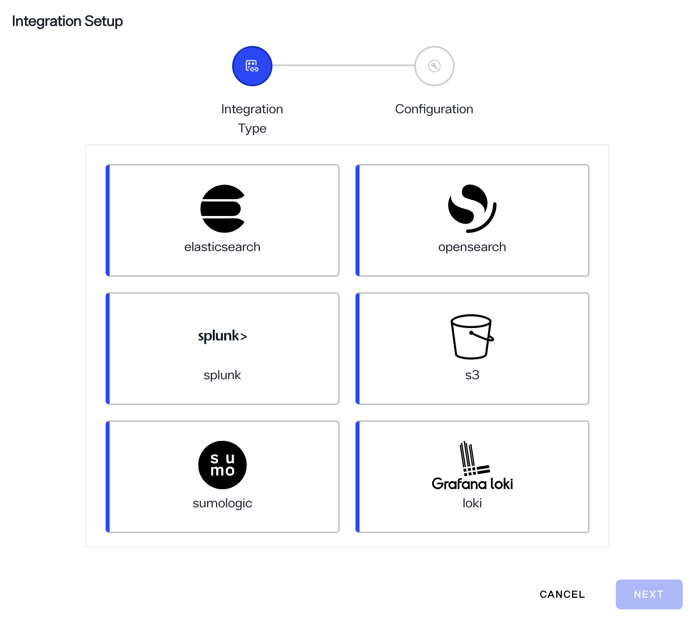
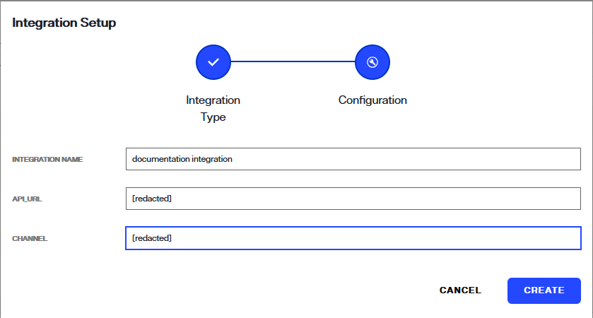
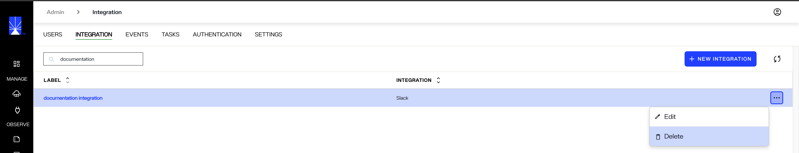
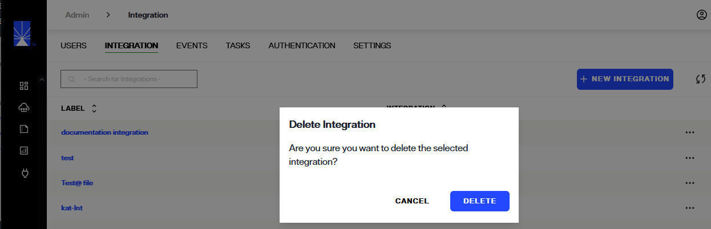

---
keywords:
title: Manage Integrations
description: Learn how to integrate with external notification services (e.g. Slack, Email, PagerDuty) to send alerts about monitored events in Environment Operations Center.
---
# Manage Integrations

External communication channels can be integrated with Environment Operations Center to receive alerts or notifications about changes of state. From the *Integrations* tab in the Admin section, administrators can add, edit, or delete integrations. This guide outlines the required steps to manage communication channel integrations.

## Getting started

Radiant Logic supports two integration types:

- **Alert Integrations**: This integration allows you to automatically send application-related alerts to services such as Slack, Email, PagerDuty, and Webhook.
  
- **Log Integrations**: This integration allows you to automatically send logs to platforms such as ElasticSearch, OpenSearch, Splunk, S3, SumoLogic, and Grafana Loki.

> [!note] For both integration types, you must have an existing account with the service where you intend to send alerts or logs. For example, to receive alerts in Slack, you'll need to have a channel already set up.

To access the Integrations tab, click the admin icon in the bottom-left corner of the page, then select **Integration**. The *Integration* tab shows a summary of your current integrations, including their names and types. To set up a new integration, choose either Alerts or Log as the integration type, and then click **+ New Integration**.

Next, follow the steps listed below to configure an integration that suits your needs. 

## Configure a new Alerts integration

To add a new alert integration, choose **ALERTS** as the integration type and click **New Integration**. This will open the *Integration Setup* dialog. From there, you'll need to specify the integration type and provide the necessary configuration details to complete the setup.

### Integration type

Select an **Integration Type** from the available channels listed and select **Next** to continue.

### Configuration Details

The required configuration details differ depending on the type of configuration selected. Complete the required configuration fields and select **Create** to finish setting up the new integration.

The example below demonstrates how to configure email integration, allowing you to specify one or more comma-separated email addresses for receiving alerts.

If the integration is successfully created, you will receive a confirmation message and the integration will be added to the list of integrations on the *Integrations* tab.

> [!note] For the integration to become active, you will need to configure the applicable alerts to send to the channel. See the [alert management](../../environments/environment-details/alert-management-overview.md) guide to learn how to set up alerts to send via the integration.

## Configure a new Log integration

To add a new log integration, choose **LOG** as the integration type and click **New Integration**. This will open the *Integration Setup* dialog. From there, you'll need to specify the integration type and provide the necessary configuration details to complete the setup.

### Integration type

Select an **Integration Type** from the available channels listed and select **Next** to continue.

### Configuration Details

The required configuration details differ depending on the type of configuration selected. The table below shows the required fields for each integration. 

| Integration Type | Required fields                         |
|------------------|-----------------------------------------|
| Elasticsearch    | Integration Name, Host, and Port        |
| OpenSearch       | Integration Name, Host, and Port        |
| Splunk           | Integration Name, Host, Port, and Token |
| S3               | Integration Name, Bucket, and Region    |
| Sumo Logic       | Integration Name and Endpoint           |
| Grafana Loki     | Integration Name and URL                |

Complete the required configuration fields and select **Test Connection** to test whether or not your integration works. If it is working as expected, select **Create** to finish setting up the new integration. To provide additional information, click the **+ Add field** button under Additional Configuration. 

The example below demonstrates how to configure an Elasticsearch integration. 

If the integration is successfully created, you will receive a confirmation message and the integration will be added to the list of integrations on the *Integrations* tab.

## Edit an integration

Each integration listed on the *Integrations* tab has an **Options** (**...**) dropdown menu. From the dropdown, select **Edit** to begin editing the integration. 

The workflow to edit an integration is the same as the *New Integration* workflow. You can select a new integration type and add the required configuration details. Alternatively, you can keep the same integration type and proceed to adjust the configuration details.

> [!note] When updating an integration, ensure any alerts that have been created for the channel are also updated with the correct channel information. See the [alert management](../../environments/environment-details/alert-management-overview.md) documentation for details on editing alerts.

If the integration successfully updates, a confirmation message displays, and the details are updated on the *Integrations* tab.

## Delete an integration

To delete an integration, select **Delete** from the the **Options** (**...**) menu.

A message displays, asking you to confirm that you would like to delete the selected integration. Select **Delete** to delete the integration.

The integration is removed from the *Integrations* tab, and alerts are no longer sent to the communication channel.

## Next steps

You should now have an understanding of the steps to add integrations to receive Environment Operations Center alerts in external channels. To learn how to create alerts to send to the configured channels, see [alert management](../../environments/applications/alerting/alert-management-overview.md).

