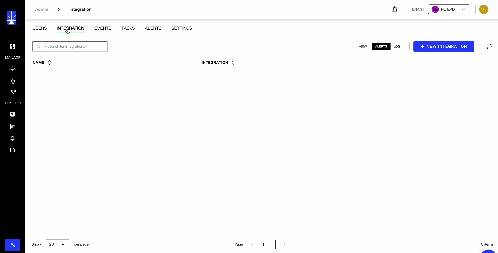
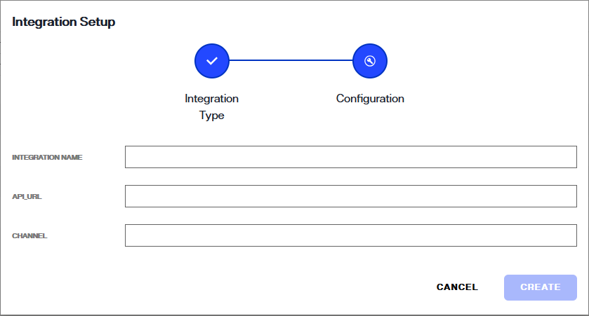
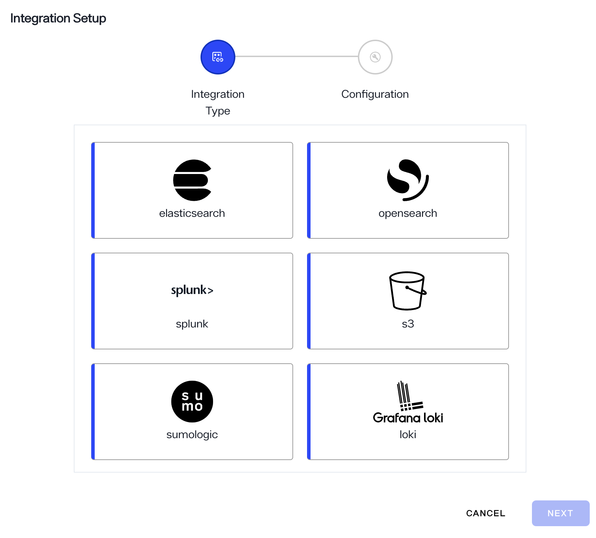
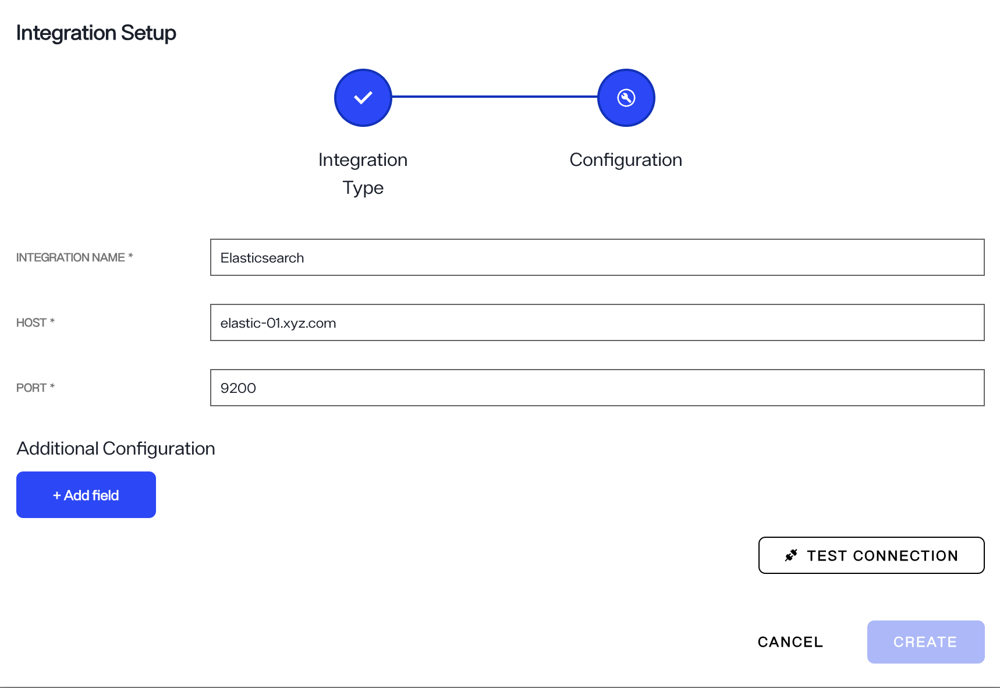
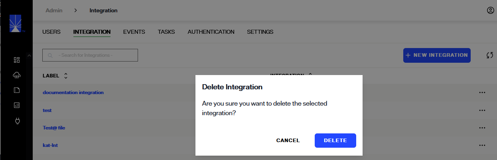

---
keywords:
title: Manage Integrations
description: Learn how to integrate with external notification services (e.g. Slack, Email, PagerDuty) to send alerts about monitored events in Environment Operations Center.
---
# Manage Integrations

Integrate external services with Environment Operations Center to send them alerts and logs. From the *Integration* tab of the *Admin* screen, administrators add, edit, and delete integrations. This guide explains how to manage integrations.

## Getting started

Radiant Logic supports two integration types:

- **Alert Integrations**: This integration allows you to automatically send application-related alerts to services such as Slack, Email, PagerDuty, and Webhook.
  
- **Log Integrations**: This integration allows you to automatically send logs to platforms such as ElasticSearch, OpenSearch, Splunk, S3, SumoLogic, and Grafana Loki.

> [!note] For both integration types, you must have an existing account with the service where you intend to send alerts or logs. For example, to receive alerts in Slack, you'll need to have a channel already set up.

To open the *Integration* tab, select **Admin** at the bottom of the left navigation, then select **Integration**. The tab lists your integrations with their names and types. Use the **View** toggle to switch between **Alerts** and **Log** integrations, then select **New Integration** to add one.

Next, follow the steps listed below to configure an integration that suits your needs. 

## Configure a new Alerts integration

To add an alert integration, set the **View** toggle to **Alerts** and select **New Integration**. The *Integration Setup* dialog opens, where you choose the integration type and then enter its configuration.

### Integration type

Select **Slack**, **Email**, **PagerDuty**, or **Webhook**, then select **Next**.

### Configuration Details

The required fields depend on the integration type. Every type requires an **Integration Name** of up to 255 characters.

| Integration type | Required fields |
| ---------------- | --------------- |
| Slack | Integration Name, API URL, and Channel |
| Email | Integration Name and Email Recipients (separate multiple addresses with commas) |
| PagerDuty | Integration Name and Integration Key |
| Webhook | Webhook Type (Generic Webhook), Integration Name, and Webhook URL |

Select **Test** to check the connection, then select **Create** to create the integration. The following example shows an email integration.

When Environment Operations Center creates the integration, a confirmation message appears and the integration appears on the *Integration* tab.

> [!note] An integration sends alerts only after you configure alerts to use it. See the [alert management](../../environments/applications/alerting/alert-management-overview.md) guide to set up alerts that send to the integration.

#### Webhook integrations

Select **Generic Webhook** from the **Webhook Type** dropdown, enter a valid **Webhook URL**, then select **Test** to confirm the connection before you save.

### Additional configuration

Webhook and log integrations include an **Additional Configuration** section for targets that need more settings, such as a username and password, an HTTP method (for example **PUT**), or a credential schema for a secured webhook. Select **Add field** to add a setting. These fields are optional; use them only when your integration target requires them.

- Available for webhook integrations and, where applicable, PagerDuty.
- Email and Slack integrations use generic configuration.
- Log integrations (Elasticsearch, OpenSearch, and Splunk) include additional configuration because each connects to an account with its own username and password.

## Configure a new Log integration

To add a log integration, set the **View** toggle to **Log** and select **New Integration**. The *Integration Setup* dialog opens, where you choose the integration type and then enter its configuration.

### Integration type

Select the log platform, then select **Next**.

### Configuration Details

The required fields depend on the integration type:

| Integration Type | Required fields                         |
|------------------|-----------------------------------------|
| Elasticsearch    | Integration Name, Host, and Port        |
| OpenSearch       | Integration Name, Host, and Port        |
| Splunk           | Integration Name, Host, Port, and Token |
| S3               | Integration Name, Bucket, and Region    |
| Sumo Logic       | Integration Name and Endpoint           |
| Grafana Loki     | Integration Name and URL                |

Complete the required fields and select **Test Connection** to check that the integration works, then select **Create**. To add more settings, select **Add field** under **Additional Configuration**.

The following example shows an Elasticsearch integration.

When Environment Operations Center creates the integration, a confirmation message appears and the integration appears on the *Integration* tab.

## Edit an integration

To edit an integration, select **Edit** from its **Options** (**...**) menu. Editing follows the same steps as creating an integration: you can choose a different integration type, or keep the type and change the configuration.

> [!note] When you change an integration, also update any alerts that send to it. See the [alert management](../../environments/applications/alerting/alert-management-overview.md) guide for details on editing alerts.

When the update succeeds, a confirmation message appears and the *Integration* tab shows the new details.

## Delete an integration

To delete an integration, select **Delete** from its **Options** (**...**) menu. In the confirmation dialog, select **Delete**.

Environment Operations Center removes the integration from the *Integration* tab and stops sending alerts to it.

## Next steps

You should now have an understanding of the steps to add integrations to receive Environment Operations Center alerts in external channels. To learn how to create alerts to send to the configured channels, see [alert management](../../environments/applications/alerting/alert-management-overview.md).

