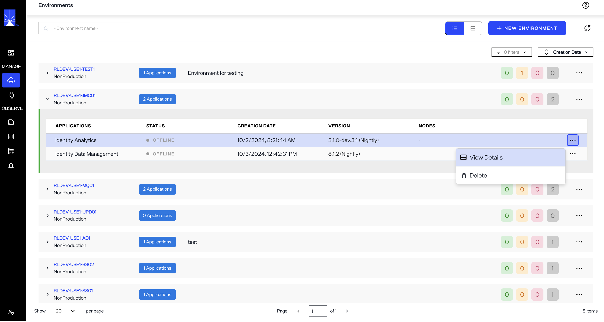

# Role-based Permissions

The operations a user can perform and what they can view in Environment Operations Center differ based on their assigned role. Environment Operations Center has three levels of user roles: Tenant Administrator, Environment Administrator, and Environment User. This guide outlines the permissions for each user role.

The following table provides an overview of user permissions for each role:

|   | [Tenant Administrator](#tenant-administrator) | [Read-Only](#read-only) | [Environment Administrator](#environment-administrator) | [Environment User](#environment-user) |
| -- | ------------------- | ------------------------- | ---------------- | ---------------- |
| Environment Details | View and edit all environment details | View all environment details | View and edit assigned environments | View assigned environments |
| User Details | View and edit all user details | View all user details | View and edit all users within assigned environments | View user details within assigned environments and can only edit their own details |

## Tenant administrator

A Tenant Administrator is granted permission to access all possible operations and views for all of the organization's environments. A Tenant Administrator can view and edit all environments and users, and can edit their own user details.

From the Environment Operations Center home page, the Tenant Administrator can view and access operations for all of the organization's environments.

## Read-Only

A Read-Only user is granted permission to access all possible views for all of the organization's environments. A user with this role can view all environments and users, but can not edit any of those details.

From the Environment Operations Center home page, the Read-Only user can view all of the organization's environments.

## Environment administrator

An Environment Administrator is granted permission to access all operations and views for the environments they have been assigned to. An Environment Administrator can edit their own user details and the details of all users within their assigned environments. They cannot view or edit environments or users that have not been assigned to them.

From the Environment Operations Center home page, the Environment Administrator can view and access operations for all of the environments they have been assigned to.

## Environment user

An Environment User is granted permission to only view the environments they have been assigned to, they have no access to edit the environments. Certain administrative functions are hidden, such as editing other users or updating environment authentication.

From the Environment Operations Center home page, the Environment User can view all of the environments they have been assigned to. An Environment User cannot perform operations on the environment and the  **Delete** button is disabled in the **Options** (**...**) drop down menu.

## Next steps

After reading this guide you should have an understanding of the different role assignments in Environment Operations Center and their permissions within the application. For details on user management, see the guides to [create a user](../user-management/create-user.md) or [edit a user](../user-management/edit-user.md).
