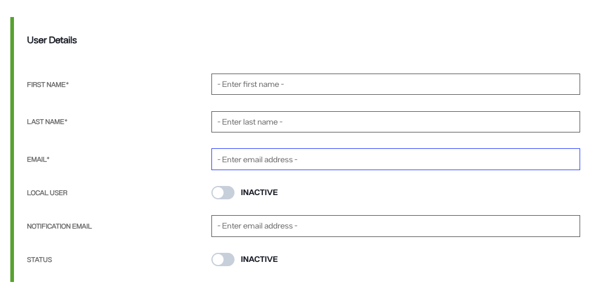
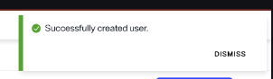

---
keywords:
title: Create a User
description: Learn how to create new users and assign roles in Environment Operations Center. What a user can view and which actions they can perform are dependent on their assigned role. You assign roles to each user through access control
---
# Create a User

This guide explains how to create a user and assign their roles in Environment Operations Center. What a user can view and do depends on the roles you assign them. For details on the default roles and their permissions, see the [role-based permissions](../../role-based-permission/role-based-permissions.md) guide.

## Getting started

Select **Admin** from the left navigation to open the *Admin* screen on the *Users* tab.

To create a user, select **New User** on the *Users* tab.

The *Create User* page has two sections: **User Details** and **Access Control**.

## User details

In the *User Details* section, enter the following:

| Field | Description |
| ----- | ----------- |
| First Name | Required. Up to 50 characters. |
| Last Name | Required. Up to 50 characters. |
| Email | Required. Environment Operations Center checks that the address is valid. |
| Local User | Turn on to create a local user who signs in with a password. When you turn it on, **Create Password** and **Confirm Password** fields appear. Enter a password or select **Generate**. The password must have at least 16 characters, lowercase and uppercase letters, at least 1 number, and at least 1 special character. If Require MFA is enabled for local users, the user is also prompted for MFA at sign-in. |
| Notification Email | The address that receives notifications for the user. |
| Status | Active by default. Turn off to create the user as inactive. |

You cannot select **Save** until all required fields are complete.

## Access control

Use the *Access Control* section to assign the user's roles. Each row assigns roles in one tenant.

1. Select **Add Access Control**. A new row appears.
2. Select the tenant from the **Tenant** dropdown.
3. Select the **Roles** button in the **Role** column, which shows how many roles are assigned (for example *0 Roles*), and choose the roles for that tenant.
4. Select the checkmark to confirm the row, or the **X** to discard it.

To change or remove a row after you confirm it, select **Options** (**...**) at the end of the row.

To create custom roles to assign here, see [roles](../admin-overview.md#roles).

## Save the user

When you have completed both sections, select **Save** to create the user. The user receives an email with their account information and a link to Environment Operations Center.

To leave the *Create User* page without creating the user, select **Cancel**. A message warns you that the current form details will be lost. Select **Confirm** to leave, or **Cancel** to return to the form.

## Confirmation

After you save, Environment Operations Center returns you to the *Users* tab, shows a success message, and adds the user to the list.

If Environment Operations Center cannot create the user, check the email address, including its capitalization. If the error persists, contact Radiant Logic Support.

## Next steps

You can now create a user in Environment Operations Center. To edit an existing user, see the [edit a user](edit-user.md) guide.
