---
keywords:
title: Alert Management
description: Learn how to create custom alerts to monitor the health and operations of your environment. 
---
# Alert management

Alerts can be created in Environment Operations Center to help your teams monitor the health and operations of your environments. Once created, alerts are sent to your specified communication channels to keep you up to date on important changes, potential issues, or errors. This guide outlines the steps to create and manage alerts in Environment Operations Center.

>[!note]An integration channel to receive the alert must be created prior to setting up the alert. For details on adding communication channel integrations, see the [integrations](../../../admin/integrations/manage-integrations.md) guide. 

## Application alerts

To open the *Alerts* screen, select **Alerts** under **Observe** in the left navigation. Then choose the environment you want to monitor from the **Environment** dropdown and the application from the **Application** dropdown. From this screen, you can add new environment monitoring alerts and manage existing alerts.

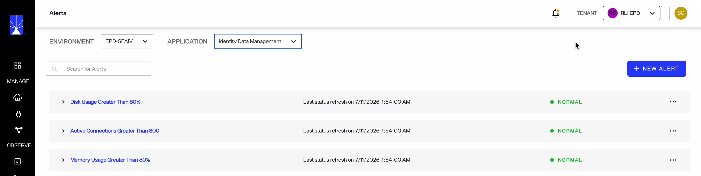

All existing alerts are listed on the *Alerts* screen, including the alert name, when the alert status was last refreshed, and its current status. Select the arrow next to an alert name to expand the row and review the alert's details. 
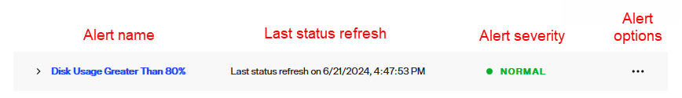

You can search for an existing alert by using the search bar. 

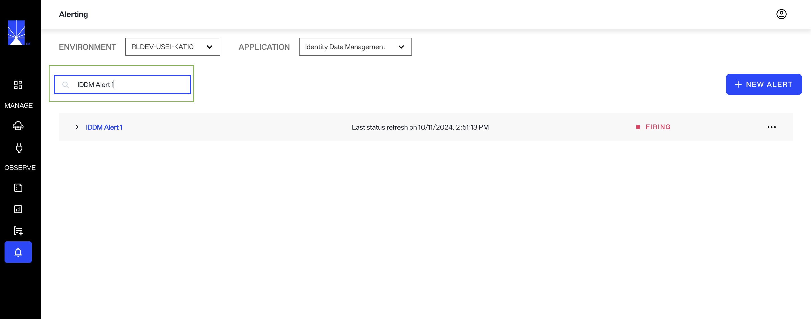

### Global alerts

You can create alerts at the global level in addition to creating them within an individual application. Global alerts let you build any type of alert from one place. You can navigate to global alerts by clicking on the Admin icon and opening the Alerts tab.

When you create an alert, you select a metric and its labels, such as namespace, job, node, and cluster name. Within an application, you see only that application's metrics (Identity Data Management, Identity Analytics, Identity Observability, or Secure data connector). In the global alerts section, you will see all metrics across every application.

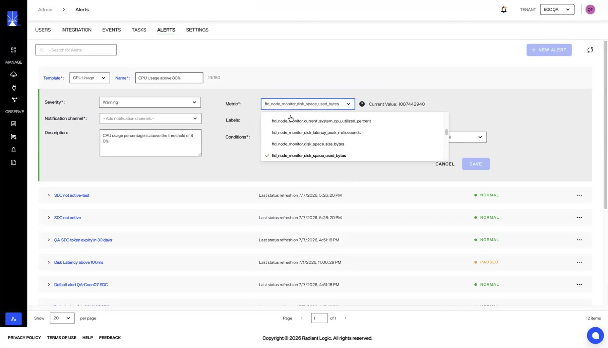

## Add alerts

To add a new alert, select **New Alert**. This opens the new alert form directly above the alert list, where you add the alert information and its metric to create the new alert.

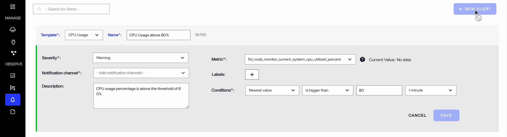

You can choose a predefined template for common alert types such as CPU Usage, Memory Usage, Disk Usage, Disk Latency, VDS Running, etc. Selecting a template will automatically populate the relevant fields, which you can still edit if needed. Alternatively, select 'Custom' to create an alert with metrics and conditions of your choice.

### Alert information

Enter the general details for the alert in the alerts form. These include:

| Alert information | Description |
| ----------------- | ----------- |
| Template | The Template dropdown provides predefined alert templates for common monitoring scenarios. Select an existing template or select "custom" to create your own alert. |
| Name | A unique name to identify the alert. It is recommended to keep this relevant to the purpose of the alert. |
| Severity | Select a severity rating to accompany the alert. Severity options include "Info", "Warning", and "Error". |
| Notification channel | The notification channel to send the alert to. The dropdown will display all of the integration channels you have configured in your Environment Operations Center instance. |
| Description | The description of the alert that will display in the selected channel if an alert is triggered. |

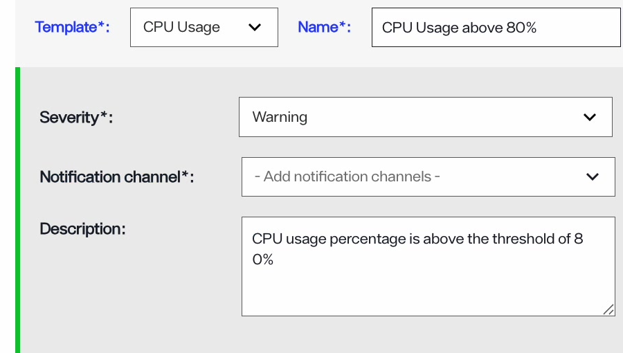

### Alert metrics

Specify the metric and conditions (such as statistic, threshold, and duration) that trigger the alert. These fields are explained in more detail below. The *Labels* field is optional and can be used for additional filtering of the metric.

1. Under *Metric*, select the specific environment component to provide alerts for. To set the metric, select the downward arrow to expand the dropdown list. Select a component to monitor from the list. You can hover over any metric component name to view its definition.

Optionally, you can also select a label to add a filter for the metric. 

2. Under *Conditions*, specify values for the following fields:

    * Under *Statistic*, define what value the alert is based on. To set the statistic, select the downward arrow to expand the dropdown list. Select a value from the list to measure for the metric.
    * Under *Condition*, select the conditional expression to measure the metric against the threshold. To set the condition, select the downward arrow to expand the dropdown and select a conditional expression from the list. The current value of the selected metric is shown as **Current Value** to the right of the *Metric* dropdown.
    * Under *Threshold*, select the percentage value that the condition is measured against. To set the threshold, enter a percentage in the space provided.
    * Under *Duration*, select the amount of time the condition must be met before the alert is sent. To set the duration, select the downward arrow to expand the dropdown and select a time from list.

Once you have completed all required fields, select **Save** to create the alert, or **Cancel** to discard it.

## Manage alerts

Each alert listed on the *Alerts* screen has a corresponding **Options** (**...**) menu that provides the option to edit or delete the alert.

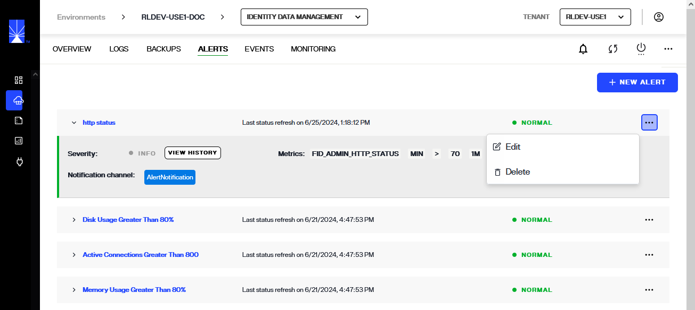

### Notification center
 
The bell icon in the top navigation bar represents the Notification center. It shows alerts that are firing or that fired recently. After clicking on the bell icon, you can perform any of these actions:

- Select an alert in the notification center to navigate to its source. For example, selecting a Secure data connector alert opens the Secure data connectors page.
- Select **Mark as read** to remove an alert from the list.

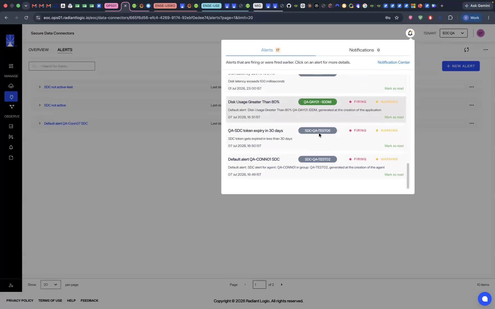

### Pause an alert

When an alert fires, Environment Operations Center sends notifications to the configured email address or Slack channel on the alert's schedule — for example, every five minutes. If you are already aware of the condition or want to pause the alert temporarily, select the Pause option from the **Options** (**...**) menu to pause notifications.

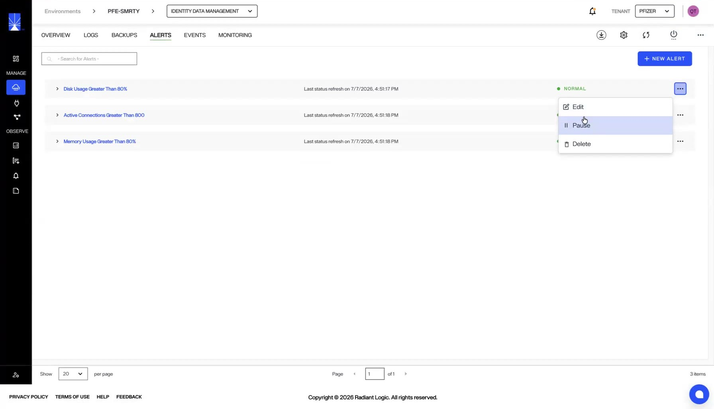

### Edit alerts

To edit an alert, select **Edit** from the **Options** (**...**) menu of the alert to edit.

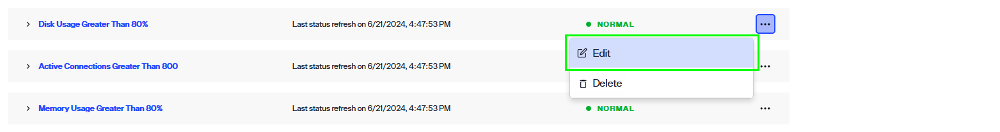

This opens the alert in an editable form containing the same fields as the new alert form. Edit the fields you want to change, then select **Save** to save the updated alert, or **Cancel** to discard your changes.

### Delete alerts

To delete an alert, select **Delete** from the **Options** (**...**) menu of the alert to delete.

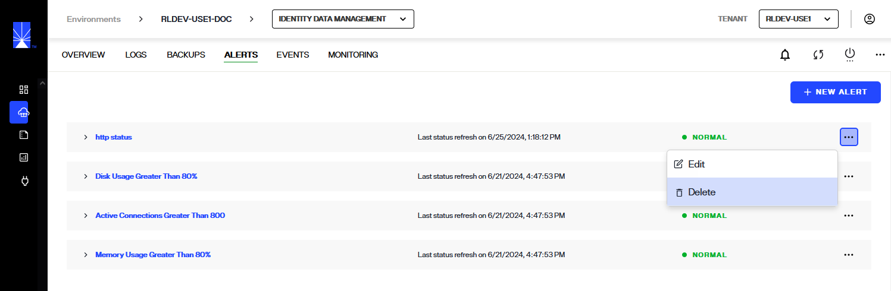

A notification displays to confirm that you would like to delete the selected alert. Select **Delete** to proceed and delete the alert.

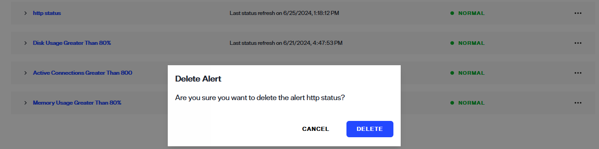

You'll see a message confirming that the alert was successfully deleted.

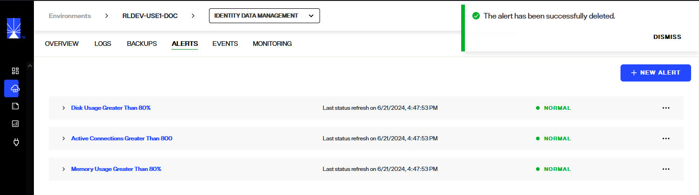

## Next steps

You should now have an understanding of the steps to create and manage alerts to help monitor your environments in Environment Operations Center. To learn more about managing communication channels see the [manage integrations](../../../admin/integrations/manage-integrations.md) guide.
