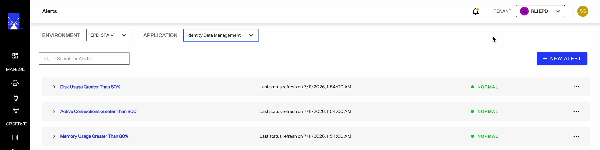
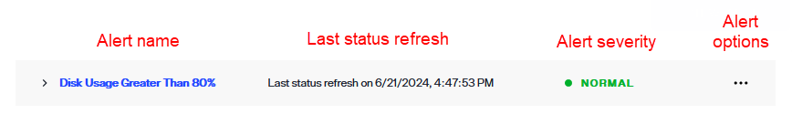
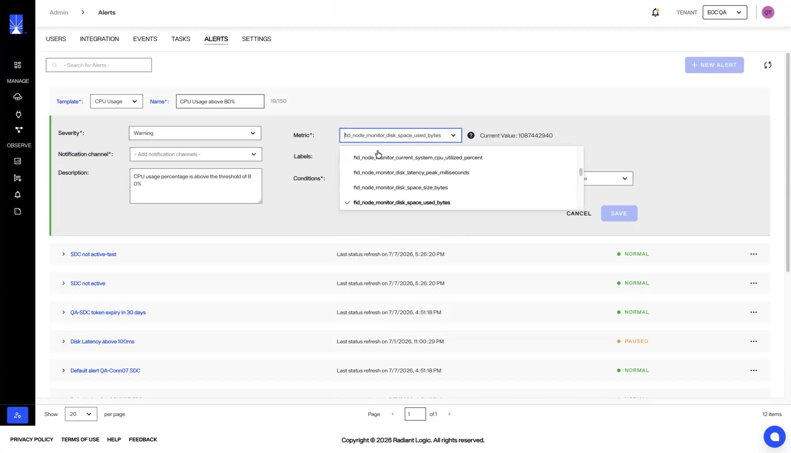
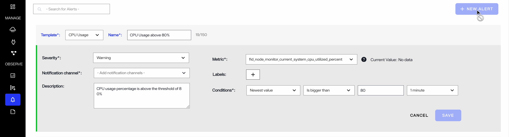
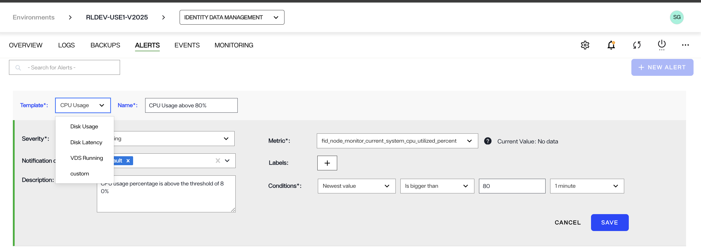
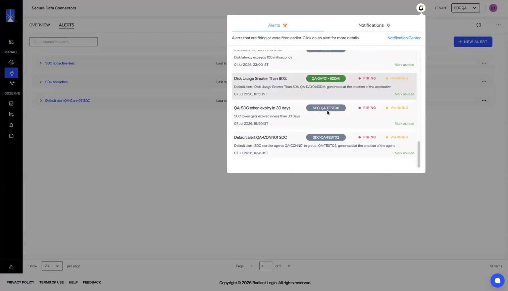
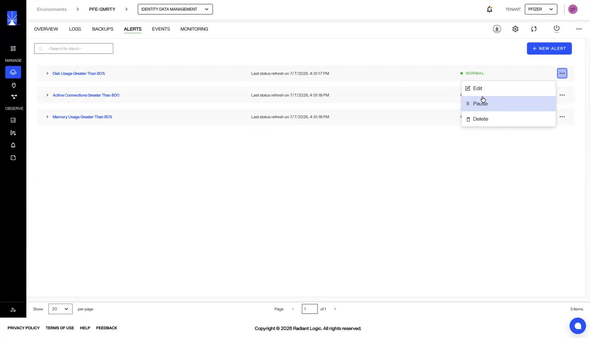
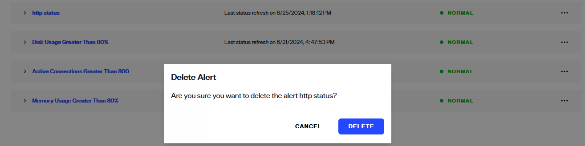

---
keywords:
title: Alert Management
description: Learn how to create custom alerts to monitor the health and operations of your environment. 
---
# Alert management

Create alerts in Environment Operations Center to help your teams monitor the health and operations of your environments. Environment Operations Center sends alerts to the communication channels you specify, so you stay up to date on important changes, potential issues, and errors. This guide explains how to create and manage alerts.

>[!note]Create an integration channel to receive the alert before you set up the alert. For details on adding communication channel integrations, see the [integrations](../../../admin/integrations/manage-integrations.md) guide. 

## Application alerts

You can open an application's alerts in two ways:

- Open the application's detailed view and select the **Alerts** tab.
- Select **Alerts** under **Observe** in the left navigation, then choose the environment from the **Environment** dropdown and the application from the **Application** dropdown.

From either place, you can add alerts and manage existing ones.

When you create an Identity Data Management application, Environment Operations Center creates a set of default alerts for it, such as *Disk Usage Greater Than 80%*, *Memory Usage Greater Than 80%*, and *Active Connections Greater Than 800*. You can edit, pause, or delete these alerts like any other alert.

The *Alerts* screen lists each alert with its name, the time its status was last refreshed, and its current status, such as *Normal*. Select the arrow next to an alert name to expand the row and review the alert's details.

Use the **Search for Alerts** bar to find an existing alert. 

### Global alerts

You can also create alerts at the global level. Global alerts let you build any type of alert from one place. To open global alerts, select the **Admin** icon and open the **Alerts** tab.

When you create an alert, you select a metric and its labels, such as namespace, job, node, and cluster name. Within an application, you see only that application's metrics (Identity Data Management, Identity Analytics, Identity Data Platform, or Secure data connector). In the global alerts section, you see all metrics across every application.

## Add alerts

To add an alert, select **New Alert**. The new alert form opens directly above the alert list.

Choose a predefined template for a common alert type: **CPU Usage**, **Memory Usage**, **Disk Usage**, **Disk Latency**, or **VDS Running**. The template fills in the relevant fields, which you can still edit. To choose your own metric and conditions instead, select **custom**.

### Alert information

Enter the general details for the alert:

| Alert information | Description |
| ----------------- | ----------- |
| Template | A predefined alert template for a common monitoring scenario. Select a template, or select **custom** to create your own alert. |
| Name | A unique name of up to 150 characters that identifies the alert. Use a name that describes the alert's purpose. |
| Severity | The severity of the alert: **Info**, **Warning**, or **Error**. |
| Notification channel | One or more channels to send the alert to. The dropdown lists the integration channels configured in your Environment Operations Center instance. |
| Description | The description that appears in the selected channels when the alert fires. |

### Alert metrics

Specify the metric and the conditions (statistic, condition, threshold, and duration) that trigger the alert. The *Labels* field is optional; use it to filter the metric further.

1. Under *Metric*, select the component to monitor from the dropdown. Hover over a metric name to view its definition. The current value of the selected metric appears as **Current Value** to the right of the dropdown.

   Optionally, select a label to filter the metric.

2. Under *Conditions*, specify values for the following fields:

    * *Statistic*: the value the alert is based on: **Minimum value**, **Maximum value**, **Average value**, **Sum of all values**, **Number of values**, or **Newest value**.
    * *Condition*: how to compare the metric with the threshold: **Is bigger than**, **Is smaller than**, **Increases by**, **Decreases by**, or **Is different than**.
    * *Threshold*: the value to compare the metric against.
    * *Duration*: how long the condition must be met before Environment Operations Center sends the alert: **1 minute**, **5 minutes**, **10 minutes**, **15 minutes**, **30 minutes**, or **1 hour**.

When you complete all required fields, select **Save** to create the alert, or **Cancel** to discard it.

## Manage alerts

Each alert on the *Alerts* screen has an **Options** (**...**) menu with **Edit**, **Pause**, and **Delete**.

### Notification center
 
The bell icon in the top navigation bar opens the notification center, which shows alerts that are firing or that fired recently. From the notification center, you can:

- Select an alert in the notification center to navigate to its source. For example, selecting a Secure data connector alert opens the Secure data connectors page.
- Select **Mark as read** to remove an alert from the list.

### Pause an alert

When an alert fires, Environment Operations Center sends notifications to the configured email address or Slack channel on the alert's schedule, for example every five minutes. If you already know about the condition or want to stop notifications temporarily, select **Pause** from the alert's **Options** (**...**) menu.

### Edit alerts

To edit an alert, select **Edit** from the alert's **Options** (**...**) menu.

The alert opens in a form with the same fields as the new alert form. Change the fields you need, then select **Save** to save the alert, or **Cancel** to discard your changes.

### Delete alerts

To delete an alert, select **Delete** from the alert's **Options** (**...**) menu.

A dialog asks you to confirm. Select **Delete** to delete the alert.

A message confirms that Environment Operations Center deleted the alert.

## Next steps

You can now create and manage alerts to monitor your environments. To learn about managing communication channels, see the [manage integrations](../../../admin/integrations/manage-integrations.md) guide.
