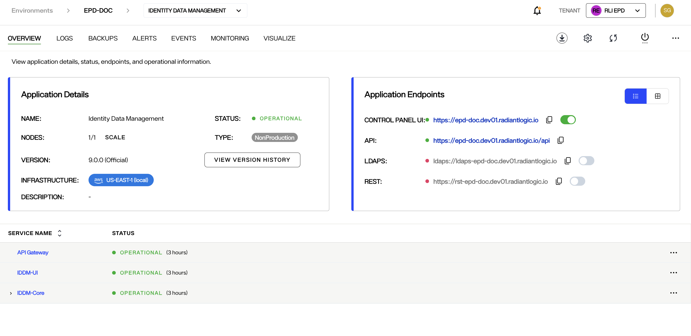
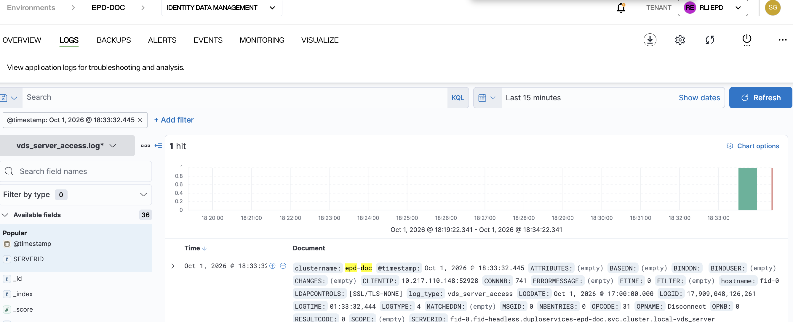
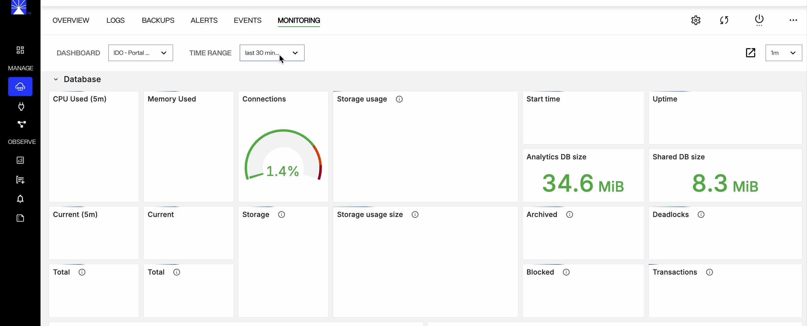
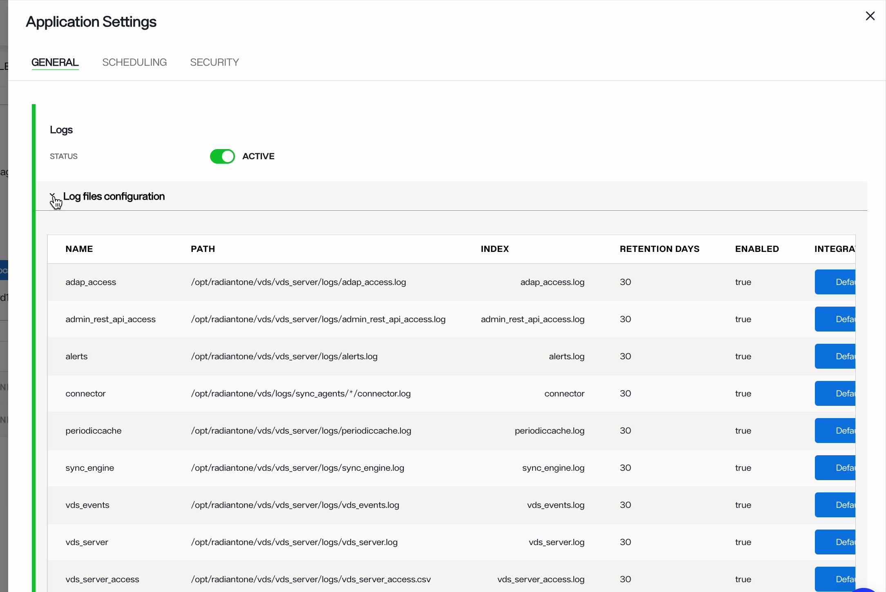
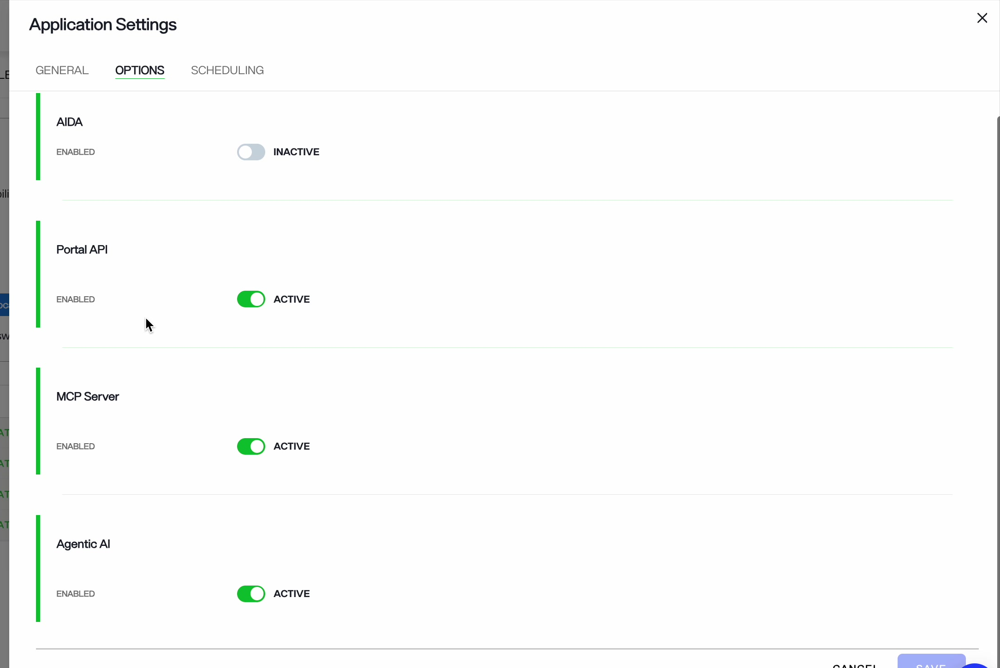
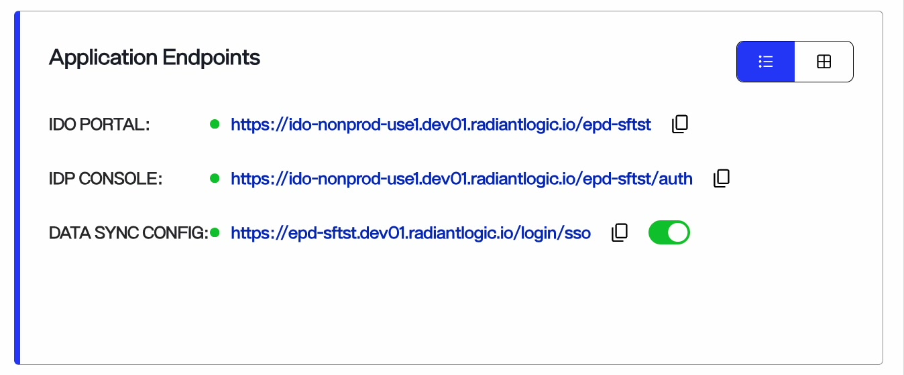
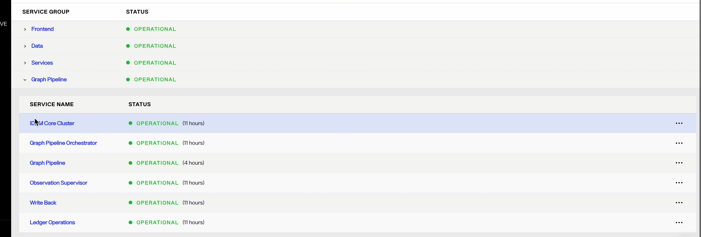
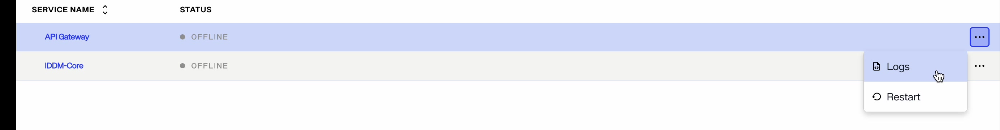

---
keywords:
title: Application details
description: Get a quick introduction to navigating applications in Environment Operations Center. This includes where to see an overview, how to access logs, how to create backups, how to configure alerts and where to see the activity log.
---

# Application details

Each application installed in your environment has a detailed view where you can monitor the application's status and perform operations on it. This guide outlines the detailed view of an application as seen in the application *Overview* screen. For an overview of the *Environments* screen that lists all available environments, see the [environments overview guide](../environment-overview/environments.md).

## Getting started

To navigate to the detailed view of an application, select an application name from one of the environments displayed on the *Environments* screen.

This opens the application's *Overview* screen that displays the application details, status, endpoints, and operational information. Use the navigation bar at the top of the page to open the application's monitoring and updating tools.

The breadcrumb at the top of the screen shows **Environments**, the environment name, and an application dropdown. Use the dropdown to switch to another application in the same environment.

## Top navigation

The navigation bar at the top of the *Overview* screen stays visible on every tab of the application's detailed view. Use it to open the following tabs:

- Overview
- Logs
- Backups
- Alerts
- Events
- Monitoring
- Visualize

### Logs

The *Logs* tab lets you search the application's log entries for troubleshooting and analysis. Select a log source, such as *vds_server_access.log\**, from the dropdown above the field list, then search the entries with a KQL query, add filters, and set the time range. The tab shows the number of matching entries (hits) in a chart, followed by the entries themselves.

You can also search logs from the *Logs* screen under **Observe** in the left navigation, where you first select the environment and application. For further details, see the [application logs](logging/application-logs.md) guide.

### Backups

Use the *Backups* tab to create and view backups of the application's configuration. The tab lists each backup with its name, creation date, version, and size, and shows whether scheduled backups are enabled. When they are, the status also shows when the next backup runs; otherwise it reads *Scheduled: disabled*. Backup names can be up to 20 characters. Use the search bar to find a backup by name.

For information on managing your backups, refer to the [backup and restore documentation](backup-and-restore/backup-restore-overview.md).

### Alerts

The *Alerts* tab lists the alerts configured for the application, with each alert's name, the time its status was last refreshed, and its current status, such as *Normal*. Select **New Alert** to create an alert for the application.

When you create an Identity Data Management application, Environment Operations Center creates a set of default alerts for it, such as *Disk Usage Greater Than 80%*, *Memory Usage Greater Than 80%*, and *Active Connections Greater Than 800*.

For details on creating and managing alerts, see the [alert management](alerting/alert-management-overview.md) guide.

### Events

The *Events* tab lists the events and activity for the application. Each event shows its status, the action (such as *Create*), a description, the user who started it, and its start and end times. Select the filters button to show only events with a specific action: **Create**, **Update**, **Delete**, or **Download**.

### Monitoring 

The *Monitoring* tab shows dashboards with the application's health, performance, and operational metrics. Select a dashboard from the **Dashboard** dropdown and, where the application supports it, a node from the **Node** dropdown. Select a period, from *last 30 minutes* to *last 1 year*, from the **Time Range** dropdown.

For an Identity Data Management application, choose **IDDM Dashboard** or **Audit Report**, and select a node such as *fid-0*. The **IDDM Dashboard** shows the selected node's:

- Resource usage: CPU, memory, physical memory, disk space, and file descriptors, with CPU and memory usage charts over time.
- Cluster status: whether the node is the leader, whether the task scheduler runs on the leader, and whether ZooKeeper is writable, readable, or read-only.
- Directory and activity metrics: the number and total size of HDAP stores, up time, operation count, live connections, and peak CPU, connection, memory, and disk values.

Use the controls at the right end of the toolbar to open the dashboard in a new tab and to set how often it reloads its data, from every 5 seconds to once a day, or **Off**. The dashboards offered depend on the application — see [report types](../../reporting/report-types.md) for the list.

### Visualize

The *Visualize* tab shows the application's service topology, endpoints, and their relationships in an interactive graph. The graph starts from the application and branches out to its services, the nodes that run each service, and the application's endpoints.

- Each service and node card shows its status and how long it has held that status. Node cards for core nodes, such as *fid-0* in an Identity Data Management application, also show CPU, memory, disk, and connection usage, along with the protocols the node serves.
- Use the zoom in, zoom out, and fit view controls in the lower-left corner of the graph to move around the topology. The minimap in the lower-right corner shows which part of the graph you are viewing.
- Use the **Layout** control in the upper-right corner of the graph to arrange the graph **Left - Right** or **Top - Bottom**.
- The legend below the graph explains the status colors: **Operational / Success**, **Warning / Progressing**, **Failed / Degraded**, and **Offline / Disabled**. A dashed line marks an **Endpoint route**.

## Application operations

The action bar at the right end of the navigation bar contains the following icons:

* **Download logs** downloads the application's log files as a ZIP file. This icon appears for Identity Data Management applications only. For the steps, see [download Identity Data Management logs](logging/application-logs.md#download-identity-data-management-logs).
* **Settings** opens *Application Settings*. The tabs available depend on the application:
  * For **Identity Data Management**: **General**, **Scheduling**, and **Security**.
  * For **Identity Data Platform**: **General**, **Options**, and **Scheduling**.
* **Refresh** reloads the application's details.
* **Power** starts, stops, or restarts the application.
* **Options** (**...**) lets you **Reset Password** or **Delete** the application.

### General

Use the **General** tab to turn **Logs** and **Monitoring** on or off for the application. For an Identity Data Management application, the **Log files configuration** section lists each log file the application writes, along with its path, index, retention in days, whether it is enabled, and the log integration it is forwarded to. See [forward logs to an external integration](logging/application-logs.md#forward-logs-to-an-external-integration).

### Options

The **Options** tab appears for Identity Data Platform applications and contains a toggle for each additional service available to the application, such as **AIDA**, **Portal API**, **MCP Server**, **Agentic AI**, and **Additional S3 Storage**. When a service is not enabled for your subscription, its option does not appear. See [additional services](applications-overview.md#additional-services-for-identity-data-platform).

### Scheduling

Use the **Scheduling** tab to configure automatic start and stop. See [schedule start and stop](stop-and-restart-application.md).

### Security

Use the **Security** tab to manage **IP-Based Access Control** for an Identity Data Management application. See [enable IP based access control](endpoints-overview.md#enable-ip-based-access-control).

To learn how to update or delete the application, see the [update application](update-an-application.md) and [delete application](../environment-overview/delete-environment.md) guides. For details on monitoring and adjusting nodes, see the [update and monitor nodes](node-details.md) guide.

## Application details

The *Application Details* panel shows the application's name, status, nodes, type, version, and description. It also shows the **Infrastructure** the application is deployed on as a badge naming the cloud provider and the cluster — for example, *aws US-EAST-1 (local)*.

The **Type** badge shows whether the environment is *NonProduction* or *Production*. A clock icon next to it marks an [ephemeral environment](../environment-overview/create-environments.md#ephemeral-environments), which deletes itself at a set time.

From this panel, you can also perform these actions when they are available for the application:
* Update the version of the application by clicking **Update**. 
* Scale the number of nodes for your application by clicking **Scale** next to the **Nodes** count. 
* View the application's version history by clicking **View Version History** next to the version number.

### Status

The application status changes depending on the state of the application's services. Statuses include:

- Operational: The application is fully operational with 100% of services running.
- Warning: There are services down. This can range from 10%-90% of services.
- Outage: There are too many services down for the application to operate. Less than 10% of services are running.

### Version

If the application version is out of date, an "Update Now" message appears next to the version number.

For details on updating the application, see the [update application](update-an-application.md) guide.

You can view an application's version history by selecting the **View Version History** button next to the version number in the *Application Details* panel.

## Endpoints

The *Application Endpoints* section lists all of the application's endpoints. Each endpoint has a status indicator (green when the endpoint is enabled), a copy icon and, where the endpoint can be turned on and off, a toggle. For example, an Identity Data Management application lists the **Control Panel UI**, **API**, **LDAPS**, and **REST** endpoints, and the **API** endpoint is always enabled. Note that the [endpoints](endpoints-overview.md) for the Identity Analytics application differ from the Identity Data Management application.

Use the view toggle in the upper-right corner of the panel to switch between **list view**, which shows one endpoint per row, and **grid view**, which arranges the endpoints as cards that show each endpoint's name and status.

>[!warning]
> Enable IP Based Access Control on the **Security** tab of *Application Settings* to limit which IP addresses can access the endpoints.

## Service groups

Below the *Application Details* and *Application Endpoints* panels, the *Overview* screen lists the application's service groups with the status of each group. The groups depend on the application — an Identity Data Platform application, for example, has *Frontend*, *Data*, *Services*, and *Graph Pipeline*, while an Identity Data Management application lists the *API Gateway*, *IDDM-UI*, and *IDDM-Core* services. Select **Service Name** in the column header to sort the list.

Select the arrow next to a group name to expand it and list the individual services in that group. Each service shows its status and how long it has held that status.

For an Identity Data Management application, expanding a service lists the nodes that run it, with each node's name, status, and how long it has held that status. Nodes of the *IDDM-Core* service, such as *fid-0*, also show **CPU**, **Memory**, and **Disk** usage and the number of **Connections**. Each node has an **Options** (**...**) menu with **View Node Details** and **Logs**. See [update and monitor nodes](node-details.md).

Each service has an **Options** (**...**) menu with the following actions:

- **Logs** — open the logs for that service.
- **Restart** — restart that service on its own, without restarting the whole application.

> Restarting a service makes it briefly unavailable. Restart a single service when only that service is unhealthy; to restart everything, use the **Power** icon in the action bar instead.

## Next steps

After reading this guide, you can navigate the *Overview* screen of an application and understand its main features including the top navigation, Application Details, Application Endpoints, service groups, and the *Visualize* topology graph. To update the application, see [update an application](update-an-application.md).
