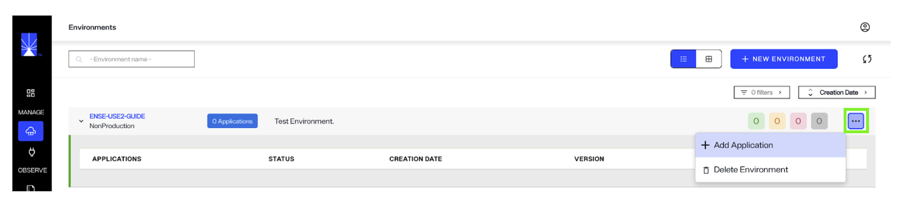
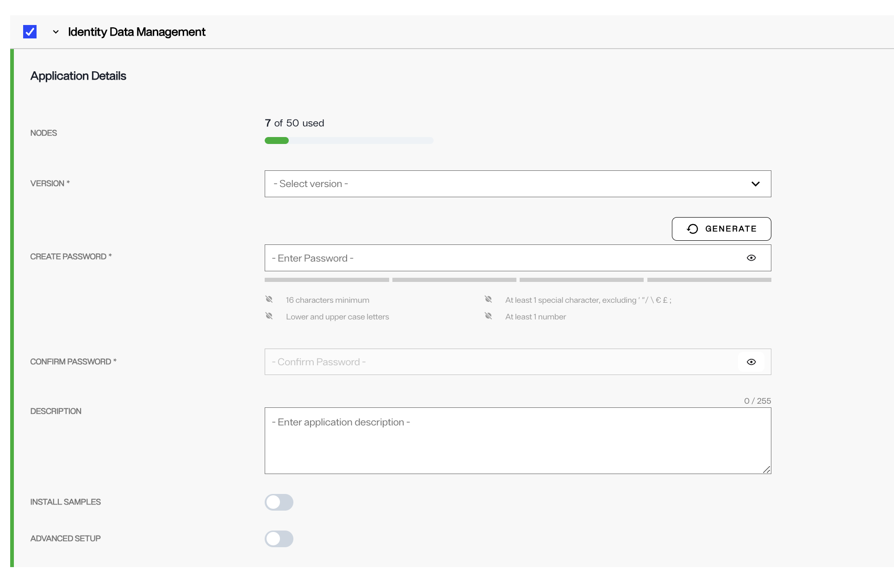
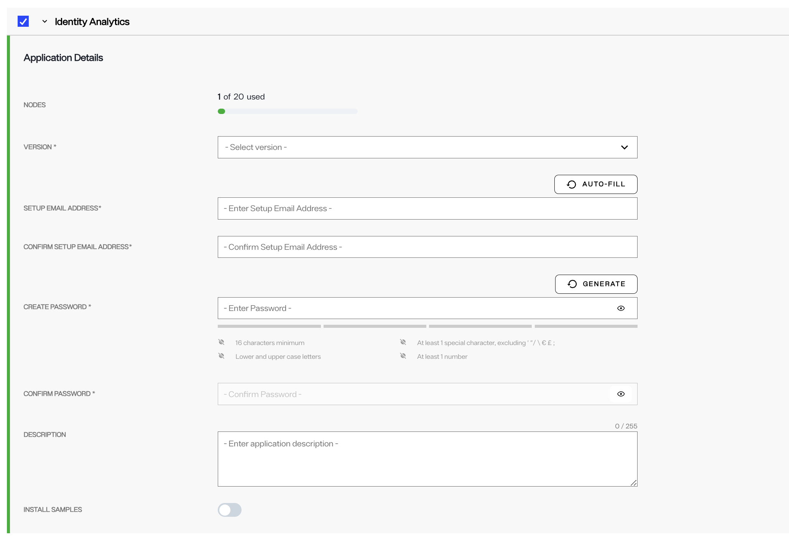
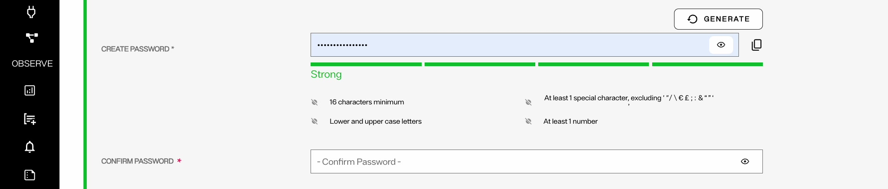
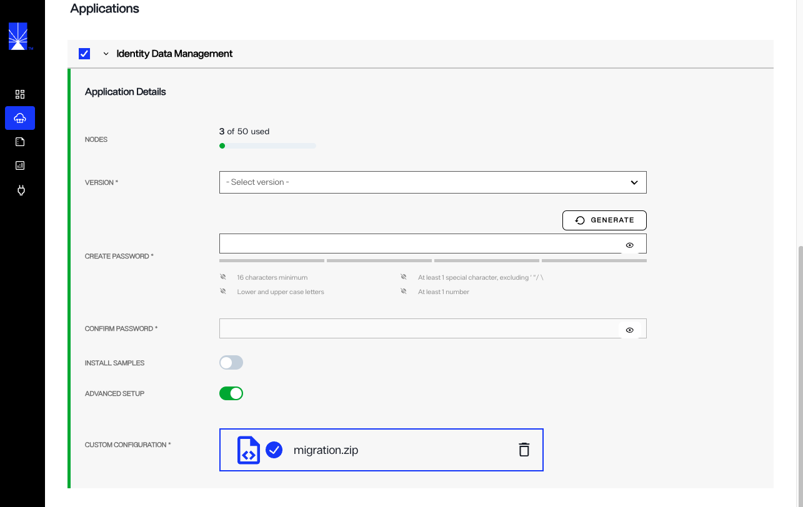
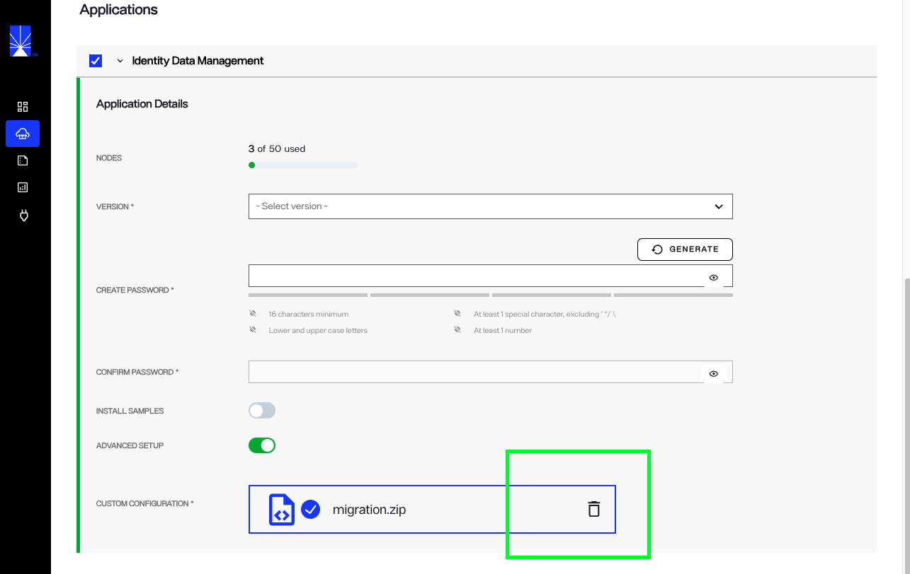
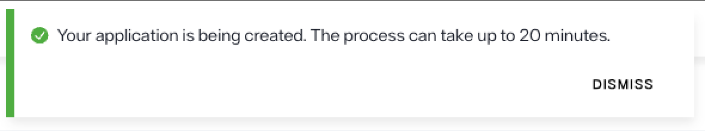
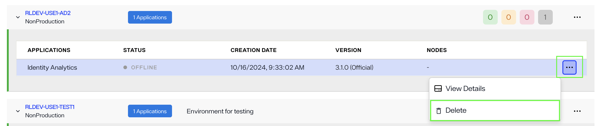
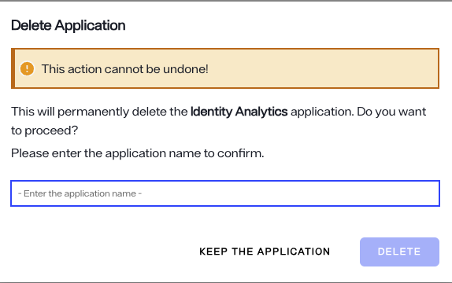

---
keywords:
title: Applications Overview
description: Learn about the different application types that can be installed in an environment.
---

# Applications Overview

In your environment, you can install one or both of the following RadiantLogic applications:

* **Identity Data Management** – This application streamlines identity data by eliminating silos and ensuring seamless synchronization across your organization. It serves as a scalable, unified source of truth, helping to manage and maintain accurate, up-to-date identity information.

* **Identity Data Analytics** – This application offers deep insights into potential gaps in your identity data, particularly in relation to access management workflows. It enhances visibility, enabling you to identify and address blind spots, while strengthening your organization’s overall identity security posture.

## Prerequisites

* Ensure you have necessary permissions, as only Tenant Administrators or Environment Administrators can add, update or delete applications in the environments.

## Install an application 

To install an application in a new environment, refer to the [Create an environment](to-add) guide. 
To add an application to an existing environment in the Environment Operations Center, follow these steps:

1. After logging into your Environment Operations Center, select **Environments** in the left navigation.
2. On the Environments page, locate the environment where you want to add the new application. Use the Search or Filter option if necessary. 
3. Click on the (...) option and select **Add Application** from the dropdown. 

   

4. Select the checkbox adjacent to the application name.
5. In the expanded view, fill out all required information listed below. 

### Application Details

Under the **Application Details** section, provide the required details such as the application version, password ,and application description.

There are minor differences in the application details form for Identity Data Management and Identity Analytics application. For Identity Data Management deployment, you have the option to enable advanced setup if you wish to deploy the application using an existing configuration file. Note that this option is available only in Identity Data Management, not in Identity Analytics.

### Version

To set the application **Version**, select the version drop down to display all available versions. Select the value that corresponds with your organization's version of Environment Operations Center.

### Password

Select a password by either entering your chosen password in the space provided, or by selecting the **Generate** button to have a password automatically generated for you.

> Passwords must be a minimum of 16 characters, contain at least 1 special character, contain lower and upper case letters, and contain at least 1 number.

Depending on the complexity and strength of your password, you will receive a notification that your password is "Weak", "Fair", "Good", or "Strong". It is recommended that you adjust the password until you receive a "Strong" rating. Adjust your password accordingly to ensure you have entered a strong password before proceeding to the confirmation step.

To confirm your password, reenter or copy and paste your password in the confirmation space provided. If you selected to have a password automatically generated, the password will also automatically populate in the confirmation text box.

To reveal your original or confirmation password, select the eye icon () located within the text field you wish to view.

### Advanced Setup

This is an optional step and is not required. An advanced setup is available if you would like to upload a configuration ZIP file from another environment or create the environment using samples. Enable advanced setup by toggling on **Advanced Setup**.

>![warn] Use this approach to restore an environment from an existing backup file. When creating a new environment, choose the backup configuration (ZIP file) that was downloaded from the environment you want to restore. 

The **Install Samples** option imports sample data. See [Sample Data](../introduction/samples.md) for further details about sample data.

### Custom Configuration

To import a configuration file, select the configuration ZIP file to upload. You can locate the file on your system and drag and drop it into the provided space. Alternatively, you can select **choose file** within the upload box to open your system's file manager and locate the file to upload.

While your file is uploading, an **Uploading** message displays in the file upload box, along with a progress bar. You can cancel the file upload while it is in progress by selecting the **X** located in the progress bar box.

Once your configuration file has successfully loaded, the file name displays in place of the file upload box. Select **Create** to create the new environment.

To delete the file and return to the file upload screen, select the trash can icon located in the same box as the successful file upload.

If the file upload is not successful, the configuration upload box displays with a red dashed outline and an error message appears just below. Review your file type to ensure you have selected the correct configuration file for upload and try again.

After saving the details form, you are redirected to the *Applications* home screen. A confirmation message appears noting that your application is being created and that the process can take up to twenty minutes. Select **Dismiss** to close the confirmation message.

Once the application has been successfully installed, the application's status changes to "Operational".

### Form submission failure

If there is an issue with the form submission, an error message states that the new environment creation failed and the new environment will no longer be visible in the environment list on the *Environments* home screen. Select **Dismiss** to close the error message and proceed to restart the workflow to create a new environment.

## Update an application 

Refer to the [managing application updates](to-add) guide to learn how to update an application. 

## Delete an application 

1. To begin the workflow to delete an application, navigate to the environments page and click on the environment where the application is installed. 

2. Next, select the ellipsis in the application to expand the **Options** menu.

   

3. From the **Options** menu, select **Delete**. This will open the delete application dialog box. Enter the Application name in the dialog box and click **Delete**. 
   This will permanently delete the application.

   

## Next steps 

Learn about all the [application details](./application-details.md) accessible in the Environment Operations Center.
