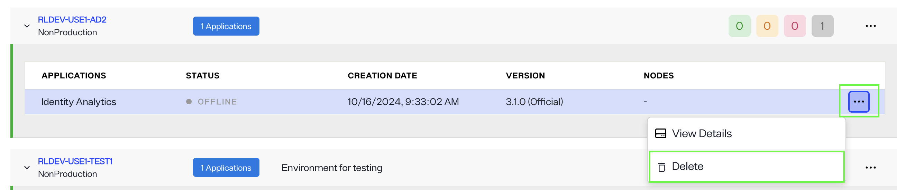
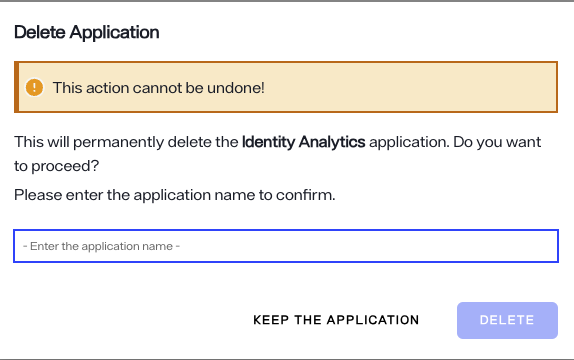

---
keywords:
title: Applications Overview
description: Learn about the different application types that can be installed in an environment.
---

# Applications Overview

In your environment, you can install one or more of the following RadiantLogic applications:

* **Identity Data Management** – This application streamlines identity data by eliminating silos and ensuring seamless synchronization across your organization. It serves as a scalable, unified source of truth, helping to manage and maintain accurate, up-to-date identity information.

* **Identity Analytics** – This application offers deep insights into potential gaps in your identity data, particularly in relation to access management workflows. It enhances visibility, enabling you to identify and address blind spots, while strengthening your organization’s overall identity security posture.

* **Identity Data Platform** (previously known as Identity Observability) – Provides observability services for your identity data including AI agents' data. You can ask Radiant Logic to enable additional services, such as extra storage, Portal API, and MCP, for this application when you create it.

Applications that are not part of your subscription are shown greyed out and labelled *Not in current subscription*, and you cannot select them.

## Prerequisites

* Ensure you have necessary permissions, as only Tenant Administrators or Environment Administrators can add, update or delete applications in the environments.

## Install an application 

To install an application in a new environment, refer to the [Create an environment](../environment-overview/environments.md) guide. 
To add an application to an existing environment in the Environment Operations Center, follow these steps:

1. After logging into your Environment Operations Center, select **Environments** in the left navigation.
2. On the Environments page, locate the environment where you want to add the new application. Use the Search or Filter option if necessary. 
3. Click on the (...) option and select **Add Application** from the dropdown. 

4. Select the checkbox adjacent to the application name.
5. In the expanded view, fill out all required information listed below. 

### Application Details

Under the **Application Details** section, provide the required details such as the application version, password, and application description. The **Nodes** row at the top of each application's section shows how many of that application's subscription nodes are already in use, for example *0 of 3 used*.

There are minor differences in the application details form for each application. For Identity Data Management deployment, you have the option to enable advanced setup if you wish to deploy the application using an existing configuration file. Note that this option is available only in Identity Data Management.

For Identity Analytics and Identity Data Platform, the form also asks for a setup email address. Enter the address in **Setup Email Address** and repeat it in **Confirm Setup Email Address**, or select **Auto-fill** to populate both fields with the email address of the signed-in account.

### Version

To set the application **Version**, select the version drop down to display all available versions. Select the value that corresponds with your organization's version of Environment Operations Center.

### Password

Enter a password in the **Create Password** field, or select **Generate** to have a password automatically generated for you.

> Passwords must be a minimum of 16 characters, contain at least 1 special character, contain lower and upper case letters, and contain at least 1 number.

A strength bar rates your password as "Weak", "Fair", "Good", or "Strong". Adjust the password until it is rated "Strong" before you confirm it.

To confirm your password, reenter or copy and paste your password in the **Confirm Password** field. If you generated the password, Environment Operations Center fills in the confirmation field for you.

To reveal your original or confirmation password, select the eye icon () located within the text field you wish to view.

### Advanced Setup

Each application's details end with an **Options** section that contains optional toggles. Identity Data Management and Identity Analytics include **Install Samples**, which imports sample data. Identity Data Management also includes **Advanced Setup**.

Advanced setup is an optional step and is not required. It is available if you would like to upload a configuration ZIP file from another environment. Enable it by toggling on **Advanced Setup**.

>![warn] Use this approach to restore an environment from an existing backup file. When creating a new environment, choose the backup configuration (ZIP file) that was downloaded from the environment you want to restore. 

### Custom Configuration

To import a configuration file, select the backup configuration ZIP file to upload. You can locate the file on your system and drag and drop it into the provided space. Alternatively, you can select **choose file** within the upload box to open your system's file manager and locate the file to upload.

>![warn] The backup version number must be less than or equal to the version of the application you selected under [Application Details](./#application-details). For example, if you choose v8.1.5 for the new application, the backup file can be v8.1.5, v8.1.4, or any earlier version down to v8.0.

While your file is uploading, an **Uploading** message displays in the file upload box, along with a progress bar. You can cancel the file upload while it is in progress by selecting the **X** located in the progress bar box.

Once your configuration file has successfully loaded, the file name displays in place of the file upload box. Select **Create** to create the new environment.

To delete the file and return to the file upload screen, select the trash can icon located in the same box as the successful file upload.

If the file upload is not successful, the configuration upload box displays with a red dashed outline and an error message appears just below. Review your file type to ensure you have selected the correct configuration file for upload and try again.

After saving the details form, you are redirected to the *Applications* home screen. A confirmation message appears noting that your application is being created and that the process can take up to twenty minutes. Select **Dismiss** to close the confirmation message.

Once the application has been successfully installed, the application's status changes to "Operational".

### Form submission failure

If the submission fails, an error message says that creation failed, and the application does not appear on the *Environments* screen. Select **Dismiss** to close the message, then start again.

## Update an application 

Refer to the [update an application](update-an-application.md) guide to learn how to update an application. 

## Additional services for Identity Data Platform

Identity Data Platform applications support additional services that are enabled per allocation, including:

- **Additional S3 storage** — extra storage for the application.
- Other Identity Data Platform services, such as **Portal API** and **MCP**.

When a service is not enabled for the application, its option does not appear.

> These services are feature-flagged. Contact Radiant Logic to enable them for an Identity Data Platform application.

## Delete an application 

1. To begin the workflow to delete an application, navigate to the environments page and click on the environment where the application is installed. 

2. Next, select the ellipsis in the application to expand the **Options** menu.

   

3. From the **Options** menu, select **Delete**. In the dialog, enter the application name and select **Delete**. This permanently deletes the application.

   

## Next steps 

After the application is installed, select its name on the *Environments* screen to open its *Overview* screen. From there you can view the application details, status, endpoints, and services, and use the **Logs**, **Backups**, **Alerts**, **Events**, **Monitoring**, and **Visualize** tabs. Learn about all the [application details](./application-details.md) accessible in the Environment Operations Center.
