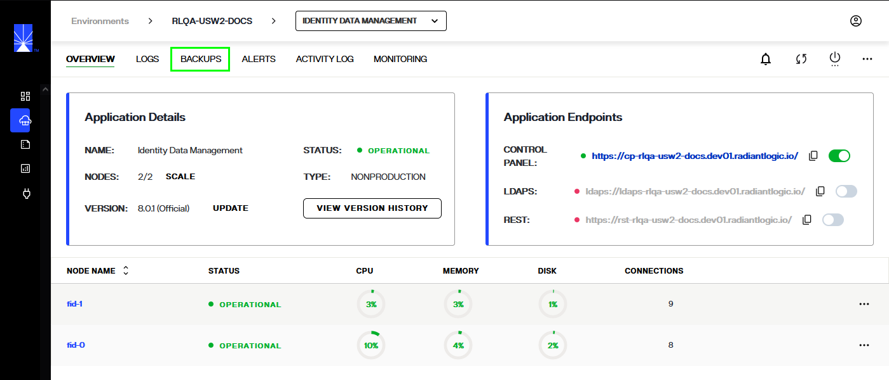
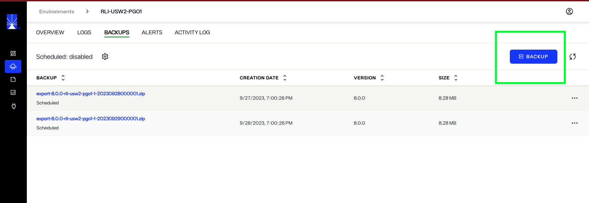
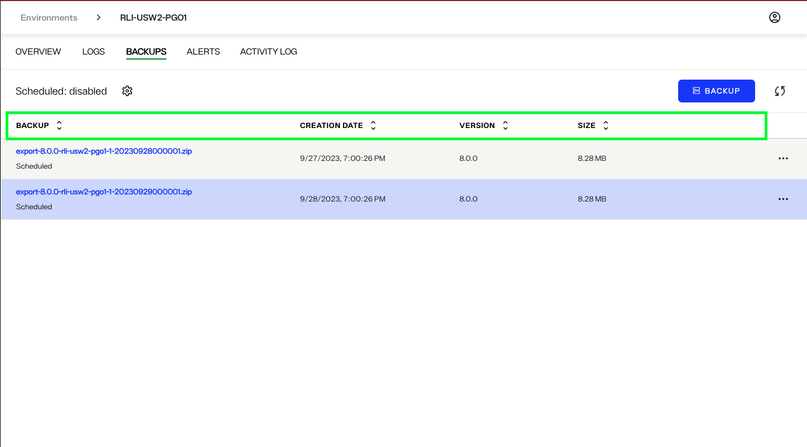
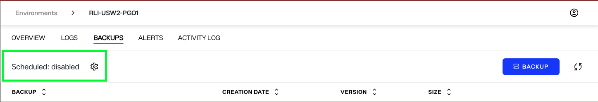
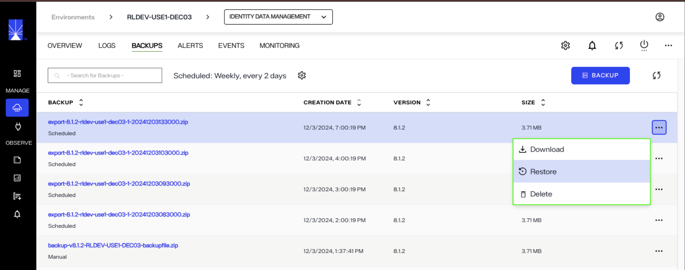

---
keywords:
title: Backup Overview
description: Get a quick introduction to backing up environments in Environment Operations Center.
---
# Backup Overview

You can create and restore backups of your environments in Environment Operations Center. Backups are managed within the detailed view of an environment, under the *Backups* tab. This guide provides an overview of the *Backups* tab and its features.

## Getting started

To navigate to the *Backups* tab for a specific environment, select **Backups** from the top navigation in the environment's detailed view.

This brings you to the *Backups* view that provides a chronological overview of all backups that have been performed on the environment.

## Review backups

From the *Backups* tab, you can review all backups that have been performed on the environment. For each backup, the backup name, creation date, and version are listed.

If you have set a scheduled backup for the environment, a "Scheduled" notification appears at the top of the workspace indicating the frequency and time of the scheduled backup.

For more information on scheduling environment backups, see the [schedule backups](schedule-backup.md) guide.

## Manage backups

You can create backups manually by selecting **Backup** or schedule an automated backup workflow by selecting the gear icon.

For details on creating manual environment backups and restoring backups, see the [create a backup](create-backup.md) guide. For details on scheduling automated environment backups, see the [schedule a backup](schedule-backup.md) guide.

## Restore an existing application

You can restore your backed up application configuration to an existing environment or a new environment. Each backup has an Options (...) menu that allows you to either Download a backup, Restore a backup or Delete a backup.

Selecting Download will download the configuration file of that backup to your system.

To restore an existing application using a backup, click the Options (...) menu and select Restore. 
In the confirmation dialog, confirm that you would like to proceed with the Restore option. After a few minutes, the restore process will complete and the application data will be restored to the backed up version. 

To use the backup in a new environment, download the backup file that you would like to use by clicking the options menu and selecting Download. Next, follow the steps outlined [here](../applications-overview.md#custom-configuration). Note that if you use this backup to restore the application in a new environment, the [endpoint URLs](../endpoints-overview.md) of the application will be different than that of the original application.  

Selecting Delete will permanently delete the backup.

<!-- The workflow to restore a backup can also be initiated by selecting the **Restore** button. For more information on restoring backups, see the [restore a backup](restore-backup.md) guide.

 -->

## Read-only mode

If you have read-only access to the environment, you will still be able to view the list of backups that have been performed and the backup schedule if an automated backup has been created. You will not be able to create new backups or modify existing backups.

The gear icon, **Restore**, and **Backup** buttons will be deactivated and the **Options** (**...**) menu for each backup wil be hidden.

## Next steps

After reading this guide you should have an understanding of how to navigate the *Backups* tab and its main features. To begin creating an environment backup, review the documentation on [creating a backup](create-backup.md).
