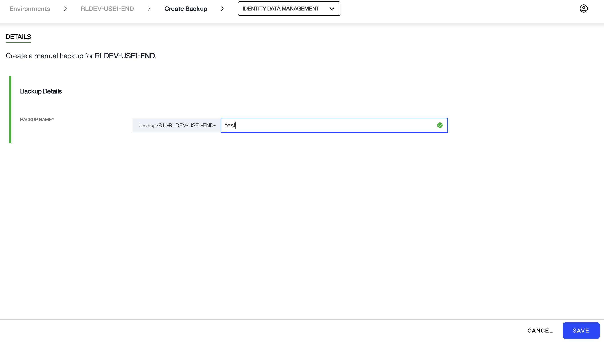
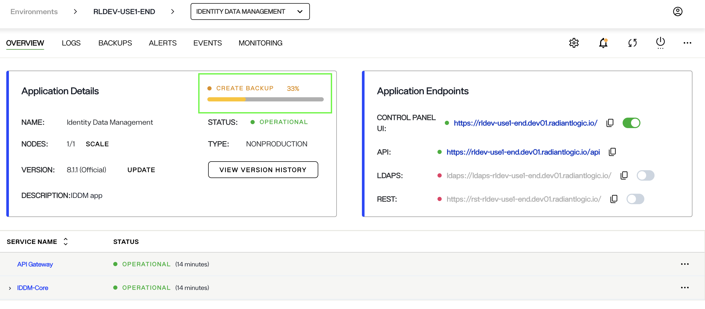
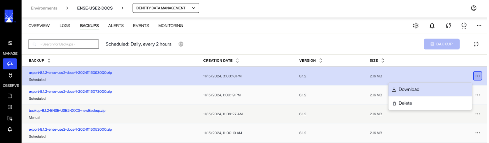

---
keywords:
title: Create an Environment Backup
description: Learn how to manually create backups of applications in Environment Operations Center.
---
# Create an Application Backup

This guide provides an overview of the steps required to create application backups manually. For details on scheduling automatic application backups, see the [schedule backups](schedule-backup.md) guide.

## Getting started

To begin creating a manual backup of an application, open the **Backup** tab and click on the **backup** button.

> Note that the application needs to be running in order for you to create a backup. If your application's status is offline, re-start the application by clicking the start button in order to see the backup option.

## Backup details

On the *Create Backup* screen, the "Backup Name" field must be completed in order to submit the form to create a backup. A unique backup name will automatically generate in the name field. You can adjust the provided name but it must be unique. If a backup with the same name exists, you will not be able to save the backup.

Once you have completed the name field, select **Save** to create the backup.

## Backup confirmation

While the backup is being created, you will return to the main *Backups* tab and a **"Creating Backup"** message is displayed below the name of the new backup.

After the backup process is initiated, you can see a **"Creating application backup"** message on the overview screen of the application.

If the backup was successfully created, you will receive a confirmation message and the new backup will be visible in the list of backups on the main *Backups* screen. Select **Dismiss** to close the message. Download this backup file to store a local copy in your computer. 

If the backup could not be successfully created, you will receive an error message indicating that the backup creation failed and it will no longer be listed on the main *Backups* screen. Select **Dismiss** to close the message and proceed to try creating the backup again.

## Restore a backup

You can restore your backed up Identity Data Management and Identity Analytics applications from the Backups tab. To restore an existing application (Identity Data Management or Identity Analytics application) using a backup, click the Options (...) menu and select Restore. 
In the confirmation dialog, confirm that you would like to proceed with the Restore option. After a few minutes, the restore process will complete and the application data will be restored to the backed up version. 

Selecting Delete will permanently delete the backup. 

In an Identity Data Management application, you can use the back up file to restore a new application. Each backup has an Options (...) menu that allows you to either Download a backup, Restore a backup or Delete a backup. 

Selecting Download will download the configuration file of that backup to your system. The download option is only available in Identity Data Management applications.

To use the backup in a new Identity Data Management application, download the backup file that you would like to use by clicking the options menu and selecting Download. Next, create a new Identity Data Management application and use the downloaded backup file by following the steps outlined [here](../applications-overview.md#custom-configuration). Note that if you use this backup to restore the application in a new environment, the [endpoint URLs](../endpoints-overview.md) of the application will be different than that of the original application.  

## Next steps

After reading this guide you should have an understanding of the steps required to create an application backup. To learn how to schedule automatic application backups, review the guide on [scheduling backups](schedule-backup.md).
