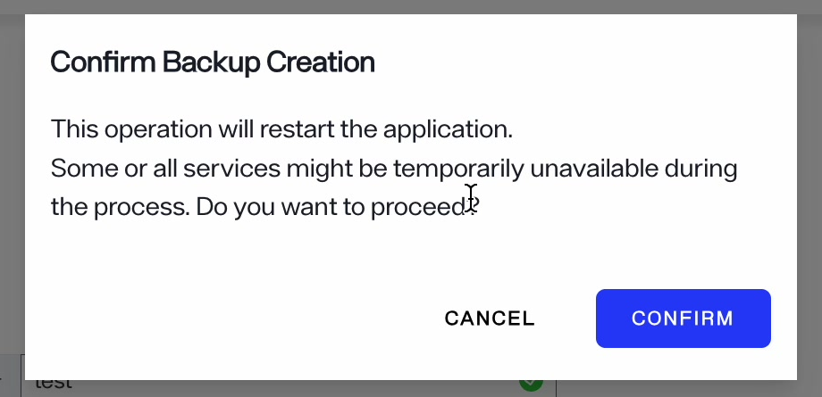

---
keywords:
title: Create an Application Backup
description: Learn how to manually create backups of applications in Environment Operations Center.
---

# Create an Application Backup

This guide explains how to create an application backup manually. For details on scheduling automatic application backups, see the [schedule backups](schedule-backup.md) guide.

## Getting started

To create a backup manually, open the application's **Backups** tab and select **Backup**.

> The application must be running for you to create a backup. If the application is offline, start it with the **Power** icon to see the **Backup** button.

## Backup details

On the *Create Backup* screen, enter a **Backup Name** of up to 20 characters. The name must be unique: you cannot save a backup with the same name as an existing one.

Select **Save**. A *Confirm Backup Creation* dialog warns you that the operation restarts the application and that some or all services might be temporarily unavailable while it runs. Select **Confirm** to create the backup, or **Cancel** to go back.

When Environment Operations Center creates the backup, a confirmation message appears and the new backup appears in the list on the *Backups* tab. Download the backup to keep a local copy on your computer.

If the backup fails, an error message appears and the backup does not appear in the list.

## Restore a backup

To restore, download, or delete a backup, use the backup's **Options** (**...**) menu on the *Backups* tab. See [restore a backup](backup-restore-overview.md#restore-a-backup).

## Next steps

You can now create an application backup. To schedule automatic backups, see [schedule backups](schedule-backup.md).
