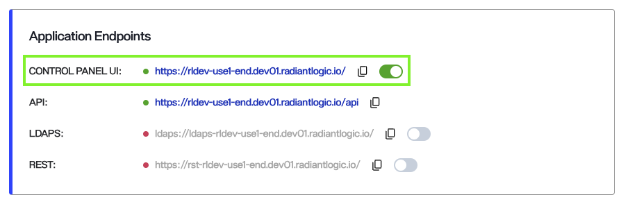
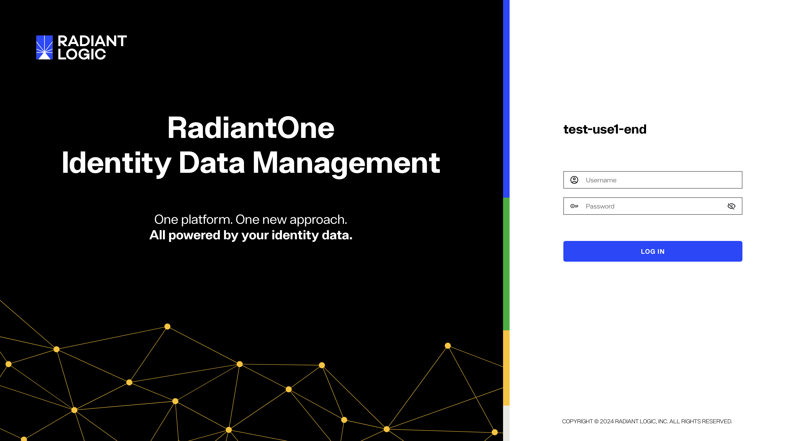
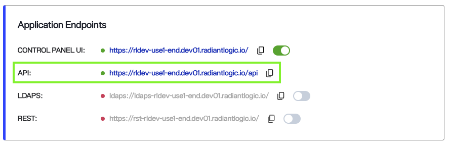
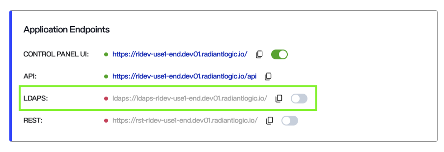
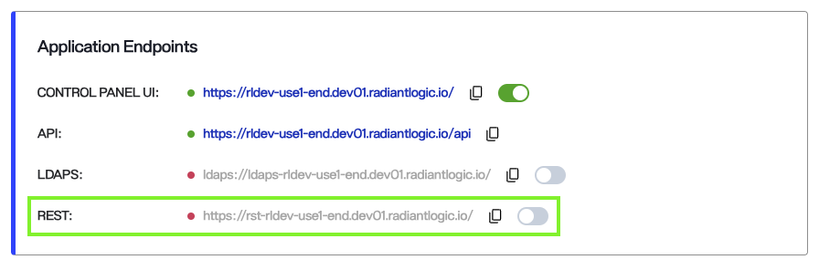
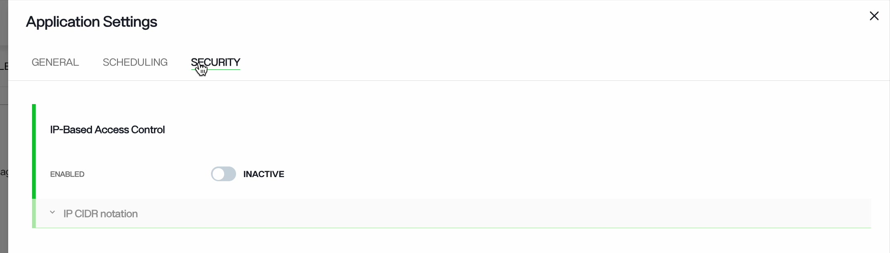
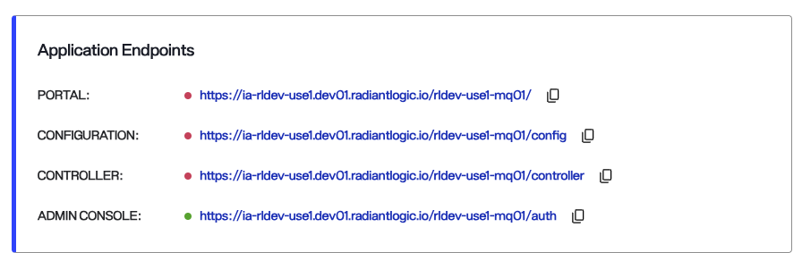

---
keywords:
title: Enable or disable endpoints in an application from its detailed view. 
description: Learn how to enable/disable endpoints of applications in Environment Operations Center.
---

# Application endpoints

Identity Data Management and Identity Analytics applications each have a set of endpoints. This guide describes these endpoints and how to enable or disable them.

The endpoints appear in the *Application Endpoints* panel on the application's *Overview* screen. Use the view toggle in the upper-right corner of the panel to switch between **list view**, which shows one endpoint per row, and **grid view**, which arranges the endpoints as cards. Each endpoint has a status indicator that is green when the endpoint is enabled, and a copy icon so you can copy its URL. Endpoints that can be turned on and off also have a toggle. In grid view, each card shows the endpoint's name and status.

> [!note] You may enable or disable only one endpoint at a time. 

## Identity Data Management Endpoints

Identity Data Management has the following endpoints: **Control Panel UI**, **API**, **LDAPS**, and **REST**. Use the toggle to enable or disable the Control Panel UI, LDAPS, and REST endpoints; the API endpoint is always enabled. When you enable or disable an endpoint, a notification appears and the application's *Overview* screen shows the task's progress. The task takes about 5-10 minutes.

If you try to start a task while another is in progress, an error message explains why. Wait for the current task to finish, then try again.

### Control Panel

The **Control Panel UI** endpoint opens the Identity Data Management Control Panel. It is enabled by default when you create the application.

Select the URL, or copy it into a browser, to open the Control Panel in a new window. Sign in with your credentials.

### API

The **API** endpoint gives access to the Configuration REST API and is always enabled. To use it, copy the URL into your REST client. The RadiantOne service responds to REST requests over HTTP/SOAP.

### LDAPS

The **LDAPS** endpoint gives access to RadiantOne over the LDAPS protocol. It is disabled by default; turn on its toggle to enable it.

When you enable the endpoint, a confirmation message appears, the toggle turns green, and the **Application Details** panel shows "Enabling environment LDAPS endpoint". Enabling takes about 5-10 minutes.

#### Disabling LDAPS

To disable the LDAPS endpoint, turn off its toggle. The **Application Details** panel shows that the endpoint is being disabled.

### REST

The **REST** endpoint gives API access to RadiantOne.

The REST endpoint is disabled by default; turn on its toggle to enable it. When you enable it, the toggle turns green and the **Application Details** panel shows that the task has started.

#### Disabling REST

To disable the REST endpoint, turn off its toggle. The **Application Details** panel shows "Deleting environment REST endpoint".

> If the endpoint's status does not change and the enabling message still appears, refresh the page.

### Enable IP based access control

Identity Data Management applications support IP based access control. Use the Security settings to limit which IP addresses can access the application.

To do so, select the **Settings** (gear) icon in the action bar of the application's detailed view to open *Application Settings*, then open the **Security** tab. Toggle **Enabled** to active and expand **IP CIDR notation** to enter the addresses.

Enter one or more IP addresses that can access the application endpoints. When you confirm the changes, Environment Operations Center restarts the endpoints, and only the allowed IP addresses can access them.

> You can add up to 100 IP addresses to the allow list.

## Identity Analytics Endpoints

Identity Analytics endpoints do not have toggles. Open them through the URLs shown in the *Application Endpoints* panel.

### Portal

This endpoint is used by end-users to log in and access Identity Analytics interfaces.

### Configuration

This endpoint is for the administrator of the Identity Analytics instance to perform technical configurations, including tasks like scheduling batch jobs for data ingestion, configuring proxy and SMTP settings for notifications, Identity Analytics customization, and more. Learn more about the Configuration interface here: [Configuration UI](https://developer.radiantlogic.com/ia/version-1.5/configuration/config-ui/). 

### Controller

This endpoint lets the Identity Analytics administrator configure connectors for data extraction, manage data files once uploaded (e.g., in "import files" and "uploads"), and oversee data ingestion into the Identity Analytics database through "execution plans." Learn more about the Controller interface here: [Controller](https://developer.radiantlogic.com/ia/version-1.5/containers/controller/).

### Admin Console

This is the Keycloak configuration interface used to manage end-user accounts and roles, providing access to the Portal. 

