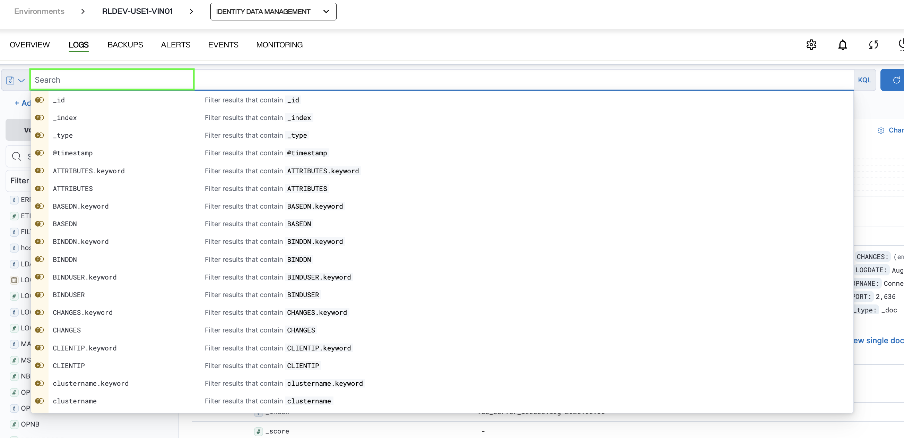
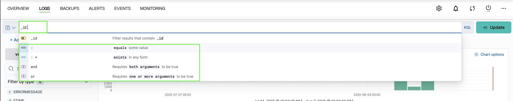
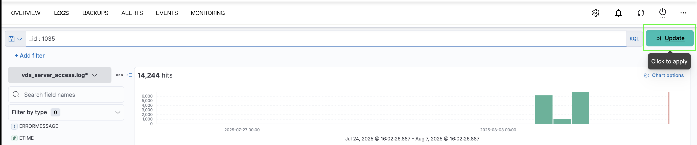
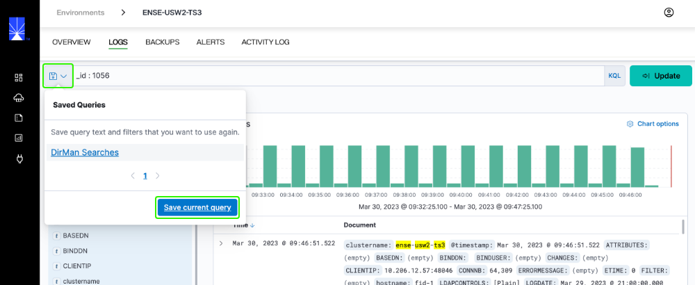
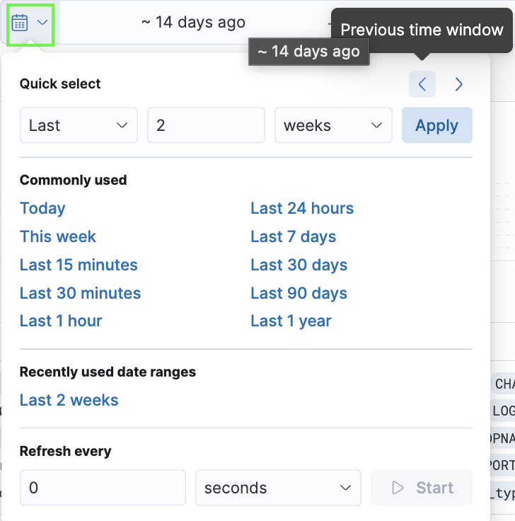
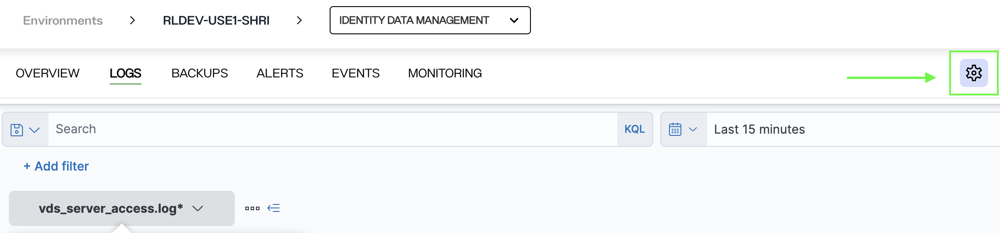
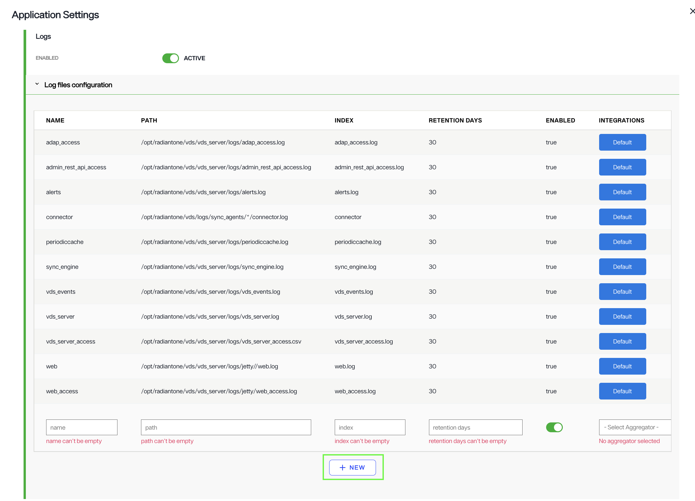
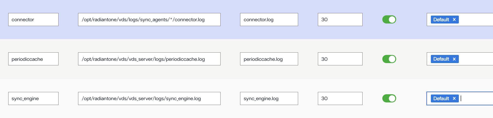
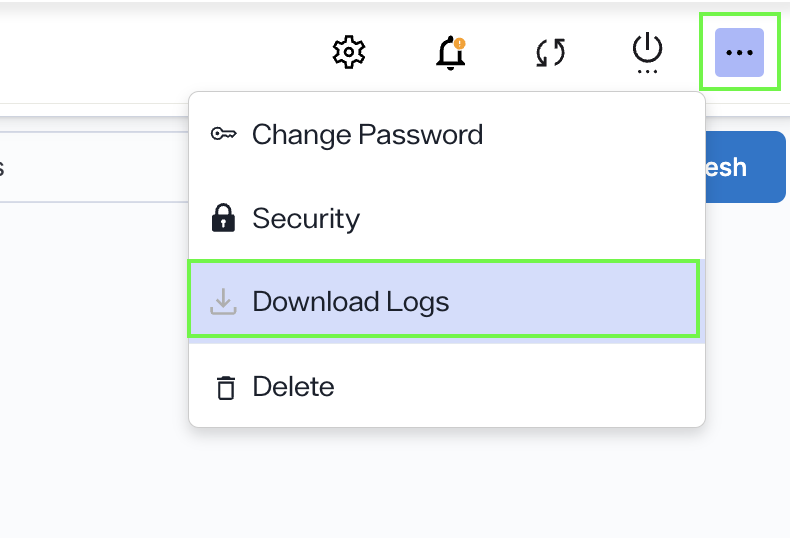

---
keywords:
title: Application Logs
description: Learn how to access and review logs for a specific application in Environment Operations Center. Log files let you monitor activities and troubleshoot errors in your applications. They outline the event description, a date and time stamp of when the event occurred, and the email of the user who triggered the event.
---
# Application Logs

This guide outlines the steps to review logs for a specific application. Log files let you monitor activities and troubleshoot errors in your application. They outline the event description, a date and time stamp of when the event occurred, and the email of the user who triggered the event. The information contained in these logs is helpful if you require assistance from Radiant Logic Support to troubleshoot problems if they arise.

Environment Operations Center is connected to Elastic and displays the Elastic monitoring user interface directly within the Environment Operations Center logging tab. This allows you to review environment logs directly in Environment Operations Center without having to navigate away from the application.

>[!note] For further details on specific log types and the data they provide, see the RadiantOne [logging and troubleshooting](../../../idm/v8.1/troubleshooting/troubleshooting.md) guide.

## Getting started

To navigate to the *Logs* screen for a specific application, select **Logs** from the top navigation in the application's detailed view.

From the logs tab you can filter and search the application logs to review detailed information about application activity.

## Filter and search logs

The search bar allows you to filter log results by field. Select the **Search** bar to expand a list of fields and select a field to filter the log files by.

Select an operator and enter a value to refine the query.

Once you have completed the search filter, select **Update** to display the filtered log files.

To save frequently used queries, select the **Save** icon next to the **Save** bar and select **Save current query**.

Logs can also be filtered by date and time. Select the **Calendar** icon to display the options to filter by quick select, commonly used, or recently used data ranges. There is also an option to set the refresh interval for log results.

Select the **Date and Time** bar to set the date and time to refresh log data. After setting the interval, select **Update** to apply the refresh interval.

## Change log type

To review a different log file, select the **Log File** dropdown and select the log file to review. Once you select the file type, the page will load with the file details.

## Configure Additional Logs

If you find that certain logs are missing from your search results, you may need to configure those log files. To do this, click on the Application settings icon.

Under **Logs**, select **Log files configuration** and then click the **New** button to create a new log configuration. Fill in the necessary details, such as the name, path, index, retention days, and aggregator for the log file.

Here is an example of how you can add configurations for additional logs:

Once you've entered the required information, click the blue checkmark and then click **Save**. After saving the configuration, any log files in that category will appear in your search results.

## Download logs

To download the application logs, click the ellipsis icon in the top-right corner of the page and select "Download Logs."

Next, enter a name for the log file and click the confirm button to proceed with the download. Once the download is complete, a success message will appear, and the logs will be saved as a zip file on your device.

## Next steps

After reviewing this guide you should have an understanding of the steps required to review the log files of a specific application. To learn more about backing up an application, see the [backup and restore](../backup-and-restore/backup-restore-overview.md) documentation.
