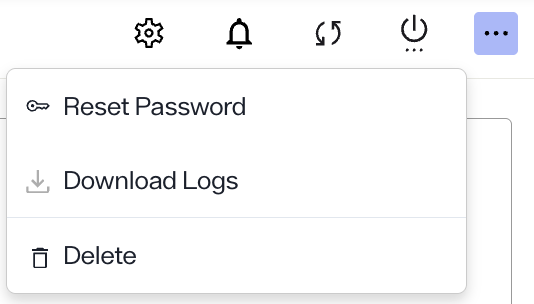
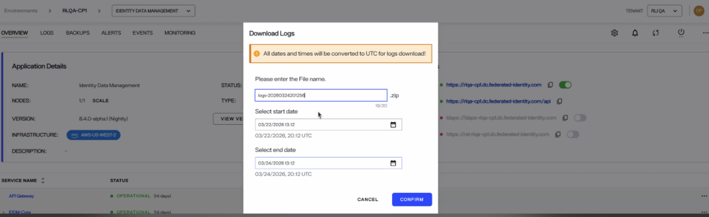
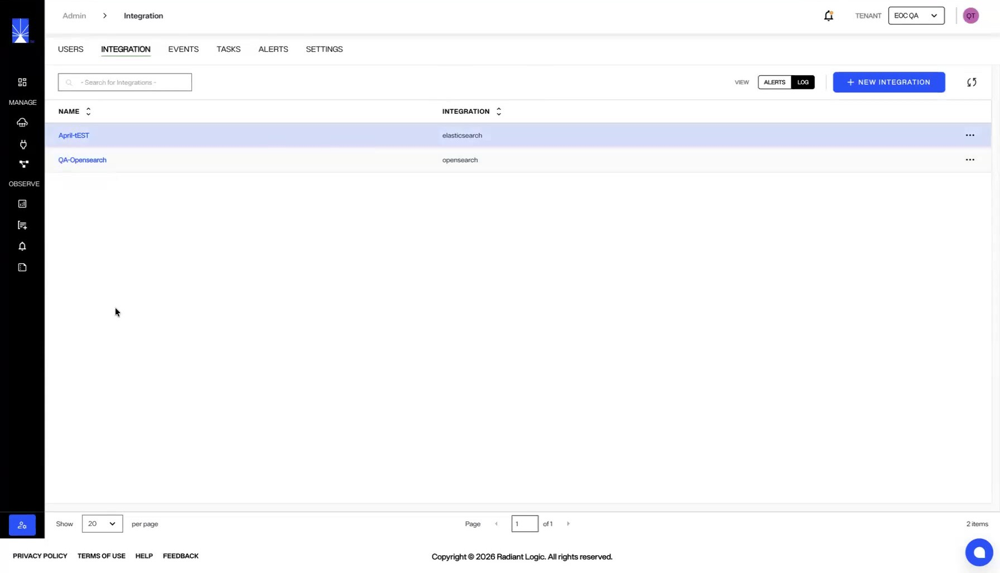

---
keywords:
title: Application Logs
description: Learn how to access and review logs for a specific application in Environment Operations Center. Log files let you monitor activities and troubleshoot errors in your applications. They outline the event description, a date and time stamp of when the event occurred, and the email of the user who triggered the event.
---
# Application Logs

This guide outlines the steps to review logs for a specific application. Log files let you monitor activities and troubleshoot errors in your application. The information contained in these logs is helpful if you require assistance from Radiant Logic Support to troubleshoot problems if they arise.

Environment Operations Center is connected to Elastic and displays the Elastic monitoring user interface directly within the Environment Operations Center logging tab. This allows you to review environment logs directly in Environment Operations Center without having to navigate away from the application.

>[!note] For further details on specific Identity Data Management log types and the data they provide, see the RadiantOne [logging and troubleshooting](../../../../../idm/v8.1/troubleshooting/troubleshooting.md) guide.

## Getting started

To navigate to the *Logs* screen, select **Logs** under **Observe** in the left navigation. Then choose the environment whose logs you want to review from the **Environment** dropdown, and the application from the **Application** dropdown.

From the *Logs* screen you can filter and search the application logs to review detailed information about application activity.

## Filter and search logs

The search bar allows you to filter log results by field. Select the **Search** bar to expand a list of fields and select a field to filter the log files by. Queries are written in KQL.

Select **+ Add filter** below the search bar to build a filter. The panel on the left lists the fields available in the selected log source: use **Search field names** to find a field by name, **Filter by type** to narrow the list to a field type, and **Available fields** to browse them all.

Select **Refresh** at the right end of the search bar to rerun the query.

Select an operator and enter a value to refine the query.

Once you have completed the search filter, select **Update** to display the filtered log files.

To save frequently used queries, select the **Save** icon next to the **Save** bar and select **Save current query**.

Logs can also be filtered by date and time. Select the **Calendar** icon to display the options to filter by quick select, commonly used, or recently used date ranges. There is also an option to set the refresh interval for log results. Select **Show dates** to enter an explicit start and end for the range instead.

Select the **Date and Time** bar to set the date and time to refresh log data. After setting the interval, select **Update** to apply the refresh interval.

## Download Identity Data Management logs

To download logs for Identity Data Management through EOC, follow these steps:

1. Go to the Application Overview page.
2. In the top-right corner, click the "…" option.

    

3. Select Download Logs.
   
    

4. Enter a file name for the log download (the file will be saved as a .zip).
5. Select the start date, end date and time for the logs.
7. Click Confirm. This downloads all Identity Data Management log files for the defined range into a ZIP file automatically.

### Forward logs to an external integration

If you want your logs in your own system, you can forward them to a log integration such as Elasticsearch, OpenSearch, or Splunk.

1. Create the log integration under **Admin > Integrations**.
2. Open the application's log file configuration and add the log integration.

Environment Operations Center then pushes the logs at the configured path — for example, the VDS server logs — to the integration, in addition to making them available in the application.

>[!note] Log forwarding is currently available for the Identity Data Management (IDDM) application only.

## Next steps

After reviewing this guide you should have an understanding of the steps required to review the log files of a specific application. To learn more about backing up an application, see the [backup and restore](../backup-and-restore/backup-restore-overview.md) documentation.

