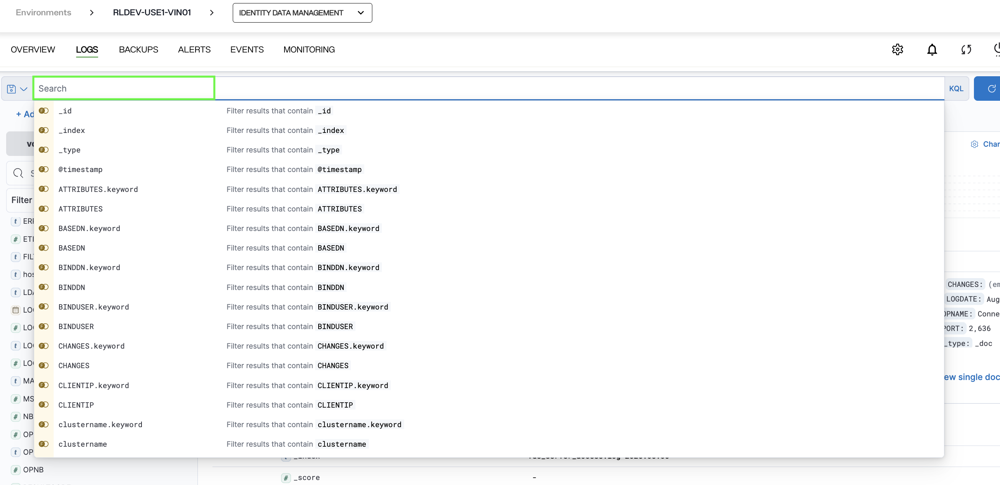
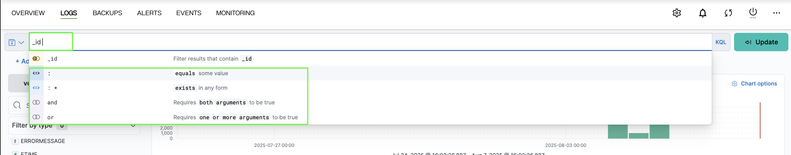
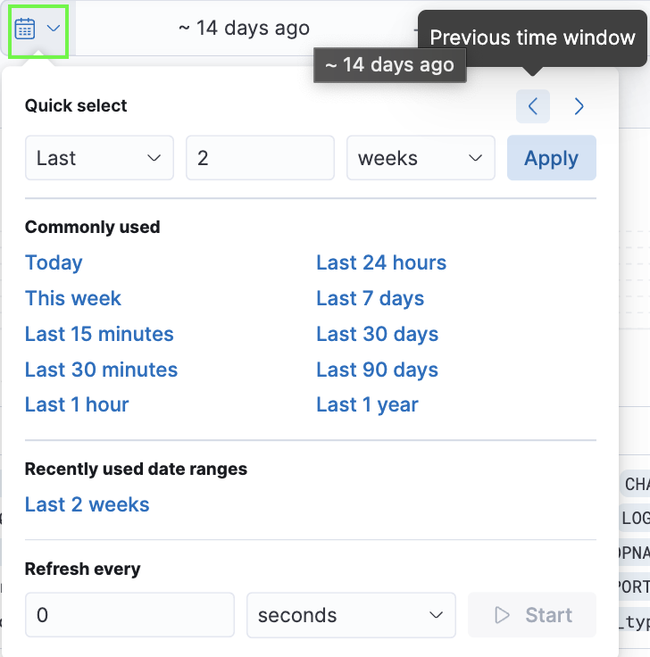
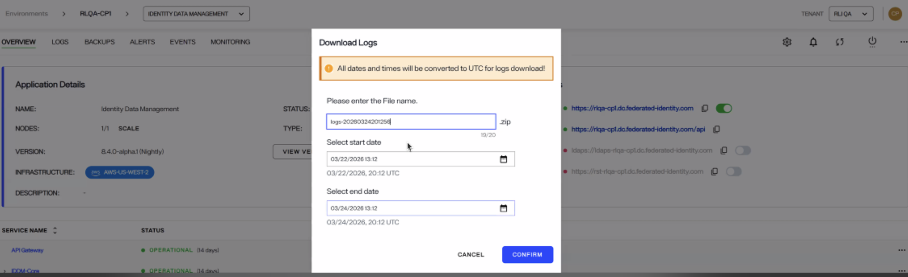
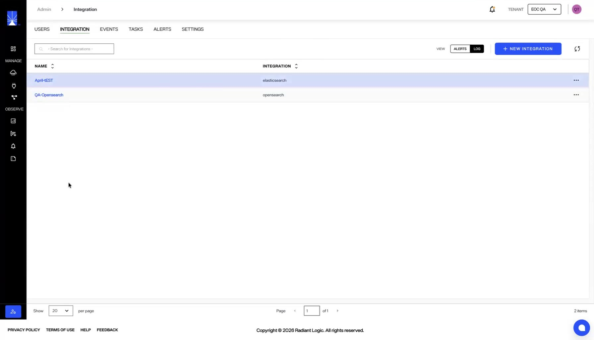

---
keywords:
title: Application Logs
description: Learn how to access and review logs for a specific application in Environment Operations Center. Log files let you monitor activities and troubleshoot errors in your applications. They outline the event description, a date and time stamp of when the event occurred, and the email of the user who triggered the event.
---

# Application Logs

This guide explains how to review logs for a specific application. Use log files to monitor activity and troubleshoot errors in your application. Radiant Logic Support may also ask for this information when helping you troubleshoot a problem.

Environment Operations Center connects to Elastic and embeds the Elastic log search interface, so you can review application logs without leaving Environment Operations Center.

>[!note] For further details on specific Identity Data Management log types and the data they provide, see the RadiantOne [logging and troubleshooting](../../../../../idm/v8.1/troubleshooting/troubleshooting.md) guide.

## Getting started

You can search application logs from two places:

- The **Logs** tab in an application's detailed view, which shows the logs of that application.
- The **Logs** screen under **Observe** in the left navigation. Select the environment from the **Environment** dropdown and the application from the **Application** dropdown.

Both places offer the same search and filter tools, described in the rest of this guide.

### Select a log source

Each log file the application writes is a separate log source. Select the log source dropdown above the field list to choose which log to search. For an Identity Data Management application, the log sources include *vds_server.log\**, *vds_server_access.log\**, *vds_events.log\**, *sync_engine.log\**, *periodiccache.log\**, *scim.log\**, *web.log\**, *web_access.log\**, and *internal-container.log\**.

The field list below the dropdown shows the fields in the selected log source. Use **Search field names** to find a field by name and **Filter by type** to narrow the list to a field type.

After you run a search, the screen shows the number of matching entries (hits) in a chart, followed by a table that lists each entry's time and contents.

## Filter and search logs

Use the search bar to filter log entries by field. Select the **Search** bar to expand a list of fields, then select the field to filter by. Write queries in KQL.

Select **+ Add filter** below the search bar to build a filter.

Select **Refresh** at the right end of the search bar to rerun the query.

Select an operator and enter a value to refine the query.

When you finish the filter, select **Update** to show the filtered log entries.

To save a query you use often, select the **Save** icon at the left end of the search bar and select **Save current query**.

To filter logs by date and time, select the **Calendar** icon. Choose a quick select, commonly used, or recently used date range, or set the refresh interval for the results. Select **Show dates** to enter an explicit start and end for the range instead. The default range is *Last 15 minutes*.

After you set the interval, select **Update** to apply it.

## Download Identity Data Management logs

To download Identity Data Management logs from Environment Operations Center:

1. Open the application's *Overview* screen.
2. Select the **Download logs** icon in the action bar at the right of the tab row, to the left of the **Settings** (gear) icon.

3. Enter a file name for the download. Environment Operations Center saves the logs as a ZIP file.

    

4. Select the start date, end date and time for the logs.
5. Select **Confirm**. Environment Operations Center downloads all Identity Data Management log files for the range as a ZIP file.

### Forward logs to an external integration

To keep your logs in your own system, forward them to a log integration such as Elasticsearch, OpenSearch, or Splunk.

1. Create the log integration under **Admin > Integrations**.
2. Open the application's log file configuration and add the log integration.

Environment Operations Center then pushes the logs at the configured path — for example, the VDS server logs — to the integration, in addition to making them available in the application.

>[!note] Log forwarding is currently available for Identity Data Management applications only.

## Next steps

You can now review the log files of a specific application. To learn about backing up an application, see the [backup and restore](../backup-and-restore/backup-restore-overview.md) documentation.

