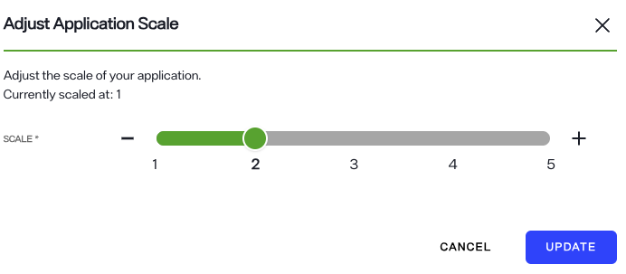
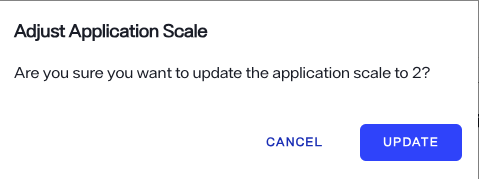
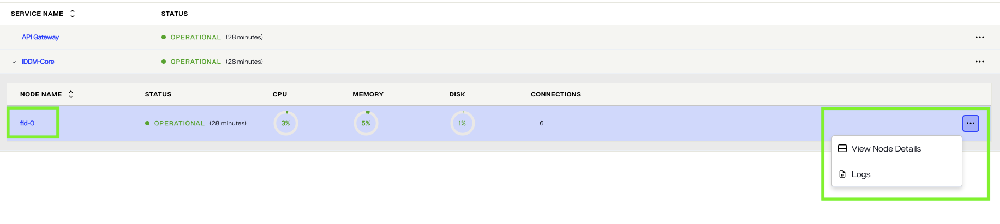
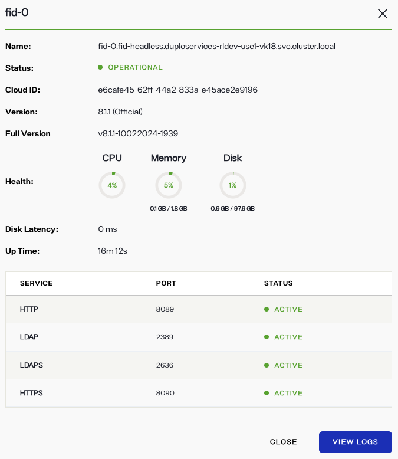
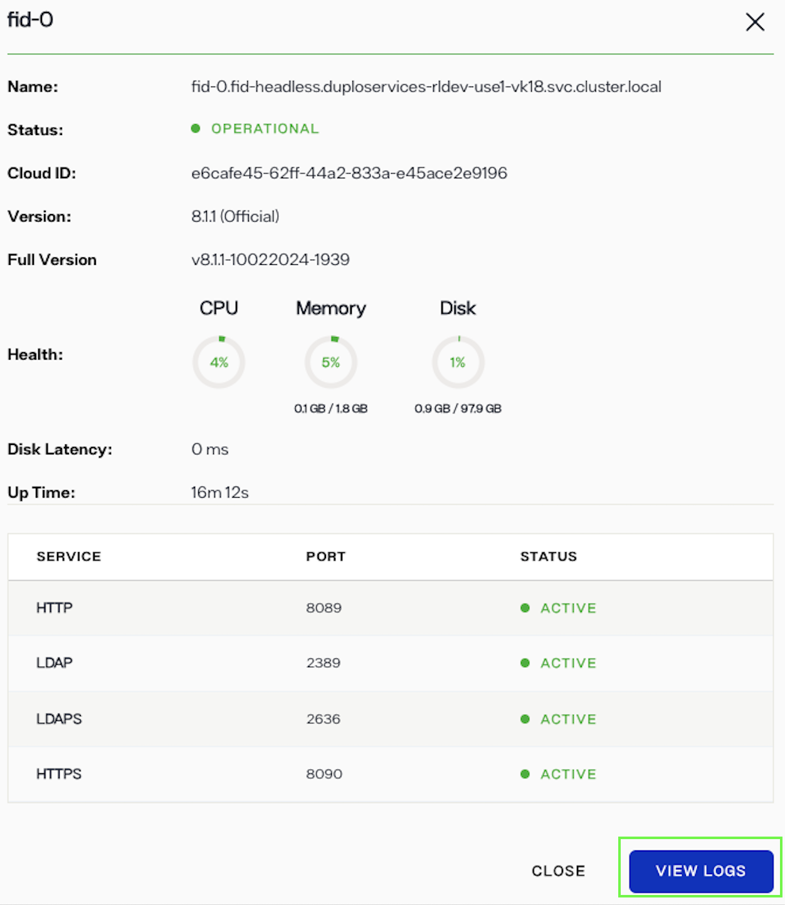

---
keywords:
title: Update and monitor environment nodes
description: Learn how to adjust the number of nodes in a RadiantOne cluster and to monitor the status details of a specific node.
---
# Update and monitor environment nodes

A node is an individual instance of a service in a RadiantOne cluster. When an application has multiple nodes, a load balancer distributes the workload across them. Each tenant in Environment Operations Center has a set number of nodes based on its license plan. You can scale the number of nodes in an application up or down, and all environments share the tenant's total.

This guide explains how to adjust the number of nodes in an application and how to monitor a specific node. On the application's *Overview* tab, expand a service to see the status of its nodes. For an Identity Data Management application, the nodes of the *IDDM-Core* service, such as *fid-0*, also show CPU, memory, and disk usage and the number of connections. Each node also has a details view with more information about its status and health.

## Adjust number of nodes

To set the number of nodes in an application, select **Scale** next to the **Nodes** count in the *Application Details* panel.

In the *Adjust Application Scale* dialog, use the slider, or the minus (**-**) and plus (**+**) signs on either side of it, to set the number of nodes. The slider starts at the application's current number of nodes.

Select **Update** to confirm your selection.

A message shows that scaling is in progress. When scaling completes, the application's number of nodes matches your selection.

## View node details

To open a node's details, expand its service on the *Overview* tab, then select the node name or select **View Node Details** from the node's **Options** (**...**) menu.

### Node details

The node details dialog shows the following information:

| Node Details | Definition |
| ------------ | ---------- |
| Name | The name of the node. |
| Status | Indicates if the node is operational, experiencing a partial outage, or experiencing a full outage. Displays as "Healthy", "Warning", or "Outage". |
| Cloud ID | The unique ID of the node within the cluster of an environment. |
| Version | The environment version number. |
| Health | The status of the CPU and quantity used of memory and disk space. |
| Disk Latency | The node performance. |
| Up Time | How long the application has been running. |
| Services | Lists the internal ports and their statuses. |

## View node logs

Each node has log files with more information about its health and status alerts. To open them, select **View Logs** in the node details dialog, or select **Logs** from the node's **Options** (**...**) menu. Select **Close** to close the node details dialog.

## Next steps

You can now review the status and health of specific nodes. For information on reviewing application logs, see [application logs](logging/application-logs.md).
