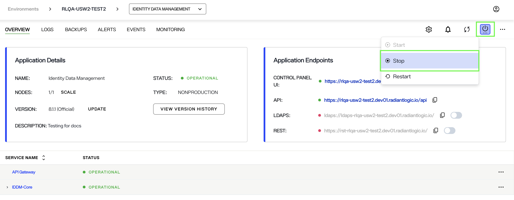
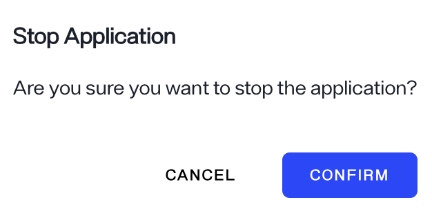
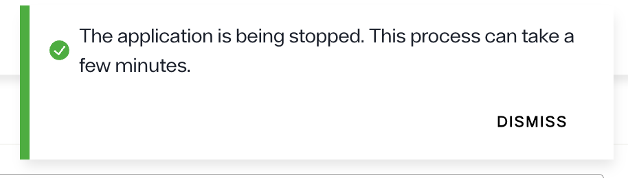
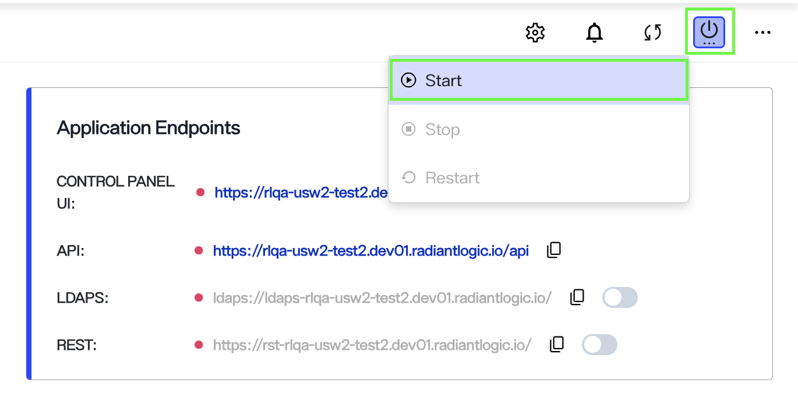
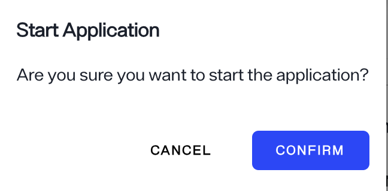
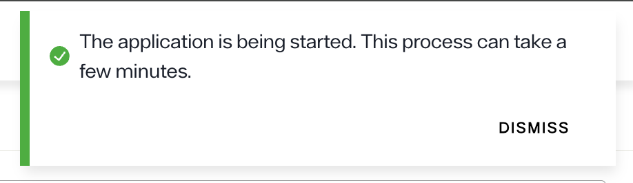
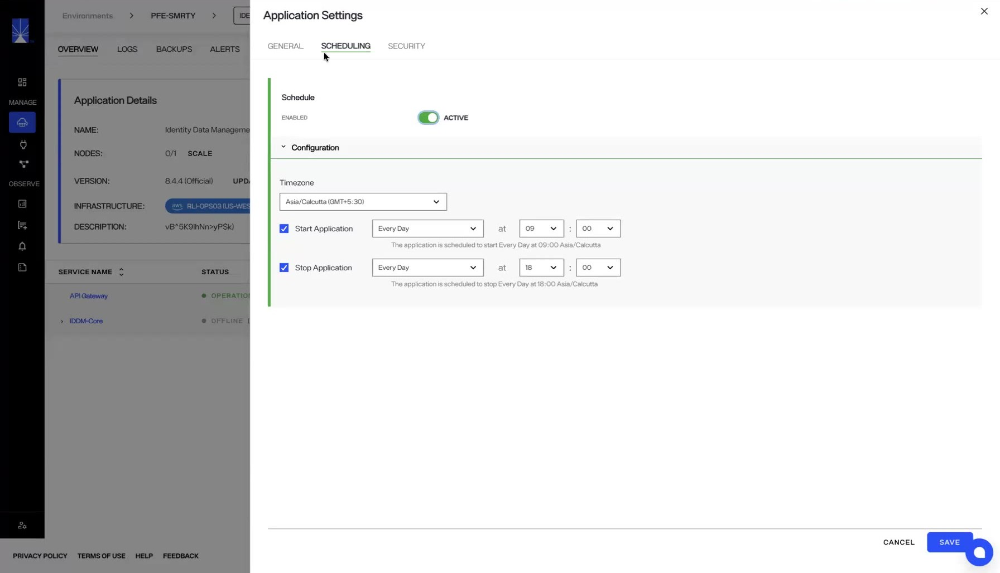

---
keywords:
title: Stop and restart an Application
description: Learn how to stop and restart an application in Environment Operations Center.
---
# Stop and restart an Application

This guide outlines the required steps to stop an application while on the *Environments* home screen in Environment Operations Center.

> [!note] Only non-production applications can be stopped by users. To stop a production application, please contact Radiant Logic.

## Select the application

From the *environment* home screen, locate the application you would like to stop from the list of applications. Go the specific application and, on the right top corner, click on the power icon.

From the list of options select **STOP** to stop the application.

> [!note] When an application is stopped, no data is lost. The application can be started back to the state before it was stopped.

A pop up appears asking to confirm Stopping the application, click **CONFIRM** to stop the application, or click **CANCEL** to cancel the operation.

In the upper-right corner of the application overview page, a message indicates the application is being stopped.

When the application is successfully stopped, the status of the application changes to **OFFLINE**.

## Start application

> [!note] Starting an application is only available when an application has been created and stopped.

To start the selected application, click the power icon in the upper-right corner of the *Overview* page.
From the options listed, click **Start**.

A message prompts you to confirm the **Start application**. Click **Confirm** to start the application, or to go back click **Cancel**.

A "Starting application" message displays on the application *Overview* page.

> [!note] The process of starting an application may take up to 10 minutes.

## Confirmation

After a successful restart of the application, status of the application turns to **OPERATIONAL** on the application *Overview* page.

## Schedule start and stop

You can schedule an application to start and stop automatically at set times. Scheduling is useful when you want to conserve resources during periods when the apps are not actively used.

To set a schedule, define the time window for when the application should start and when it should stop.

- Scheduling option is available to all three applications: Identity Data Management, Identity Analytics, and Identity Observability.
- Only tenant admins and environment admins can create or change a schedule.

