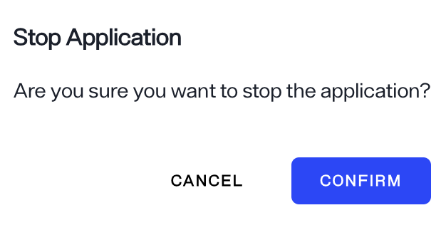
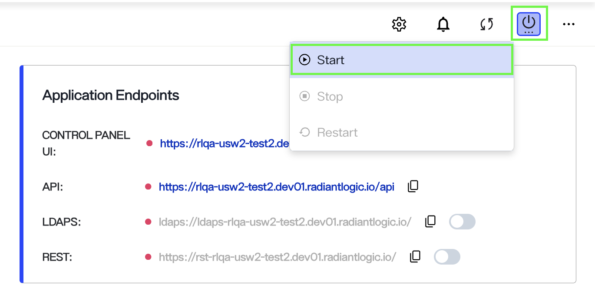
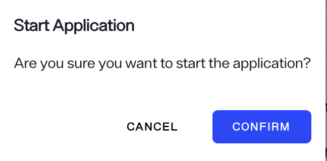
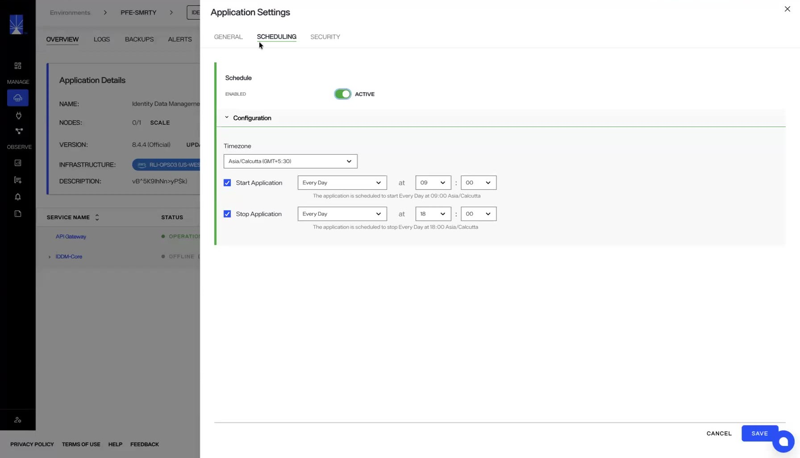

---
keywords:
title: Stop and start an Application
description: Learn how to stop and start an application in Environment Operations Center.
---
# Stop and start an Application

This guide explains how to stop and start an application, and how to schedule automatic starts and stops.

> [!note] You can stop only non-production applications. To stop a production application, contact Radiant Logic.

## Select the application

On the *Environments* screen, find the application you want to stop and open it. Select the **Power** icon in the action bar in the upper-right corner.

Select **Stop**.

> [!note] Stopping an application does not lose any data. When you start it again, it returns to the state it was in before you stopped it.

In the confirmation dialog, select **Confirm** to stop the application, or **Cancel** to go back.

A message in the upper-right corner of the *Overview* screen shows that the application is stopping. When it stops, the application's status changes to **Offline**.

## Start application

> [!note] You can start an application only after it has been stopped.

To start the application, select the **Power** icon in the upper-right corner of the *Overview* screen, then select **Start**.

In the confirmation dialog, select **Confirm** to start the application, or **Cancel** to go back.

A "Starting application" message appears on the *Overview* screen.

> [!note] Starting an application can take up to 10 minutes.

## Confirmation

When the application starts, its status changes to **Operational** on the *Overview* screen.

## Schedule start and stop

You can schedule an application to start and stop automatically at set times. Use scheduling to conserve resources during periods of low use, for example over a weekend or while you are away. Stopping the application also reduces the risk of unattended changes.

Scheduling is available for Identity Data Management, Identity Analytics, and Identity Data Platform applications. Only tenant admins and environment admins can create or change a schedule.

### Open the Scheduling tab

1. In the left navigation bar, select **Environments**.
2. Open the environment that contains the application.
3. Open the application to display its details.
4. Select the **Settings** (gear) icon to open *Application Settings*, then select the **Scheduling** tab.

### Set the schedule

1. Set **Enabled** to **Active**.
2. Under **Configuration**, select a **Timezone**.
3. Select **Start Application**, then choose a frequency (for example, **Every Day**) and a start time (hour and minute).
4. Select **Stop Application**, then choose a frequency and a stop time.
5. Select **Save**.

The tab confirms your settings below each field — for example, *The application is scheduled to start Every Day at 09:00* and *The application is scheduled to stop Every Day at 18:00*.

