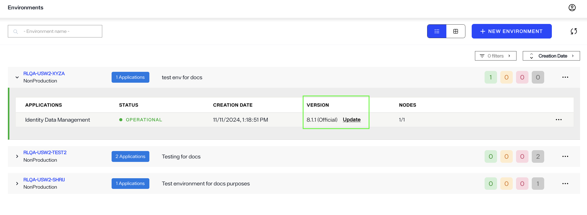
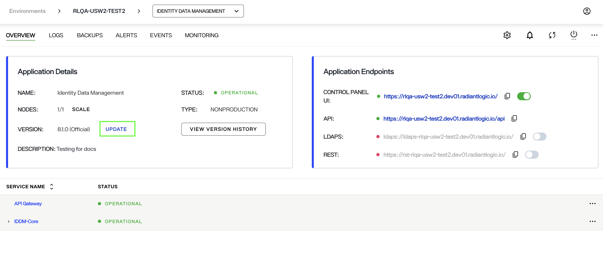
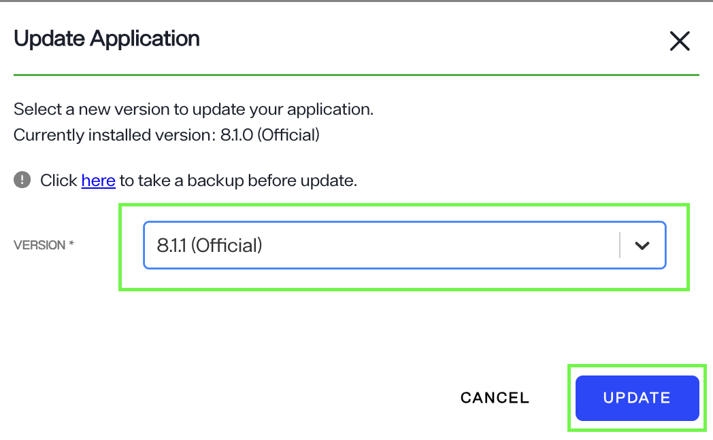
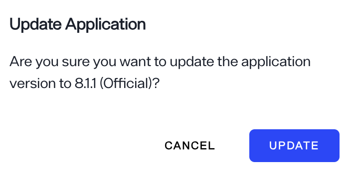
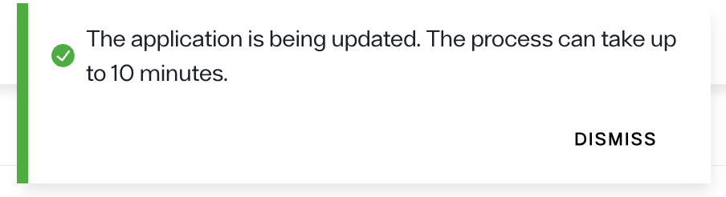
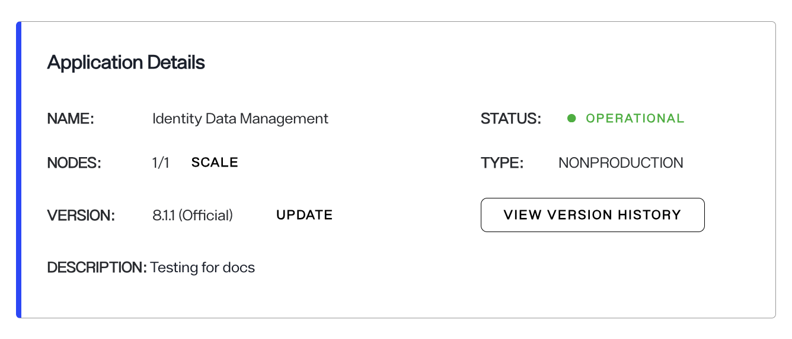
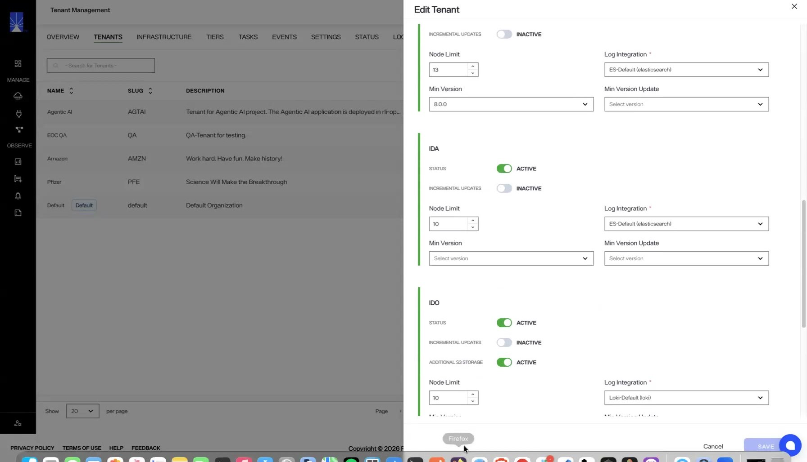
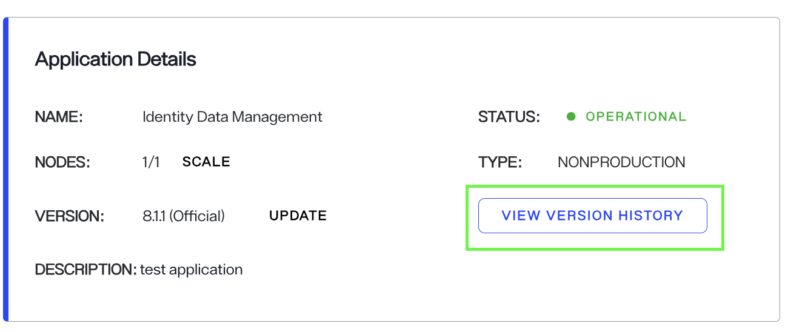
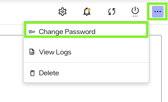

---
keywords:
title: Update an application
description: Learn how to manually update the RadiantOne application  version running in an environment.
---
# Update an application

When version updates are available for an application running in an environment in your Environment Operations Center instance, you will see an *Update* notification. You can update your application from the **Application Details**
screen. 
> [!note] Before getting started, make sure you have your current version of Environment Operations Center and the required number of RadiantOne nodes to display for each environment that requires updating.

 When an application requires updating, an **Update** message appears next to the application version number under "Application Details" and also under the selected environment in environments page.

> [!note] Ensure that your application is active and hasn't stopped. If the status of your application is OFFLINE, you will not see the Update option for your application unless to restart the application.  

### Launch update

Begin the application update workflow by selecting the **Update** message. The designated application page displays, and the **UPDATE** option is available next to the **VERSION** number. Selecting update opens the **Update** dialog box.

### Select a version number

 To update your application, select the next available version number that is ahead of your current environment version. Your currently installed version number is displayed just above the dropdown menu for reference.

> [!note] Application versions can only be increased incrementally. You cannot select a version that is more than one level ahead of your current version.

Once you have set the correct version number, click **Update**. In the next dialog, click **UPDATE**.  The update process typically takes around 10 minutes. To quit the update and return to the main *Environments* screen, select **Cancel**.

### Application update confirmation

After selecting **Update**, the status of the application being updated displays as "UPDATE APPLICATION". A confirmation message displays, indicating that the environment is being updated.

If the application updates successfully, a success notification displays, and the application's status changes to "Operational".

If an environment update is unsuccessful, an error notification displays, and the environment's status changes to "**Update Failed**".

### Incremental updates

When incremental updates are enabled for an application, you cannot skip versions. To reach a higher version, you update through each intermediate version in order. When incremental updates are disabled, you can update directly to any available version.

> [!note] Incremental updates configured for each application at the tenant level. Contact Radiant Logic to enable the feature.

## Previous updates

You can view updates previously applied to an application from the *Version History*, located within a specific application's details view.

To navigate to an application's details section, select the environment name from the *Environments* home screen.

This brings you to the *Overview* screen. From here, select **View Version History** to open the *Version History* dialog.

The *Version History* dialog displays a chronological list of all previous updates including the version number, the date the update was applied, and the user who applied the update.

### Revert to a previous version

To be able to revert to a previous application update, you must have first created a backup of the environment after it was updated. For details on creating backups, see the [create a backup](backup-and-restore/create-backup.md) guide.

To revert to a previous update, follow the same steps to restore an environment backup. Ensure the version number of the back up matches the version number that you would like to restore the environment to.

## Update Super User Credentials

When an environment is created where the RadiantOne Identity Data Management product is installed, the Super User credentials are defined.  To update these credentials in Environment Operations Center,  select the environment name > Identity Data Management application from the *Environments* home screen.
Choose the **Change Password** option from the "..." menu.

Enter the new password, confirm the value and click **Apply Password**. You can click *Generate* to autogenerate a password as an alternative to entering your own value. If you choose to auto-generate a value, remember to click the *Copy to Clipboard* icon to share the new value with your RadiantOne Adminstrator.

