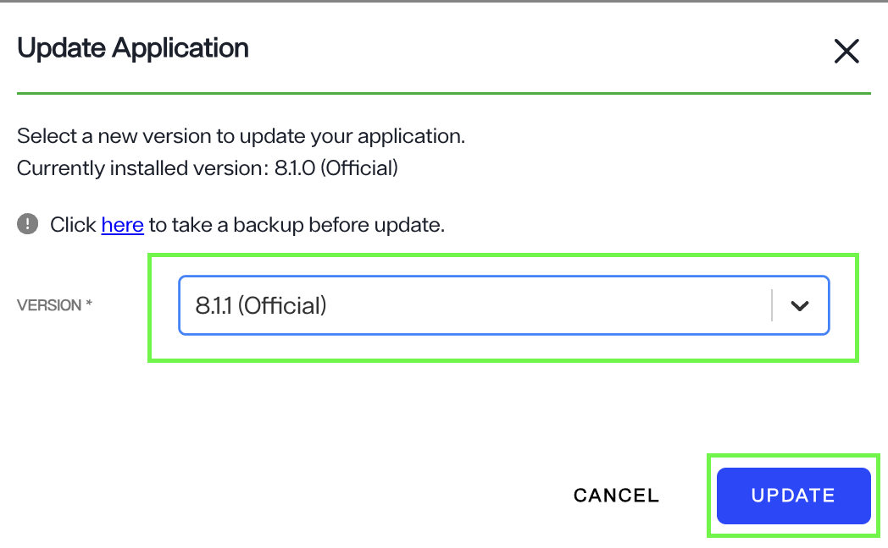
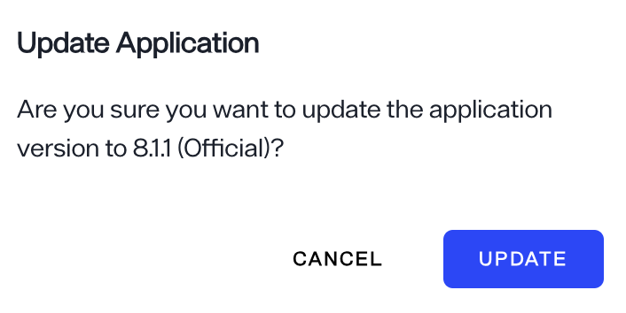
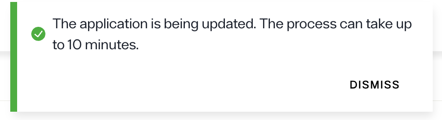

---
keywords:
title: Update an application
description: Learn how to manually update the RadiantOne application  version running in an environment.
---
# Update an application

When a version update is available for an application, Environment Operations Center shows an *Update* notification. Update the application from its **Application Details** panel.
> [!note] Before you start, make sure you know your current version and have the required number of RadiantOne nodes for each environment you are updating.

When an application needs an update, an **Update** message appears next to the version number in the *Application Details* panel and under the environment on the *Environments* screen.

> [!note] The application must be running. If its status is *Offline*, the **Update** option does not appear until you restart the application.

### Launch update

Select the **Update** message. The application's *Overview* screen opens with an **Update** option next to the **Version** number. Select **Update** to open the *Update* dialog.

### Select a version number

Select the next available version after your current version. The dialog shows your current version above the dropdown for reference.

Select **Update**, then select **Update** again in the confirmation dialog. The update usually takes about 10 minutes. To cancel the update and return to the *Environments* screen, select **Cancel**.

### Application update confirmation

While the update runs, the application's status shows "UPDATE APPLICATION" and a confirmation message appears.

When the update succeeds, a success notification appears and the application's status changes to "Operational".

If the update fails, an error notification appears and the application's status changes to "**Update Failed**".

## Previous updates

To view updates previously applied to an application, open the application's *Overview* screen and select **View Version History** next to the version number in the *Application Details* panel.

The *Version History* dialog lists all previous updates in order, with the version number, the date of the update, and the user who applied it.

### Revert to a previous version

To revert to a previous version, you need a backup that you created after the application was updated to that version. For details on creating backups, see the [create a backup](backup-and-restore/create-backup.md) guide.

To revert, [restore the backup](backup-and-restore/backup-restore-overview.md#restore-a-backup). Make sure the backup's version matches the version you want to restore.

## Update credentials

You define the Super User credentials when you create an Identity Data Management application. To change them, open the application from the *Environments* screen and select **Reset Password** from the **Options** (**...**) menu.

Enter the new password, confirm it, and select **Apply Password**.
