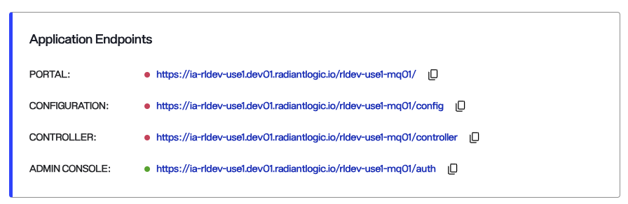
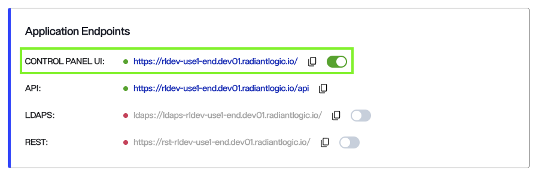
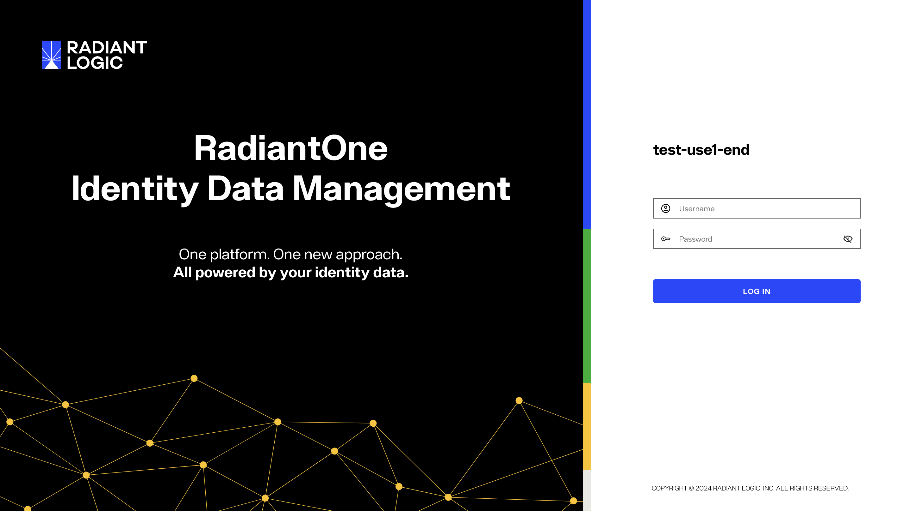
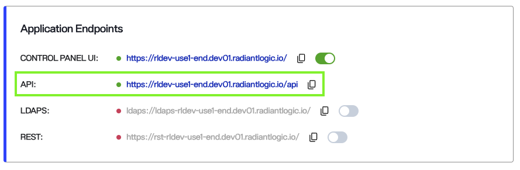
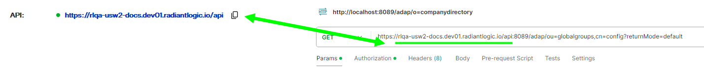
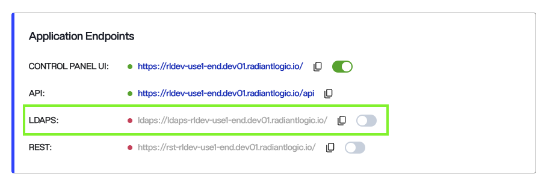
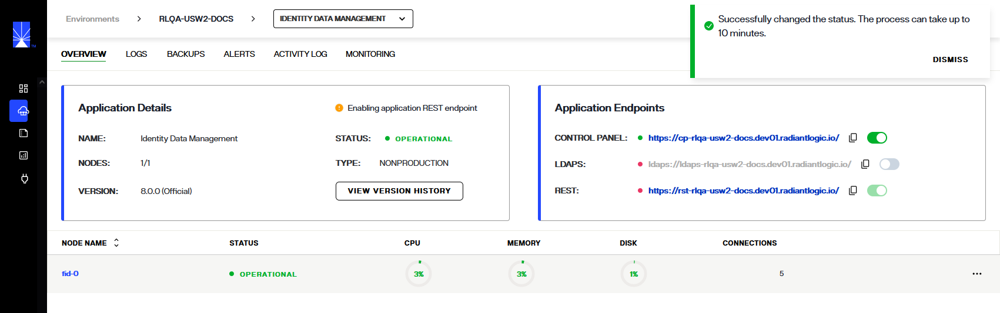
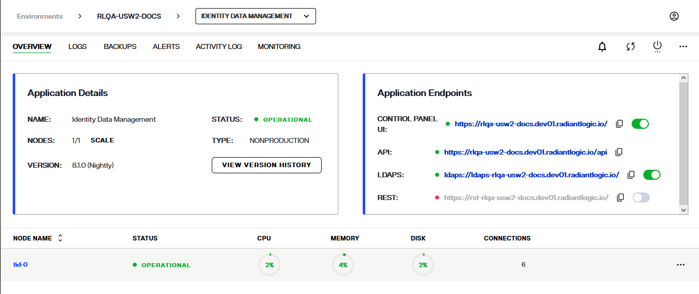

---
keywords:
title: Enable/Disable Endpoints in an Environment from its Detailed View
description: Learn how to enable/disable endpoints of environments in Environment Operations Center.
---

# Application endpoints

The Environment Operations Center has various endpoints for Identity Data Management and Identity Data Analytics applications. This document provides an overview of these
endpoints and how they can be disabled or enabled as required.

> [!note] Enabling/Disabling endpoints should only be done one endpoint at a time.

## Identity Data Management Endpoints

## Control Panel

The **CONTROL PANEL UI** endpoint provides access to the Main Control Panel of FID and is enabled by default after the environment is created.

Click the URL directly or copy and paste it in a browser to opens control panel in a new window. Login with your credentials to view the control panel.

## API

The REST API is enabled by default. To use this endpoint, copy it and paste it into the URL field of your REST client.
The RadiantOne service can respond to REST requests via HTTP/SOAP.

## LDAPS

The **LDAPS** endpoint provides access to RadiantOne through LDAPS protocol.

The LDAPS is disabled by default, and can be enabled by using toggle button.

When the endpoint is enabled, a confirmation message appears, the toggle turns green, and a message appears on the **Environment Details** panel that indicates "Enabling environment LDAPS endpoint".
The endpoint enabling process takes about 5-10 minutes for an endpoint to be successfully enabled.

### Disabling LDAPS

To disable the LDAPS endpoint, toggle the LDAPS endpoint (which is green) off.

A message appears on the Environment Details Panel that says, "Deleting environment LDAPS endpoint".

## REST

The **REST** endpoint provides API access to RadiantOne.

The REST endpoint is disabled by default, and can be enabled by using toggle button.

When the endpoint is enabled, the toggle turns green and a message appears on the **Environment Details** panel that indicates "Enabling environment REST endpoint".

The endpoint enabling process takes about 5-10 minutes for an endpoint to be successfully enabled.

### Disabling REST

To disable the REST endpoint, toggle the REST endpoint (which is green).

A message appears on the Environment Details Panel that says, "Deleting environment REST endpoint".

> If the status of the endpoint does not change and the enabling message still sppears, refresh the envrionments page.

## Identity Data Analytics Endpoint 

Unlike Identity Data Management, Identity Analytics endpoints do not have a toggle option and are accessible through the URLs displayed in your account. 

**Portal**: This endpoint is used by end-users to log in and access Identity Analytics interfaces.

**Configuration**: This endpoint is for the administrator of the Identity Analytics  instance to perform technical configurations, including tasks like scheduling batch jobs for data ingestion, configuring proxy and SMTP settings for notifications, Identity Analytics customization, and more. Learn more about the Configuration interface here: [Configuration UI](https://developer.radiantlogic.com/ia/version-1.5/configuration/config-ui/). 

**Controller**: This endpoint enables the IDA administrator to configure connectors for data extraction, manage data files once uploaded (e.g., in "import files" and "uploads"), and oversee data ingestion into the IDA database through "execution plans." Learn more about the Controller interface here: [Controller](https://developer.radiantlogic.com/ia/version-1.5/containers/controller/).

**Admin Console**: This is the Keycloak configuration interface used to manage end-user accounts and roles, providing access to the Portal. 
