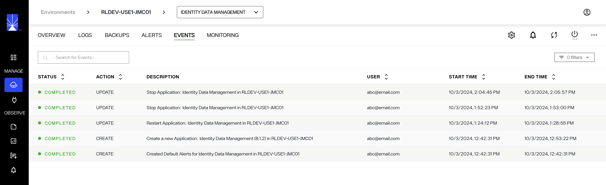
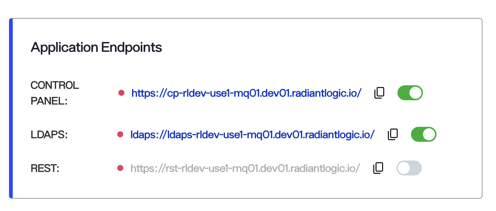

---
keywords:
title: Application Details
description: Get a quick introduction to navigating applications in Environment Operations Center. This includes where to see an overview, how to access logs, how to create backups, how to configure alerts and where to see the activity log.
---

# Application details

Each environment has a detailed view where you can see further information about the installed application(s), monitor application status, and perform various operations on the application. This guide outlines the detailed view of an application as seen in the application *Overview* screen. For an overview of the *Environments* screen that lists all available environments, see the [environments overview guide](../environment-overview/environments.md).

## Getting started

To navigate to the detailed view of an application, select an application name from one of the environments displayed on the *Environments* screen.

This brings you to the application's *Overview* screen that displays a summary of the environment details and operation statuses. Further monitoring and updating tools for the application are accessible from the navigation bar located at the top of the page.

## Top navigation

A navigation bar is located at the top of the *Overview* screen and is visible from all tabs in the environment details view. The top navigation allows you to access several monitoring and updating tools through the following tabs:

- Overview
- Logs
- Backups
- Alerts
- Events
- Monitoring

### Logs

The *Log* tab allows you to view an environment's log details.

For further details on reviewing environment logs, see the [Environment Logs](../logging/environment-logs.md) guide.

### Backups

From the *Backups* tab, you can save a backup of the current environment configuration and view previous backups.

For information on managing your environment backups, refer to the [backup and restore documentation](../backup-and-restore/backup-restore-overview.md).

### Alerts

The *Alerts* tab provides an overview of all alerts that have been triggered for the environment including the alert message, the channel the alert was sent to, date, and status.

For details on creating environment alerts, see the [alert management](./alert-management-overview.md) guide.

### Events

Under the *Events* tab, you can view a list of all events related to an application. Each event has a corresponding time and date stamp of when it occured and the user associated with the event is also listed.

## Application operations

In the right corner of the navigation menu, you can see:

* **Settings** icon that lets you change application settings
* **Bell** icon that shows you alerts related to the application
* **Refresh** icon that lets you refresh and display the most up-to-date details for the application
* **Power** icon that lets you start, stop, or restart application
* **Options** (**...**) icon that lets you change password, view logs or delete the application

To learn how to update or delete the environment, review the respective [delete application](delete-environment.md) or [updated application](update-environment.md) guides. For details on monitoring and adjusting nodes, see the [update and monitor nodes](node-details.md) guide.

## Application details

The *Application Details* section outlines the environment name, status, nodes, type, version, and description. In addition to viewing the application details, you can also perform these actions:
* Update the version of the application by clicking **Update**
* Scale the number of nodes for your application as needed by clicking **Scale**
* View application version history 

### Status

The environment status changes depending on the state of the environment. Statuses include:

- Operational: The environment is fully operational with 100% of services running.
- Warning: There are services down. This can range from 10%-90% of services.
- Outage: There are too many services down for the environment to operate. Less than 10% of services are running.

### Version

If the environment version is out of date, an "Update Now" message appears next to the version number.

For details on updating application, review the [update application](update-environment.md) guide.

You can view an application's version history by selecting the **View Version History** button in the lower right corner of the *Environment Details* box.

See the guide on [version history](update-environment#view-version-history) for further details on reviewing and restoring an environment's previous versions.

## Endpoints

The *Application Endpoints* section lists all of the environment endpoints. Note that the endpoints for Identity Analytics application differ from Identity Data Management application.

## Next steps

After reading this guide you should be able to navigate the *Overview* screen of an application and understand its main features including the top navigation, Application Details, Application Endpoints, and Service Monitoring. For details on updating the application, review the guide to [update an environment](update-environment.md).
