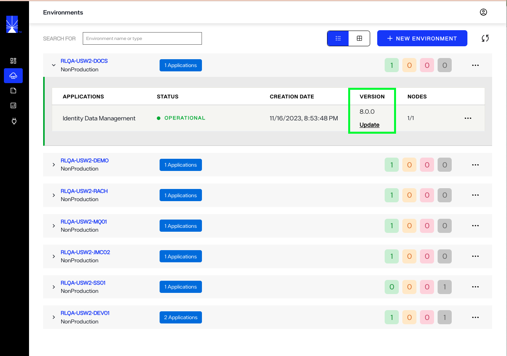
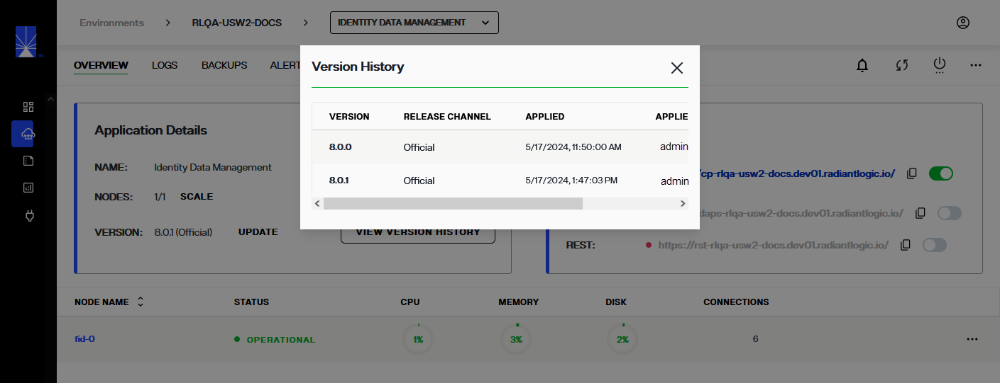

---
keywords:
title: Update an Environment from its Detailed View
description: Learn how to manually update the RadiantOne version running in an environment.
---
# Update an Environment from its Detailed View

When version updates are applied to your Environment Operations Center instance, your environments are not updated automatically. There are two ways that you can manually update the version of individual environments: From the *Environments* home screen or the *Overview* screen of the environment that you wish to update. This guide outlines the steps required to update an environment from its *Overview* screen. For details on updating an environment from the *Environments* home screen, review the overview guide on [updating an environment](../environment-overview/update-an-environment.md).

> [!note] Before getting started, make sure you know the current version of Environment Operations Center and the required number of RadiantOne nodes to display for each environment that requires updating.

## Managing environment updates

When an environment requires updating, an **Update** message appears next to the environment version number under "Application Details" and also under the selected environment in environments page.

### Begin update

Update can be initiated either from the "Environments" page or the "Overview"(under Application Details) page.

Clicking on **Update** in environment page, takes you to the ovierview page.

### Update version number

The *Update* dialog box contains a **Version** drop-down field to update the environment version. To update your version number, select the correct number from the **Version** drop-down menu. Your currently installed version number is displayed just above the dropdown menu for reference.

> [!note] Environment versions can only be updated incrementally. You must select the version number that immediately succeeds your current environment version.

Once you have selected the correct version number, select **Update** to go to the confirmation dialog box. Click **Update** to begin updating the environment.

To quit the update and return to the environment *Overview* screen, select **Cancel**.

### Environment update confirmation

After selecting **Update** the *Overview* screen is displayed. A message displays notifying you that the update is in progress and could take up to 10 minutes.

While the environment is updating, its status displays as "Updating application version".

If the environment updates successfully, the environment status changes to "Operational".

After the update of environment version is successful, the environment status changes to operational.

If the environment update is unsuccessful, the environment status changes to "Update Failed". Select **Dismiss** to close the notification and retry updating the environment.

## View version history

To view updates previously applied to an environment, select **View Version History** located in the *Application Details* section.

The *Version History* dialog lists all updates applied to the environment by their version number in chronological order. Each update also has a time and date stamp for when the update was applied and lists the user who performed the update.

## Next steps

After reading this guide you should have an understanding of the steps required to update an environment. To learn how to adjust the number of environment nodes, see the [update and monitor environment nodes](node-details.md) guide. For details on backing up and restoring environment versions, see the [backups overview](../backup-and-restore/backup-restore-overview.md).
