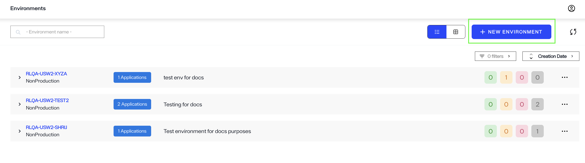
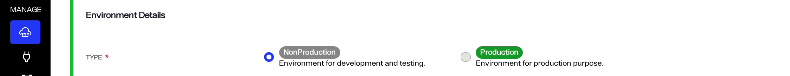
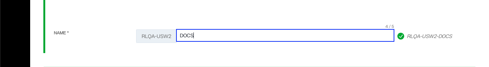
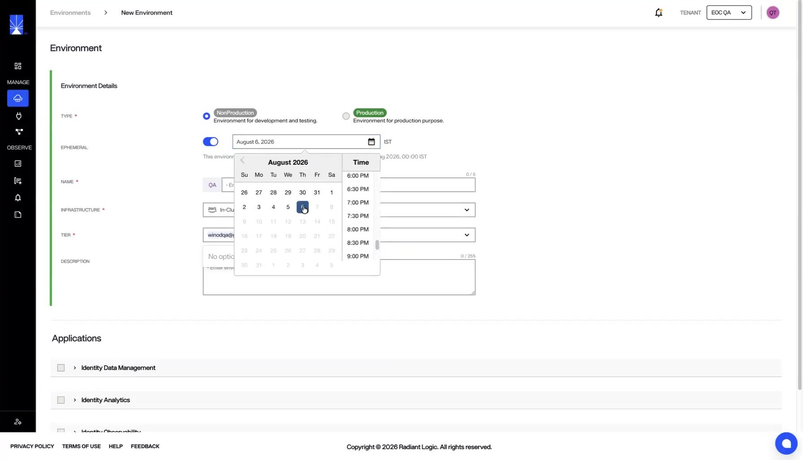
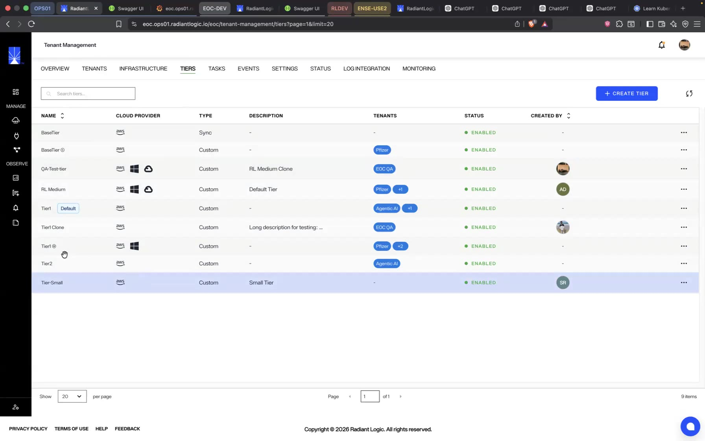
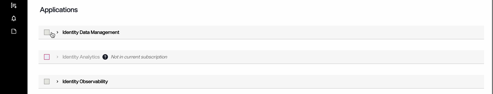
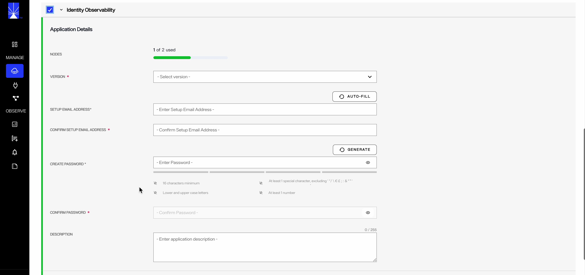

# Overview

This guide walks you through the steps required to create a new environment and deploy applications in Environment Operations Center.

An environment is where a RadiantOne product lives. Each environment is completely isolated and contains endpoints to access different applications. Each instance of the Environment Operations Center has a predefined number of production and non-production environments that can be created for production, development, quality assurance, and staging purposes.

## Getting started

Before setting up your environment, you need the following:

- The version number that corresponds with your RadiantOne product (Identity Data Management, Identity Analytics, and/or Identity Observability).
- If you are deploying the Identity Data Management application, and want to initialize the product with configuration that has been exported from an existing environment, ensure you have the correct file type saved and ready to go since you need to select this file during creation of the new environment.

The new environment setup requires you to define the environment type, details, and provides an optional step to upload a configuration file from another environment.

## Creating environments

To create a new environment, select **New Environment** on the *Environments* home screen or from the *Overview* home screen.

This takes you to the *New Environment* page that contains all the input fields for the information required to create a new environment. The following sections outline how to complete these required fields.

### Define environment type

Start by selecting the required **Environment Type**.

#### Environment type

To set the **Environment Type**, use the radio buttons to select either **Non-production**, for development and testing, or **Production**, for production purposes.

#### Environment name

In the **Environment Name** field, enter a unique name.

### Ephemeral environments

An ephemeral environment is a temporary environment that deletes itself at a time you set. When you enable the ephemeral option during environment creation, set an expiry date and time. Environment Operations Center deletes the environment automatically when that time arrives, even if you forget to remove it, so unused environments do not continue to consume resources.

If you add an ephemeral environment to a promotion pipeline, it loses its ephemeral property and becomes a regular environment.

> Ephemeral environments are feature-flagged. If the feature is not enabled for your account, the option does not appear. Contact Radiant Logic to enable it.

### Tiers and infrastructure

Each environment is deployed on an infrastructure, and each infrastructure is tied to a cloud provider — for example, an AWS-based or Azure-based infrastructure. Your infrastructure is configured by Radiant Logic during onboarding. Each tier supports a specific set of cloud providers: some tiers support every provider, while others support only a subset.

- When tier visibility is enabled, you select a tier during environment creation. The available tiers are filtered by the environment's infrastructure, so you see only the tiers that support that cloud provider.
- When tier visibility is disabled, the environment uses the default tier (AWS) and no tier selection appears.

> Tier visibility is feature-flagged, and the assigned tiers are configured for your account by Radiant Logic.

### Deploy applications

In your environment, you can install one or more of the following RadiantLogic applications:

* **Identity Data Management** – This application streamlines identity data by eliminating silos and ensuring seamless synchronization across your organization. It serves as a scalable, unified source of truth, helping to manage and maintain accurate, up-to-date identity information.

* **Identity Analytics** – This application offers deep insights into potential gaps in your identity data, particularly in relation to access management workflows. It enhances visibility, enabling you to identify and address blind spots, while strengthening your organization’s overall identity security posture.

* **Identity Observability** – Provides observability services for your identity data including AI agents' data. You may request additional services such as extra storage, Portal API, and MCP features to be enabled for this application during application creation.

To deploy an application, select the checkbox adjacent to the application name. In the expanded view, fill out all required information.

Applications that are not part of your subscription are shown greyed out and labelled *Not in current subscription*. 

#### Application details

Under the **Application Details** section, provide the required details such as the application version, password, and application description. The **Nodes** row at the top of the section shows how many of your subscription's nodes are already in use, for example *1 of 2 used*.

There are minor differences in the application details form for each application. For Identity Data Management deployment, you have the option to enable advanced setup if you wish to deploy the application using an existing configuration file. Note that this option is available only in Identity Data Management.

For Identity Observability, the form also asks for a setup email address. Enter the address in **Setup Email Address** and repeat it in **Confirm Setup Email Address**, or select **Auto-fill** to populate both fields with the email address of the signed-in account.

#### Version

To set the Environment **Version**, select the version drop down to display all available versions. Select the value that corresponds with your organization's version of Environment Operations Center.

#### Password

Select a password by either entering your chosen password in the space provided, or by selecting the **Generate** button to have a password automatically generated for you.

To confirm your password, reenter your password in the confirmation space provided. If you selected to have a password automatically generated, use the copy icon to the right of the field to copy it, then paste it into the confirmation field.

To reveal your original or confirmation password, select the eye icon () located within the text field you wish to view.

### Advanced setup

The application details end with an **Options** section that contains two optional toggles: **Install Samples**, which imports sample data, and **Advanced Setup**.

Advanced setup is not required. It can be used to restore an Identity Data Management application from an existing backup file. When creating a new application, choose the backup configuration (ZIP file) that was downloaded from the environment you want to restore.

#### Custom configuration

To import a configuration file, select the configuration ZIP file to upload. You can locate the file on your system and drag and drop it into the provided space. Alternatively, you can select **choose file** within the upload box to open your system's file manager and locate the file to upload.

While your file is uploading, an **Uploading** message displays in the file upload box, along with a progress bar. You can cancel the file upload while it is in progress by selecting the **X** located in the progress bar box.

Once your configuration file has successfully loaded, the file name displays in place of the file upload box. Select **Create** to create the new environment.

To delete the file and return to the file upload screen, select the trash can icon located in the same box as the successful file upload.

If the file upload is not successful, the configuration upload box displays with a red dashed outline and an error message appears just below. Review your file type to ensure you have selected the correct configuration file for upload and try again.

### Create the new environment

Once you have completed filling out the details for *Environment Type* and *Application Details* sections, click the **Create** button to create the new environment.

## New environment confirmation

After saving the New Environment details form, you return to the *Environments* home screen. A confirmation message appears noting that your environment is being created and that the process can take up to twenty minutes. The status of your new environment shows as "Create Application". Select **Dismiss** to close the confirmation message.

Once the environment has been successfully created, the environment's status changes to "Operational".

### Form submission failure

If there is an issue with the form submission, an error message states that the new environment creation failed and the new environment will no longer be visible in the environment list on the *Environments* home screen. Select **Dismiss** to close the error message and proceed to restart the workflow to create a new environment.

### Failure to create new environment

If there is an error and the environment cannot be created, the environment status changes to "Creation Failed".

Select the ellipsis (**...**) in line with the environment to display a list of options. Options include:

- **Submit Again**: resubmit the same form without editing any of the fields.
- **View Logs**: troubleshoot where the error may have occurred while the form data was processing.
- **Delete**: if the environment hasn't been successfully created, delete the failed instance.

## Next steps

Learn how to view [application details](../applications/application-details.md), [update an application](../applications/update-an-application.md) and [delete an environment](delete-environment.md). 

