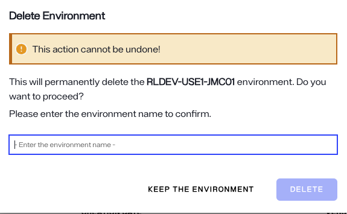

---
keywords:
title: Delete an Environment
description: Learn how to delete environments in Environment Operations Center.
---
# Delete an environment

This guide outlines the required steps to delete an environment and the application(s) that are in the environment.

> [!note] Only non-production environments can be deleted by users. To delete a production environment, please contact Radiant Logic.

## Getting started

To begin the workflow to delete the environment, navigate to the environments page and click the environment you would like to delete. If the environment has any existing application, you must delete the application first.
To do so, select the ellipsis in the application to expand the **Options** menu.

From the **Options** menu, select **Delete**. This will open the delete application dialog box. Enter the Application name in the dialog box and click **Delete**. This will permanently delete the application

## Enter environment details

After deleting the application(s) in the environment, you can now proceed to delete the environment. 

> [!warning] Deleting an environment is a permanent action and cannot be undone once submitted.

To delete the selected environment, enter the name of the environment in the space provided in the dialog box and select the **Delete** button. The environment name entered must match the actual environment name exactly, otherwise you will receive an error message and will not be able to submit the delete request.

If you would like to keep the environment and exit out of the confirmation dialog, select **Keep the Environment** to return to the *Overview*  screen.

## Confirmation

After selecting **Delete** in the confirmation dialog you will return to the *Environments* home screen. Here, you'll receive a confirmation message that the environment was successfully deleted and the environment will be removed from the environments list.

If the environment could not be deleted, you will return to the environment *Overview* screen and receive an error notification indicating that the attempt to delete the environment failed. Select **Dismiss** to close the error notification.

## Next steps

After reading this guide you should have an understanding of the steps required to delete an existing environment. If you would prefer to update the environment, please refer to the guide on [updating an environment](update-an-environment.md).
