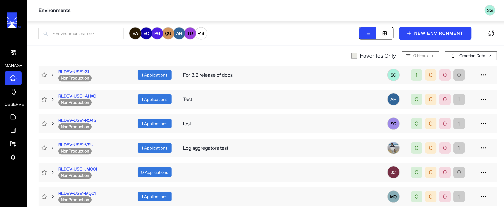
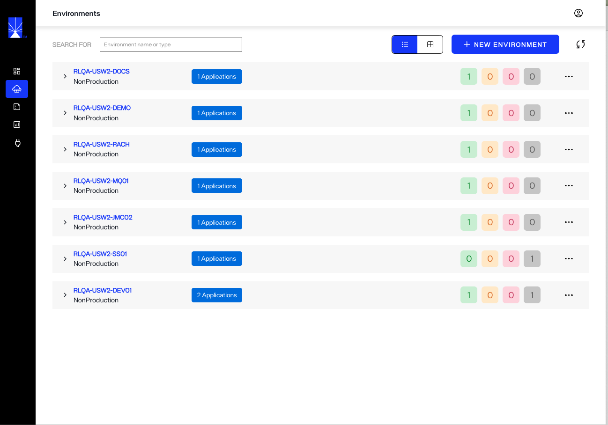
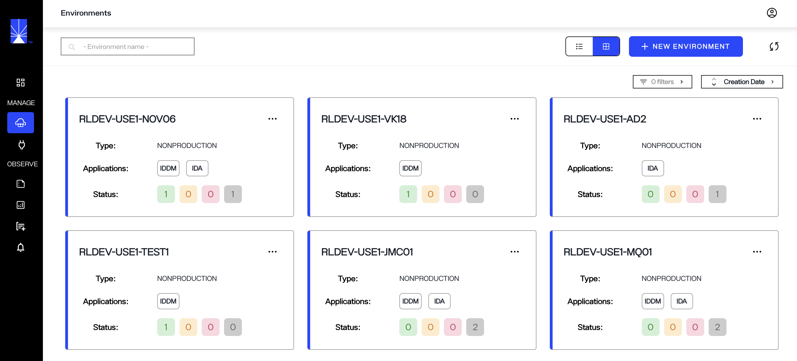
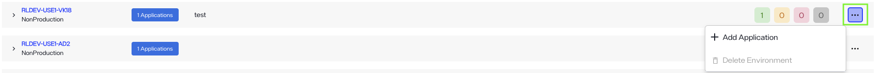
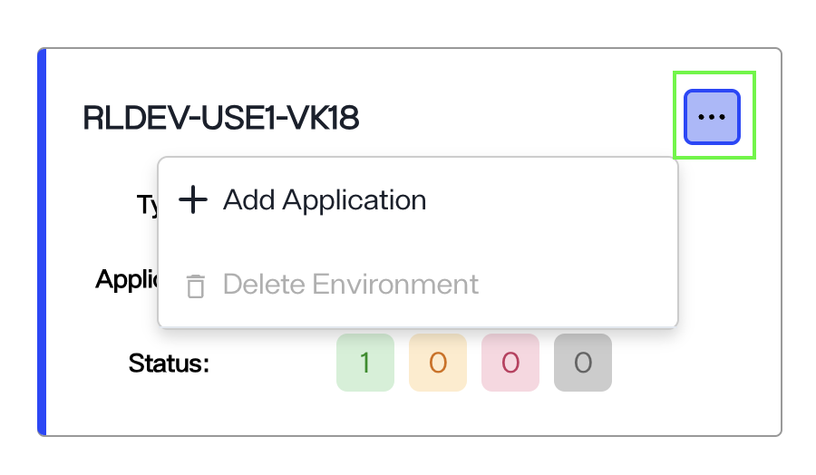
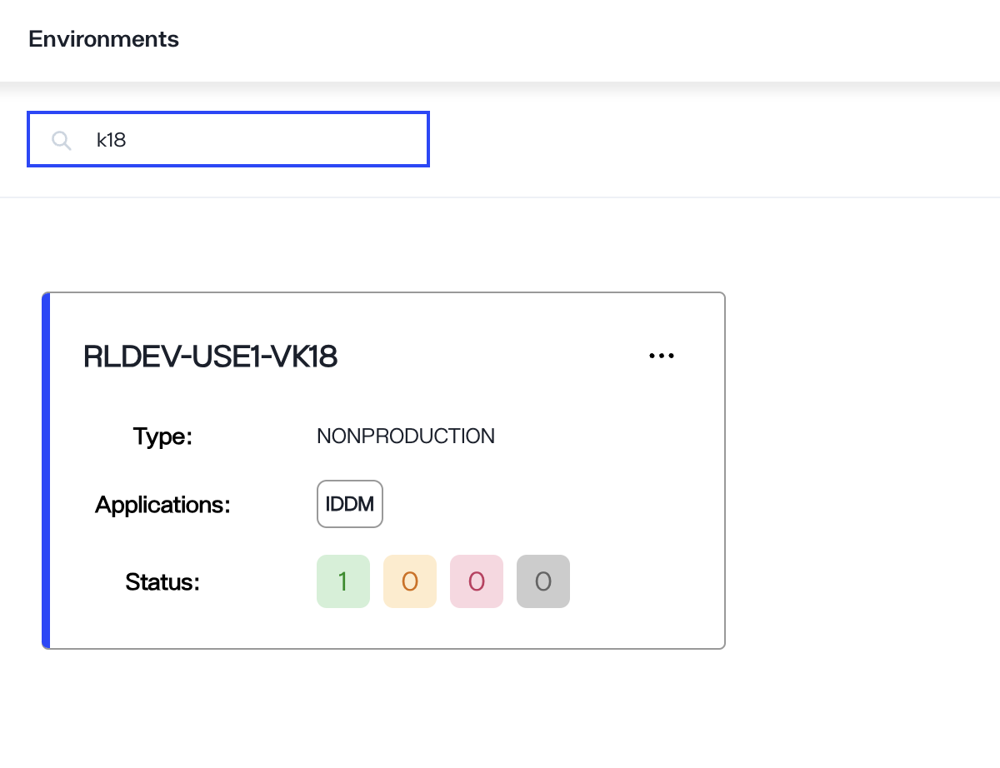
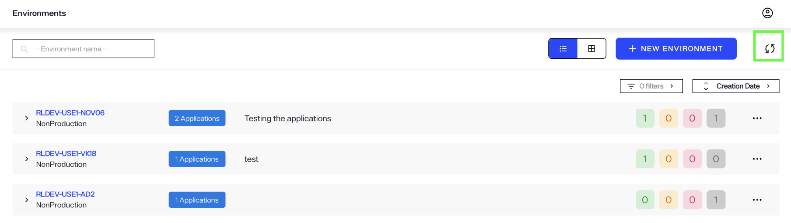

---
keywords:
title: Environments Overview
description: Learn how to navigate the Environments page and view environment details in Environment Operations Center, and understand the topics accessible in the options menu.
---
# Environments Overview

This guide provides an overview of the *Environments* home screen and its features. To navigate to the *Environments* home screen, select **Environments** in the left navigation.

The *Environments* home screen provides an overview of all your organization's available environments. Each environment provides information about installed application(s).

Two environment display views are available, either list- or grid-view. In the list-view, environments are organized by row with the associated environment details contained in the row.

In the grid-view, environments are organized in a card format with associated details for an environment contained within the card.

Each environment has its own **Options** menu (**...**) that allows you to either add an application or delete the environment. 

In the list-view, the options menu is located at the end of an environment row.

In the grid-view, the options menu is located in the upper corner of an environment card.

A **Search** bar at the top of the *Environments* screen can be used to filter the listed environments. Enter an environment name, specific characters, or words in the space provided to quickly filter through the environments.

A refresh button is located in the upper right corner of the *Environments* screen. Select the refresh icon to pull up to date information about the environments.

### Options Menu

To view a list of operations that can be performed on a given environment, select the ellipsis (**...**) in the environment row or card to expand the **Options** menu. Options include:

- **View Details**: takes you to an environment's *Overview* screen where you can view further details about the environment. To learn more about the environment *Overview*, review the [environment overview guide](../environment-details/environment-overview#environment-details).
- **View logs**: takes you to an environment's *Logs* screen where you can view log files for a given date range. To learn how to review logs, visit the environment details [logs](../environment-details/environment-overview#logs) guide.
- **Delete**: opens the dialog to being the workflow to delete an environment. For information on deleting an environment, review the [Delete an Environment](delete-an-environment.md) guide.

### New environment

The **New Environment** button allows you to quickly start creating a new environment from the home screen. For details on how to create a new environment, review the guide on [creating a new environment](create-an-environment.md).

### Applications

In your environment, you can install one or both of the following RadiantLogic applications:

* **Identity Data Management** – This application streamlines identity data by eliminating silos and ensuring seamless synchronization across your organization. It serves as a scalable, unified source of truth, helping to manage and maintain accurate, up-to-date identity information.

* **Identity Data Analytics** – This application offers deep insights into potential gaps in your identity data, particularly in relation to access management workflows. It enhances visibility, enabling you to identify and address blind spots, while strengthening your organization’s overall identity security posture.

Refer to the [Install an application](to-add) guide for additional details on the installation steps. 

## Access Permissions

Depending on your role, your administrator may set your access permissions to read-only for certain environments. If you have read-only access:

- You will not be able to create new environments and the **New Environment** button will be deactivated.
- Certain environments will be hidden if you have not been assigned either read-only or editing permissions.
- You will not be able to edit or update the environments that you have read-only access to and the **Options** menu (**...**) will no longer be visible next to the environment. You can still view the details for these environments by selecting the environment name to navigate to their respective "Overview" screens.
- An administrator can assign editing permission to you for specific environments. This allows you to edit, update, or delete the environments they have specified, while others remain hidden or read-only.

## Next Steps

After reading this guide you should have an understanding of how to navigate the *Environments* home screen and its main features. To begin setting up a new environment, review the documentation on [creating a new environment](create-an-environment.md).
