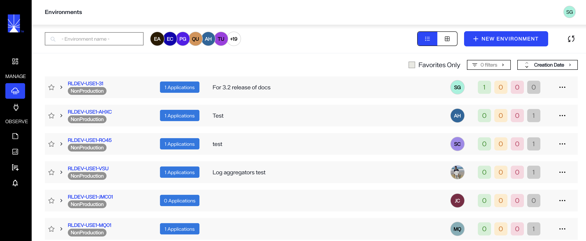
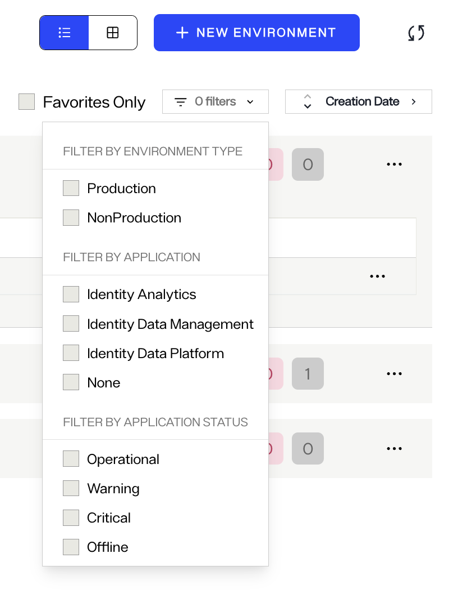
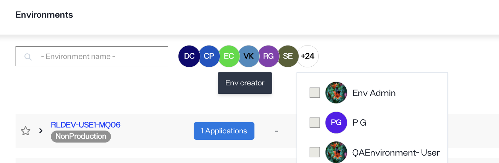
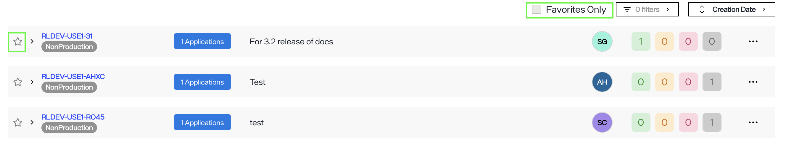
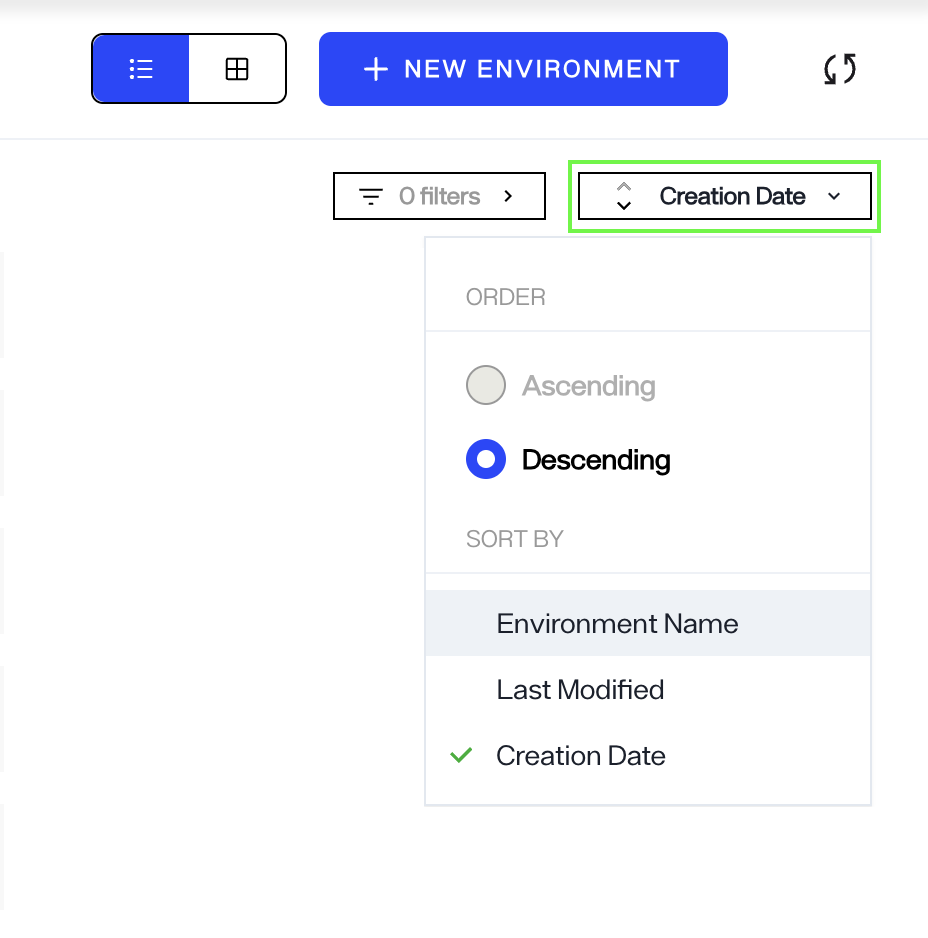
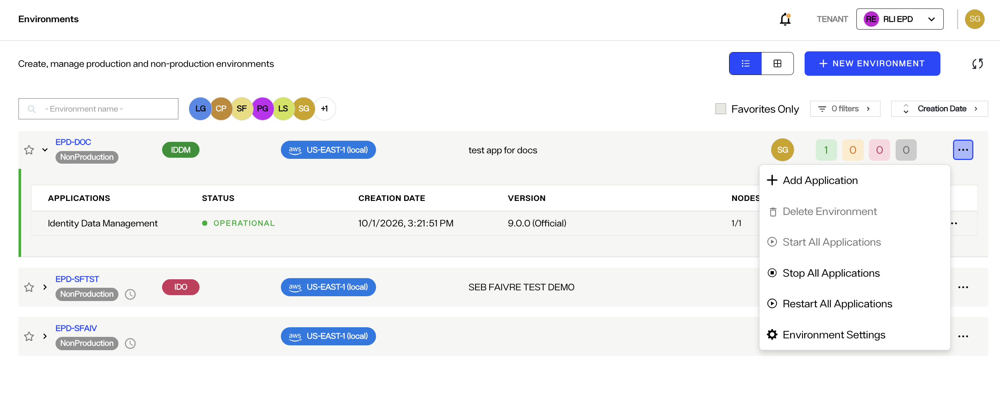
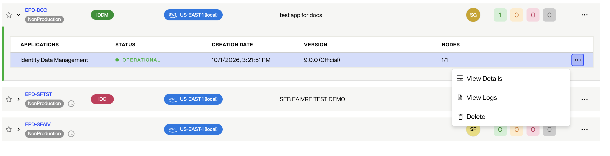
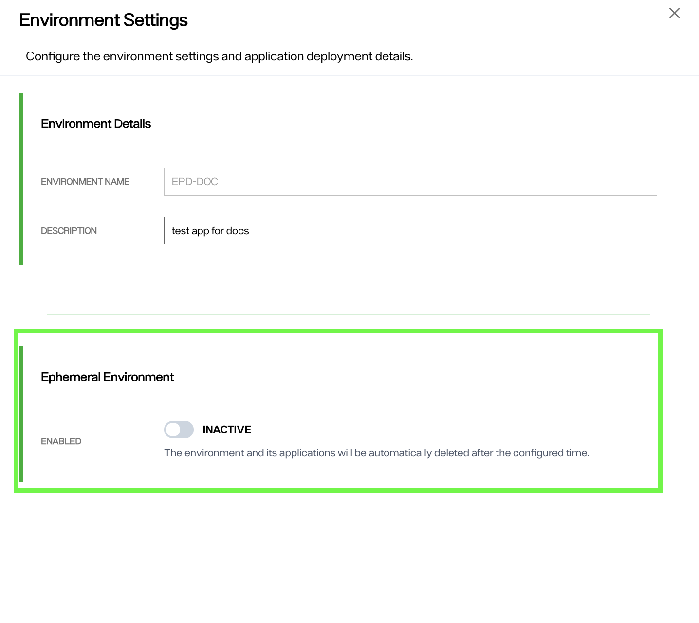

---
keywords:
title: Environments Overview
description: Learn how to navigate the Environments page and view environment details in Environment Operations Center, and understand the topics accessible in the options menu.
---
# Environments overview

This guide describes the *Environments* screen and its features. To open it, select **Environments** in the left navigation.

The *Environments* screen lists all of your organization's environments that you have access to. In list view, each environment row shows the environment name, its type (**NonProduction** or **Production**), a badge for each installed application, the infrastructure the environment is deployed on, the description, the owner, and a count of applications by status. A clock icon next to the type marks an ephemeral environment, which deletes itself automatically at a time you set. Expand a row to list the environment's applications with their status, creation date, version, and nodes.

Each infrastructure is tied to a cloud provider. To get started, see how to [create an environment](create-environments.md).

Use the view toggle in the upper-right corner to switch between list view, which shows one environment per row, and grid view, which shows each environment as a card.

### Filter and sort environments

Select the **filters** dropdown to narrow the list. You can filter by:

- **Environment type**: **Production** or **NonProduction**.
- **Application**: **Identity Analytics**, **Identity Data Management**, **Identity Data Platform**, or **None** for environments without applications.
- **Application status**: **Operational**, **Warning**, **Critical**, or **Offline**.

To show only the environments a specific user created, select that user's avatar next to the search bar.

Select the star icon next to an environment to add it to your favorites, then select **Favorites Only** to show only your favorite environments. Environment Operations Center keeps the filters you apply until you change them.

To change the order of the environments, use the sort control (for example, **Creation Date**).

Use the **Search** bar to find an environment by name, and select the refresh icon in the upper-right corner to reload the list.

### Environment options

Each environment has an **Options** (**...**) menu, at the end of the row in list view or in the upper corner of the card in grid view. The menu contains:

- **Add Application**: add an application to the environment.
- **Delete Environment**: delete the environment. You must delete the environment's applications first. See [delete an environment](delete-environment.md).
- **Start All Applications**, **Stop All Applications**, and **Restart All Applications**: act on every application in the environment at once.
- **Environment Settings**: change the environment's description and ephemeral setting.

Options that don't currently apply are greyed out, for example **Start All Applications** when all applications are already running.

### Application options

Each application in an expanded environment row has its own **Options** (**...**) menu at the end of the row. The menu contains:

- **View Details**: lets you open the application's *Overview* screen. See [application details](../applications/application-details.md).
- **View Logs**: lets you open the application's logs. See [application logs](../applications/logging/application-logs.md).
- **Delete**: lets you delete the application. See [delete an application](../applications/applications-overview.md#delete-an-application).

### Environment settings

Select **Environment Settings** from an environment's **Options** (**...**) menu to open the *Environment Settings* panel.

- **Environment Details**: the **Environment Name** is read-only. Edit the **Description** as needed.
- **Ephemeral Environment**: switch the **Enabled** toggle to **Active** to make the environment ephemeral, so that the environment and its applications are deleted automatically after the configured time. Switch it to **Inactive** to keep the environment. For details, see [ephemeral environments](create-environments.md#ephemeral-environments).

### New environment

Select **New Environment** to create an environment. For details, see [create an environment](create-environments.md).

### Applications

In your environment, you can install one or more of the following RadiantLogic applications:

* **Identity Data Management** – This application streamlines identity data by eliminating silos and ensuring seamless synchronization across your organization. It serves as a scalable, unified source of truth, helping to manage and maintain accurate, up-to-date identity information.

* **Identity Analytics** – This application offers deep insights into potential gaps in your identity data, particularly in relation to access management workflows. It enhances visibility, enabling you to identify and address blind spots, while strengthening your organization’s overall identity security posture.

* **Identity Data Platform** (previously known as Identity Observability) – Provides observability services for your identity data. Additional services such as extra S3 storage, Portal API, and MCP can be enabled for this application.

> Applications that are not part of your subscription are shown greyed out and labelled *Not in current subscription*, and their checkbox cannot be selected.

For installation details, see the [applications overview](../applications/applications-overview.md) guide.

## Access permissions

Depending on your [role](../../role-based-permission/role-based-permissions.md), your administrator may give you read-only access to some environments. If you have read-only access:

- You cannot create environments, and the **New Environment** button is deactivated.
- Environments you have not been assigned are hidden.
- You cannot change environments you have read-only access to, and their **Options** (**...**) menu is hidden. You can still select the environment name to view its *Overview* screen.
- An administrator can give you edit access to specific environments, so that you can edit, update, or delete them while others stay hidden or read-only.

## Next steps

You can now navigate the *Environments* screen and use its main features. To set up an environment, see [create an environment](create-environments.md).
