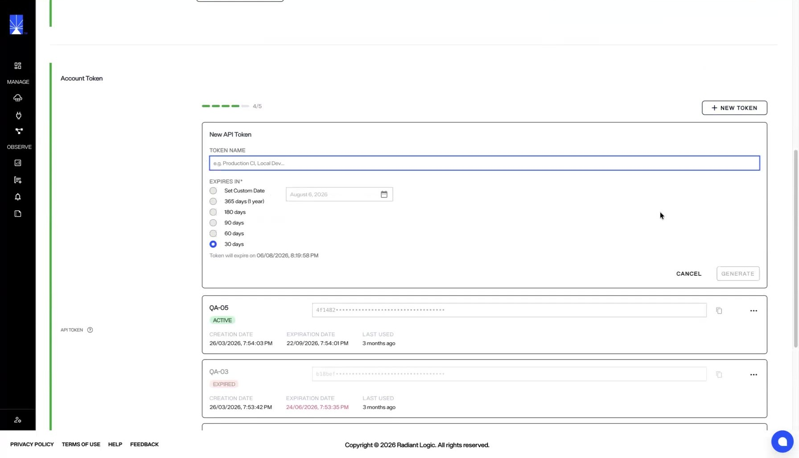

---
keywords:
title: Account Settings
description: Learn how to view and update your account settings and manage your API tokens. Users can generate API tokens for applications that are required to connect to Environment Operations Center without logging in.
---
# Account Settings

This guide provides an overview of how to update your account settings and manage your API tokens. Users can generate API tokens for applications that are required to connect to Environment Operations Center without logging in.

## Getting started

From any section or tab in Environment Operations Center, your account avatar will be visible in the upper right corner of the screen. To access your account settings, select the avatar icon to expand the account dropdown menu. From the dropdown menu, select **Account Settings** to open the *Account Settings* screen.

## Account settings

From the *Account Settings* screen you can update your user details including your first name, last name, email address associated with the account, email address to receive notifications and your profile image.

### Update user details

To update your first or last name, enter your information in the spaces provided and select **Save** to update.

> [!note] Only administrators can update email addresses. Please contact your administrator if you need to change the email associated with your Environment Operations Center account.

To update your profile image, select "Edit Avatar" and select an image from you local file system to upload.

## Manage API tokens

API tokens let applications connect to Environment Operations Center without signing in, and are available to every user, regardless of role, under Account Settings. You need a valid token to call Environment Operations Center endpoints; a request without one returns 401 Unauthorized. You can create up to five tokens in the Environment Operations Center. 

Each token is unique to the user who creates it and is scoped to that user's access. For example, an environment user's token returns data only for that user's assigned environments. Using a token beyond its scope returns an unauthorized error.

### Create an API token

To create a new API token:

1. Select **New Token**.
2. Enter a **Token Name** that identifies how the token is used, such as *Production CI* or *Local Dev*.
3. Set an expiration. Choose one of the preset periods — 30, 60, 90, 180, or 365 days — or select **Set Custom Date** and choose a date.
4. Select **Generate**. The token appears in the token list with its creation and expiration dates.
5. Copy the token immediately and store it in a safe place.

> [!warning] Copy the token before you leave the page. After you leave, you can no longer view or copy the token. If you lose it, delete the token and generate a new one.

### Review your tokens
The token list shows each token you have created, along with:

- **Status**: **Active** or **Expired**.
- **Creation date** and **expiration date**.
- **Last used**: shows when the token was most recently used.

Environment Operations Center warns you when a token is close to expiring, both in the token list and next to the expiration date in *Account Settings*.

> [!warning] API token expiry cannot be extended. Once a token expires, generate a new token to replace it.

### Delete an API token

Delete a token when you no longer need it or when you have reached the five-token limit and want to free a slot.

1. Select the delete (trash) icon or the actions menu for the token.
2. In the confirmation prompt, select **Confirm**.

> [!warning] Deleting a token is permanent and cannot be undone. Any application still using the token can no longer call Environment Operations Center endpoints. Generate a new token for future calls.
## Next steps

After reading this guide you should have an understanding of how to update your account settings and manage your API tokens. For details on managing Environment Operations Center users, see the [create a new user](../../admin/user-management/create-user.md) or [edit an existing user](../../admin/user-management/edit-user.md) guides.
