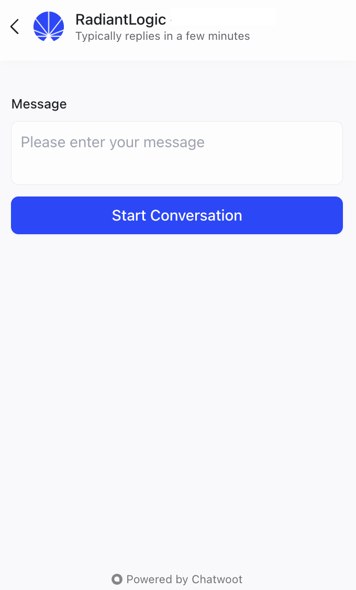

---
keywords:
title: AI Assistant
description: Learn how to use the built-in AI assistant in Environment Operations Center to ask questions about product features, configuration, troubleshooting, and everyday usage without leaving the application.
---
# AI Assistant

The Environment Operations Center includes a built-in AI assistant that answers questions about product features, configuration, troubleshooting, and everyday usage so you can get help without leaving the application. This guide outlines how to open the assistant, ask a question, and escalate a conversation to support.

>[!note] The assistant is scoped to the Environment Operations Center. If you ask something outside that scope, it asks you to rephrase your question.

## Getting started

To open the assistant, select the **chat icon** in the bottom-right corner of the interface once you are logged in. The assistant opens in a panel that displays the Radiant Logic name and the expected response time.

Enter your question in the **Message** field and select **Start Conversation**.

## Ask a question

The assistant replies based on your query. It retains context across the conversation, so you can ask follow-up questions naturally without repeating the details of your original question.

Your history is preserved if you close the panel. Reopen it at any time to pick up where you left off.

## Escalate to support

If the assistant cannot fully resolve your question, you can escalate the conversation to support. An available agent is assigned automatically and is announced in the chat when they join. The agent then responds to you directly in the same panel, so you do not need to open a separate request.