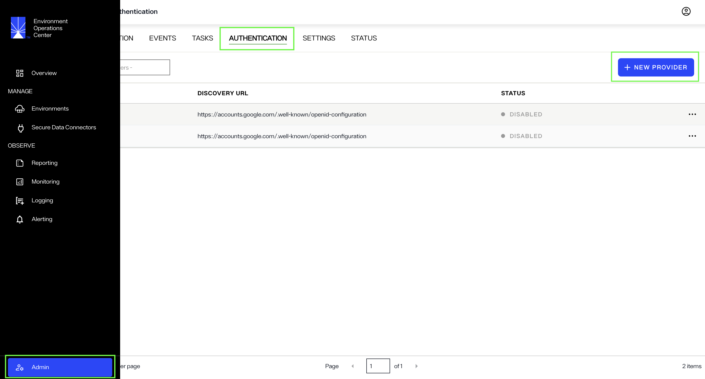
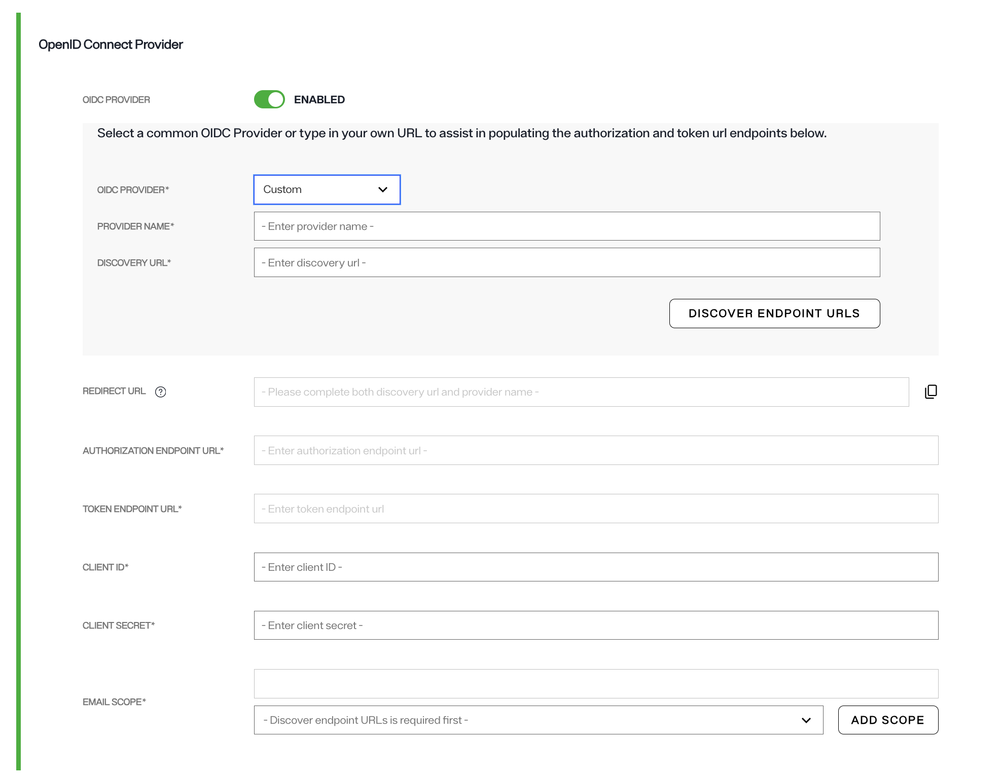

---
keywords:
title: Authentication
description: This guide provides information about configuring SSO with various OIDC providers in the Environment Operations Center. 
---

## Authentication
This guide provides information about configuring SSO with various OIDC providers in the Environment Operations Center. 

### **Prerequisites:**
- **Admin Access** - You will need administrative privileges to configure SSO and authentication providers.
- **SSO Provider Details** - Obtain the necessary OIDC details and credentials from your Identity Provider, such as Discovery URL, Redirect URL, Authorization Endpoint URL, Token Endpoint URL, Client ID, and Client Secret.

### **Steps to Configure SSO in Environment Operations Center:**

#### **1. Navigate to the Admin screen**
   - In your Environment Operations Center account, navigate to the **Admin** screen and click **Authentication**. Next, click **New Provider**.
   

#### **2. Provide required details related to your OIDC provider**

  1. OIDC PROVIDER
      * Select your provider from the dropdown list. If your provider's name is not included in the list, select CUSTOM as your provider. Note that if you select an option other than CUSTOM, certain details such as PROVIDER NAME, DISCOVERY URL, REDIRECT URL, AUTHORIZATION ENDPOINT URL and TOKEN ENDPOINT URL will be auto-filled by Radiant Logic.
     

     
  2. PROVIDER NAME
     * This is the name of your OpenID Connect provider. It can be any name you choose to identify the provider (e.g., "MyOIDCProvider") or it can be same as the selection you made in the first step. 

  3. DISCOVERY URL
     * The discovery URL is the endpoint from which the OIDC provider's metadata is retrieved. This URL typically ends with /.well-known/openid-configuration (e.g., https://example.com/.well-known/openid-configuration). This URL provides essential information like the authorization and token endpoints, supported scopes, and other configuration details. This field does not apply for Github.

  4. REDIRECT URL
     * This is the URL to which the OIDC provider will redirect users to, after successful authentication. 
    
  5. AUTHORIZATION ENDPOINT URL
     * This is the endpoint the client will use to initiate the OAuth2 authorization code flow. It typically looks like https://example.com/authorize.

  6. TOKEN ENDPOINT URL
     * This is the URL where the client can exchange the authorization code for an access token and ID token. It typically looks like https://example.com/token.

  7. CLIENT ID
     * This is the unique identifier assigned to your application by the OIDC provider when you register your application. Enter the CLIENT ID issued by your provider as the value of this field. 

  8. CLIENT SECRET
     * This is the secret associated with your client ID. It is used to authenticate your application when exchanging authorization codes for tokens. Enter the secret issued by your provider as the value of this field. 

  9. EMAIL SCOPE
     * The scope is a parameter that defines the level of access the application needs. For email-related information, the email scope is commonly used. It requests the OIDC provider to return the user's email address. For certain providers, this field is auto-selected and can not be edited.

 10. Configure EOC MFA **(Optional)**
     * When **Require MFA** is enabled, users are prompted for an authenticator code each time they sign in through a cloud identity provider — Microsoft, GitHub, or Google. When it is disabled, users sign in without the MFA step.

- MFA is now configured at the tenant level when the tenant is created. This replaces the previous per-login-type setting applied during onboarding.

#### **3. Save the Provider Configuration**
   - After entering all the details and verifying the information, click on the **Save** button to save your provider configuration.

#### **4. Enable SSO for Users**
   - Once the SSO is established, you can assign the provider to the appropriate user and specify the conditions for login when adding new users from the **Users** tab.

### **Conclusion**
By following the steps above, you can successfully set up and configure **SSO (Single Sign-On)** using **EOC's authentication provider** page. Once set up, this configuration will allow users to log into Environment Operations Center via your chosen OIDC provider. This removes the need to remember additional credentials for accessing EOC, improving security and user experience.
