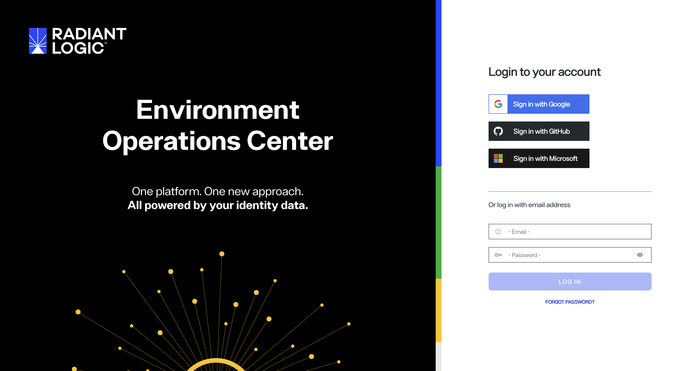
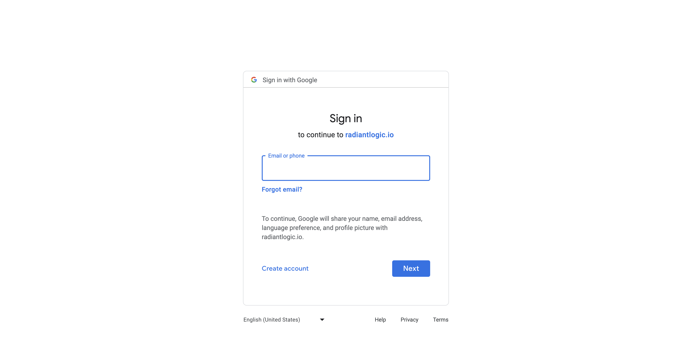
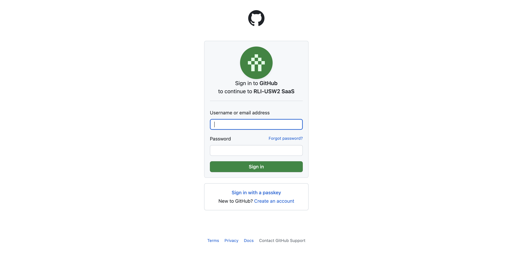
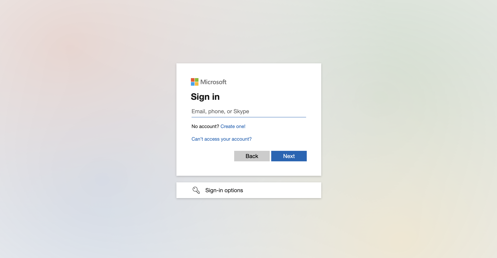

---
keywords:
title: Login Page
description: This Guide provides the information about logging in into Environment Operations Center
---

# Login

This guide provides the overview of options to login into Environment Operations Center.

Environment Operations Center provides three different Single Sign On options to login.

- **Sign in with Google**.
- **Sign in with GitHub**.
- **Sign in with Microsoft**.

Environment Operations Center also provides an option to login using an email and password.

## Getting Started

- Your admin account for the initial user login is created by Radiant Logic based on the email id provided by the respective user.
- An initial user is provided with **Tenant Admin** rights.
- The rights and the access to rest of team members can be provided by the initial user.

> [!note] The user should be added by an admin and provided with necessary access, before logging in.

### Sign In with Google

### Sign in with GitHub

### Sign in with Microsoft

Logging in with microsoft requires additional authorization from Azure.

### Next Steps
Refer to the [Microsoft SSO guide](./microsoft-sso.md
) to learn how to set up single sign on with Microsoft. 

## Local users

A local user is an account created within the tenant that signs in with an email address and password rather than through a cloud identity provider such as Microsoft, GitHub, or Google.

Local users are useful when:

- The email address you want is already associated with a cloud identity provider.
- You need a test account.
- You want to grant a specific role, such as environment admin, without tying it to a cloud identity.

To create a local user, open the user-creation screen as a tenant admin and enable the local user option.

## Authentication providers (SSO login)

If you prefer not to use local users or the built-in cloud providers, you can add your own authentication providers. The providers you configure appear as options on the SSO login screen.
