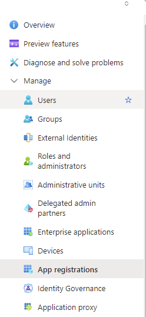
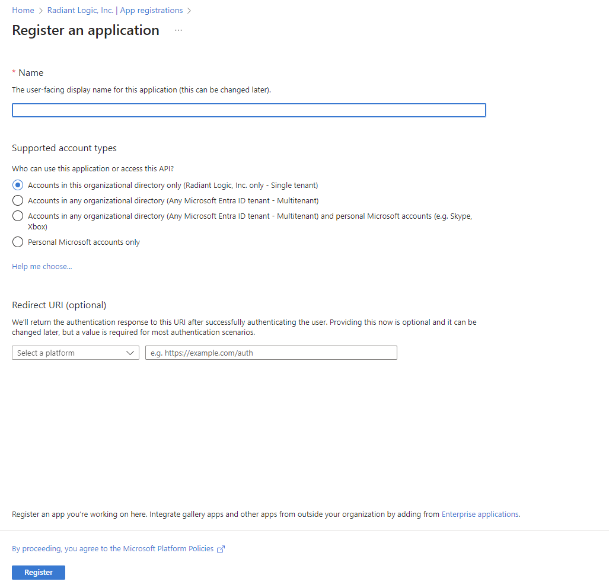
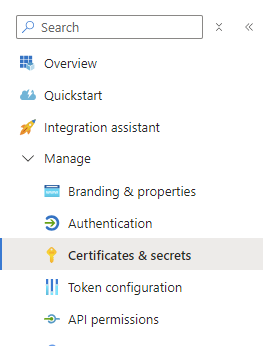
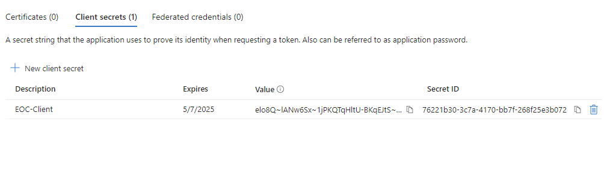
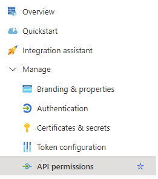
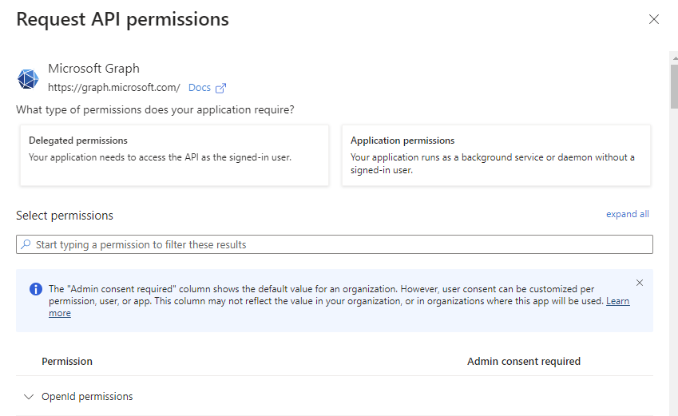
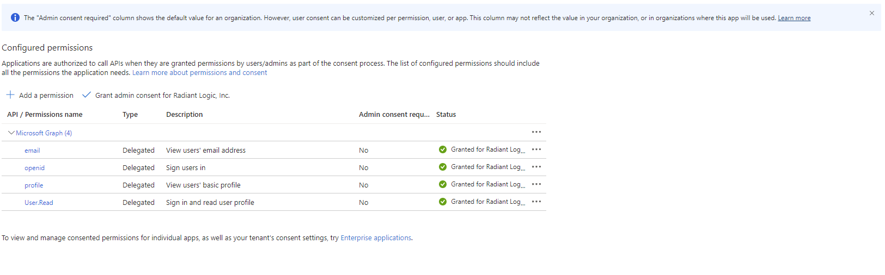
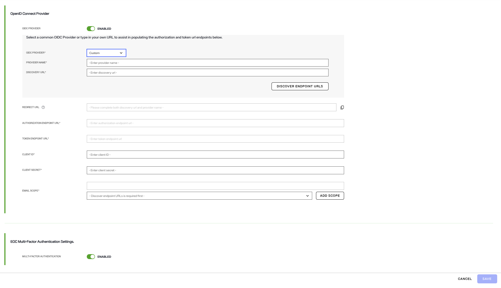

---
keywords:
title: Microsoft SSO
description: This Guide provides the information about configuring the SSO for Microsoft in Microsoft and setting up Microsoft SSO authentication in the Environment Operations Center. 
---

# Microsoft SSO

This guide provides details on how to configure Microsoft SSO using Microsoft Entra ID. Note that by default, Radiant Logic provides you with an option to sign in with Microsoft. However, if you would like to set up Microsoft authentication on your own, follow the steps outlined in this guide. 

## Registering your application in Entra ID 

This section describes how to establish your application as a recognized entity in Azure AD to facilitate secure interactions. 
1. Using an administrative account, log into the Entra ID (previously known as Azure AD) portal.
2. In the navigation pane on the left, select **App registrations**.
    
3. At the top of the page, click **New Registration**.
4. Enter a descriptive name that helps identify the application within your organization.
    
5. In the Supported Account Types section, select one of the following options.
    - **Single Tenant:** limits access to users within the organization.
    - **Multitenant:** allows users from any Azure AD directory to access the application.
6. From the Select A Platform drop-down menu, select **Web**.
7. Next to the Select A Platform menu, specify a URI to which Azure AD will send authentication responses.
8. Click **Register**.
9. Make note of the Application ID for future reference.

## Creating a secret for authentication

This section describes how to generate a secret key that your application uses to authenticate itself with Azure AD.

1. In the Azure AD portal, navigate to **Manage > Certificates & Secrets**.
    
2. On the Client Secret tab, click **New Client Secret**. An "Add a Client Secret" window displays.
    
3. Provide a meaningful description for the secret, i.e. "Production Key 2024".
4. Select an option from the **Expires** drop-down menu.
5. Note the value displayed on the Client Secrets tab.
    

## Assigning API permissions

This section describes how to specify which resources your application can access and which actions it can perform in Azure AD.

1. In the Azure AD Portal, navigate to **Manage > API Permissions**.
    
2. Click **Add a Permission**.
3. Select an API and click **Delegated Permissions**.
    
4. Add permissions as needed.
    > [!warning] These permissions must align with the functionality your application requires.
5. To apply these permissions across all users in your directory, click **Grant admin consent for [your directory]"**.
6. Click **Yes**.
    

## Testing your implementation

The section describes how to integrate and verify that SSO via Azure AD is functioning correctly in your application.

1. In your application authentication settings, input the Application (Client) ID and the Client Secret.
2. Configure the authentication library or framework you are using (such as Microsoft's Identity platform libraries) to interact with Azure AD using these credentials.
3. Implement a login feature where users are redirected to Azure AD for authentication.
4. Verify that after successful authentication, Azure AD redirects users back to your application's specified redirect URI.
    > [!note] Your application should handle this response to authenticate the user internally.
5. After implementation, monitor the integration closely for any performance issues or errors.
6. Review logs and user feedback to identify and troubleshoot any potential problems in the SSO process. 

For the latest information on these steps, refer to [Microsoft's OIDC document](https://learn.microsoft.com/en-us/entra/identity-platform/v2-protocols-oidc). 

## Enable Microsoft SSO authentication in Environment Operations Center

After configuring OIDC with Microsoft Entra ID, you will need to enable this SSO option in Radiant Logic's Environment Operations Center by following these steps:
1. Click on the Admin option at the bottom of the left navigation bar.
2. Click Authentication and click New Provider.
3. In the OpenID Connector form, provide details for the OIDC Provider.

    i. Select Microsoft as the OIDC PROVIDER. Next, you will see that PROVIDER NAME, DISCOVERY URL, REDIRECT URL, AUTHORIZATION ENDPOINT URL, TOKEN ENDPOINT URL, and EMAIL SCOPE fields get auto-populated.

   ii. Enter the CLIENT ID and CLIENT SECRET that was generated in your Azure application.

   iii. Optionally, you can enable EOC MFA. If you enable EOC MFA, upon logging in, the user will be see a prompt to set up MFA with an authenticator app. Complete the prompt to enable MFA.

   

