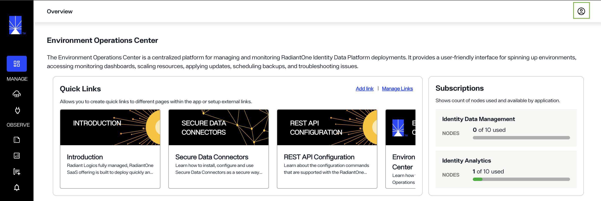
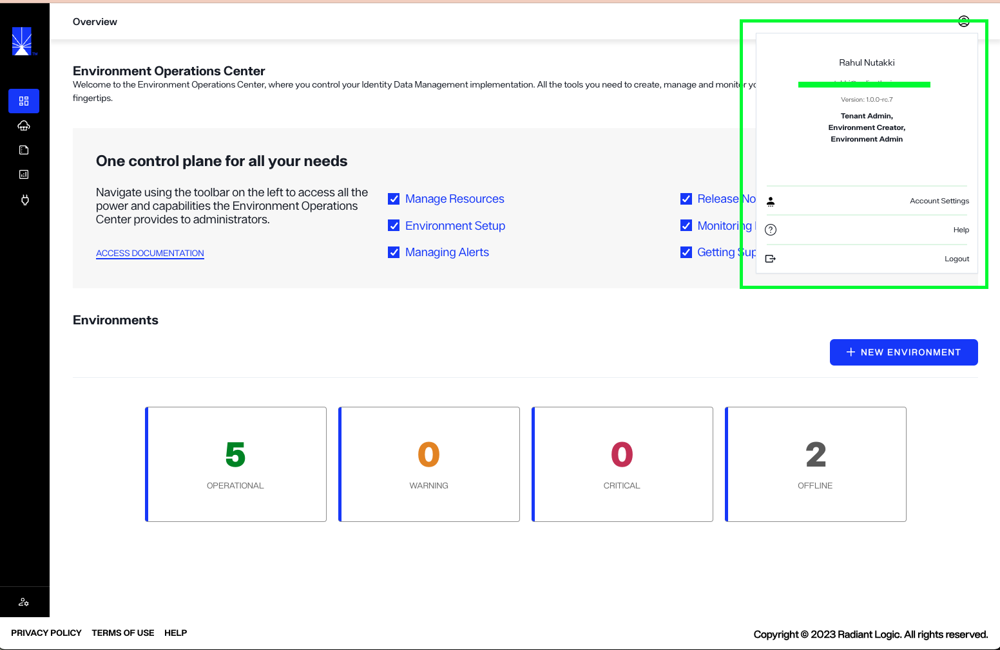
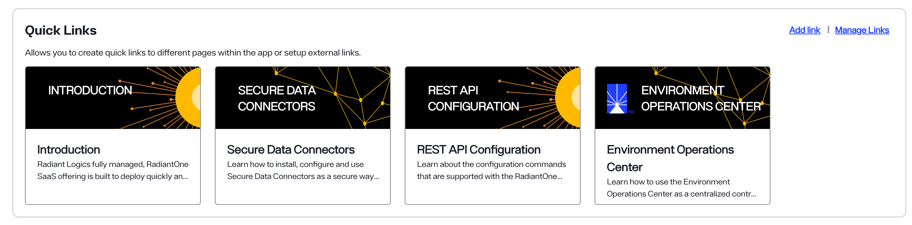
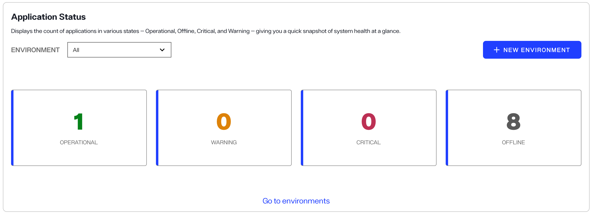
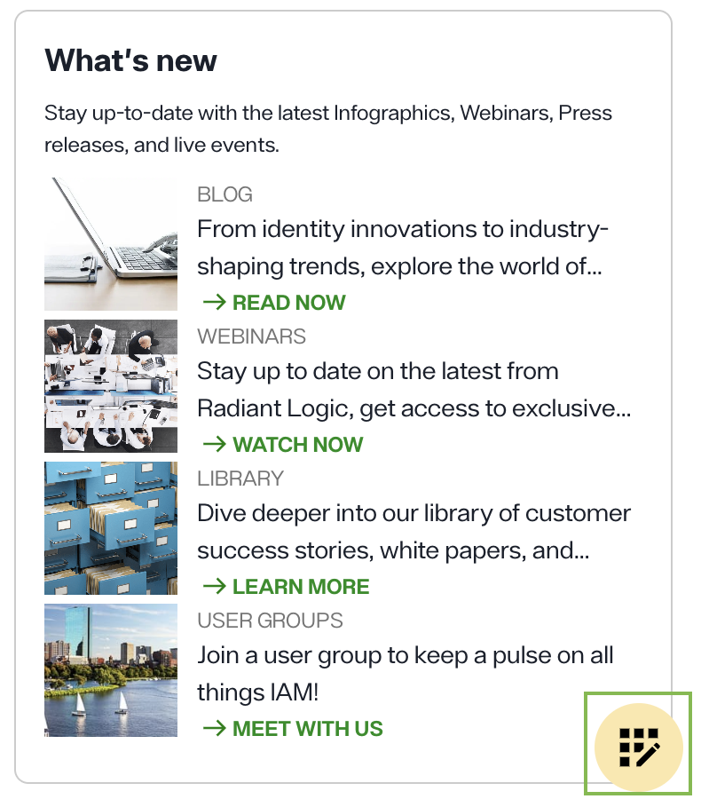
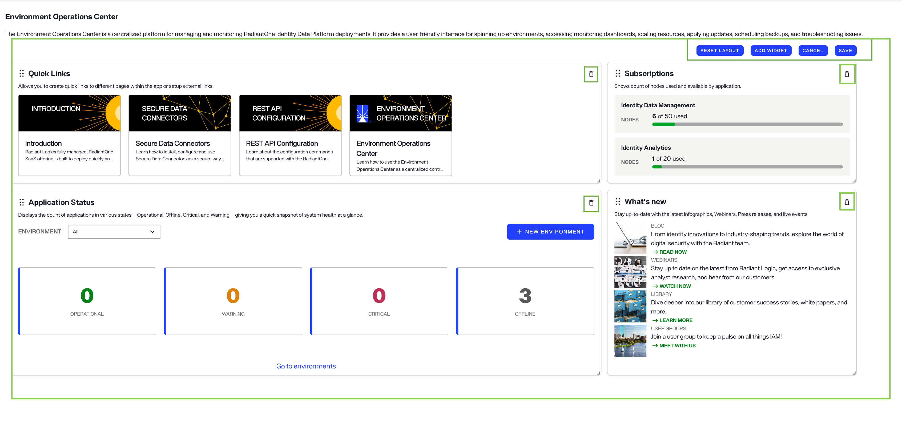
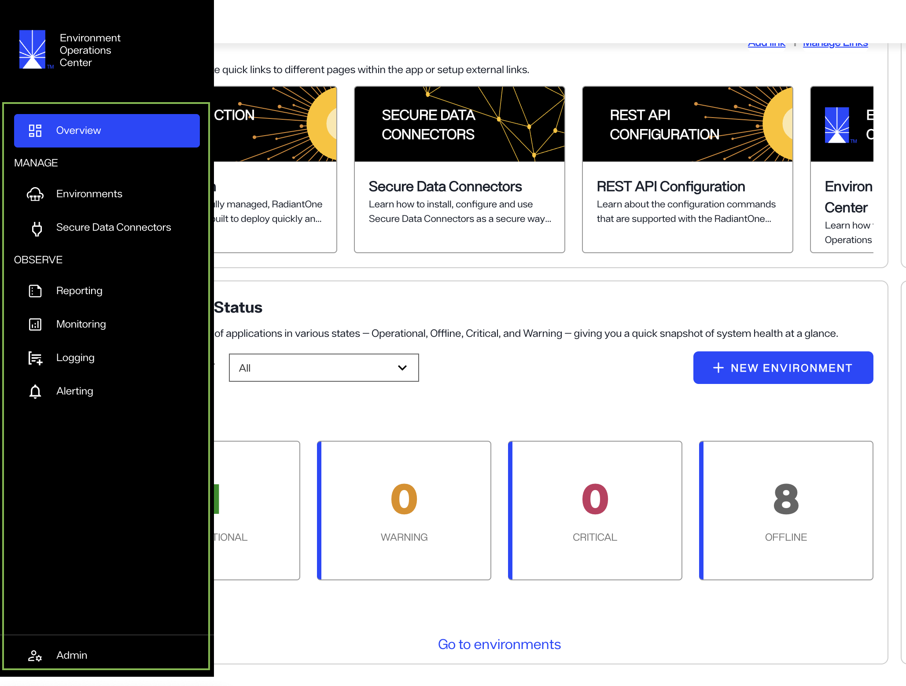

---
keywords:
title: Getting Started
description: Getting started
---
# Getting Started

Environment Operations Center allows you to control your RadiantOne implementation in a cloud environment. It provides all of the required tools to:
 
1. Create and manage RadiantOne [environments](../environments/environment-overview/environments.md) as well as install and manage RadiantOne applications in your environments. 

2. [Securely connect with on-premises data ](../secure-data-connector/configure-sdc-service.md).

3. Observe usage and issues with [reporting](../reporting/reporting-overview.md), [monitoring](../monitoring/monitoring-overview.md), [logging](../environments/logging/environment-logs.md), and [alerting](../environments/environment-details/alert-management-overview.md) dashboards.

4. [Administrate](../admin/admin-overview.md) account settings, users, environment alerts and integrations depending on the user role.  

5. Customize the homepage with widgets and relevant links.  

This guide provides an overview of the Environment Operations Center home screen and how to navigate the user interface of this screen.

## Overview
After logging in to the Environment Operations Center, the *Overview* screen appears. This is the Environment Operations Center home screen. It provides access to Radiant Logic quick links, application status and so on. You can customize the displayed layout of the screen. 

A navigation bar is located to the left and is visible from all screens within Environment Operation Center. You can access your account settings by selecting the avatar in the upper right corner, also visible from all screens in the application. If you are an admin, you can access admin settings by selecting the admin icon in the bottom left corner of the page. 

## Account settings

A user avatar is always located in the upper right corner of the Env Ops Center user interface. Select the avatar to expand your account dropdown menu. 

The dropdown displays your name, email, and permissions associated with the account. From the dropdown menu you can navigate to your **Account Settings**, access the **Help** center, or **Logout** of Env Ops Center.

For information on managing your account settings, see the [account settings](../admin/account-settings/update-account.md) guide.

### Quick Links

By default, the Quick Links section contains guides and resources to help you with your work in RadiantOne and Environment Operations Center. An admin can add or remove links to display relevant content in this section. For further details on role-based permissions, see the [role-based permissions](../admin/role-based-permission/role-based-permissions.md) guide.

### Application Status 

The *Application Status* section on the *Overview* screen allows you to quickly preview your available environments and see the count of applications in various status — Operational, Offline, Critical, and Warning.

The **New Environment** button lets you create a new environment whereas the **Go to Environments** links takes you to the Environments page. 

### Subscriptions

The **Subscriptions** section shows the number of used nodes and available nodes in an application. 

### What's new

The **What's new** section shows Radiant Logic's latest infographics, webinars, press releases and live events. 

### Custom widgets

At the buttom right of the screen, you will see a customization icon as shown in the image below.

By clicking on it, you can change the layout of the home screen, add another widget to the screen or delete any existing widget. Once you perform any of these actions, click **Save** to save the changes in the layout or **Cancel** to cancel those changes. 

 

## Left navigation

The left navigation contains links to various screens, providing access to the following Environment Operation Center features:

- Overview: To navigate to the *Overview* screen, select either **Overview** or the Radiant Logic logo.
- Environments: The main *Environments* screen provides an overview of all the environments you have access to. Select **Environments** to navigate to the *Environments* overview. To learn more about the *Environments* section, see the [environments overview](../environments/environment-overview/environments-overview.md) guide.
- Secure data connectors: You can manage connections to on-premise data connectors in the *Secure Data Connectors* section. Select **Secure Data Connectors** to navigate to the *Secure Data Connectors* screen. For details on managing data connections, see the [secure data connectors](../secure-data-connectors/data-connectors-overview.md) guide.

- Observe: The Observe section contains navigation items for **[Reporting](../reporting/reporting-overview.md)**, **[Monitoring](../monitoring/monitoring-overview.md)**, **[Logging](./environments/logging/environment-logs/)**, and **[Alerting](././environments/environment-details/alert-management-overview/)**.

- Admin: From the *Admin* section you can perform various administrative actions in Environment Operations Center. Select **Admin** to navigate to the *Admin* home screen. For further details on operations available in the *Admin* section, see the [admin overview](../admin/admin-overview.md) guide.

## Next steps

After reading this guide you should have an understanding of the *Overview* screen components and how to navigate the Environment Operations Center user interface. For more information on environments, see the [environments overview](../environments/environment-overview/environments-overview.md) guide. To learn how to create an environment, see the [create an environment](../environments/environment-overview/create-an-environment.md) guide.
