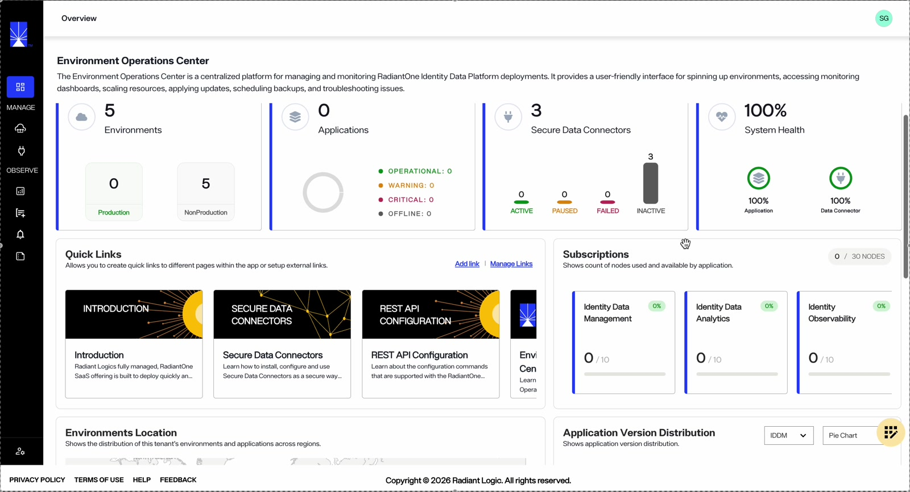
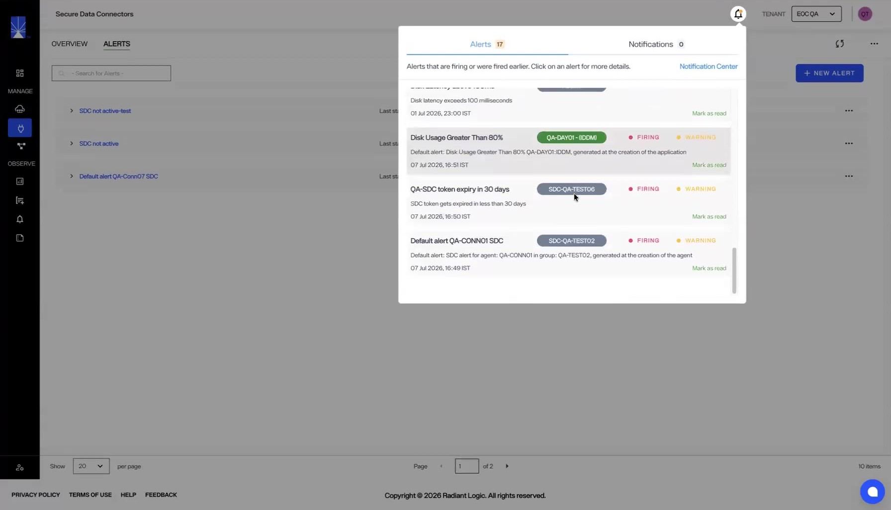
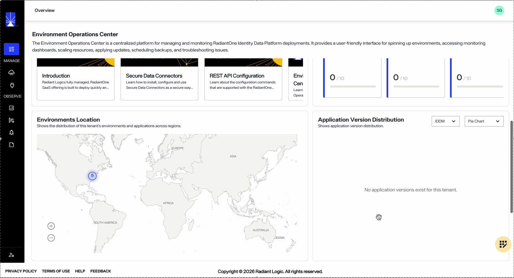
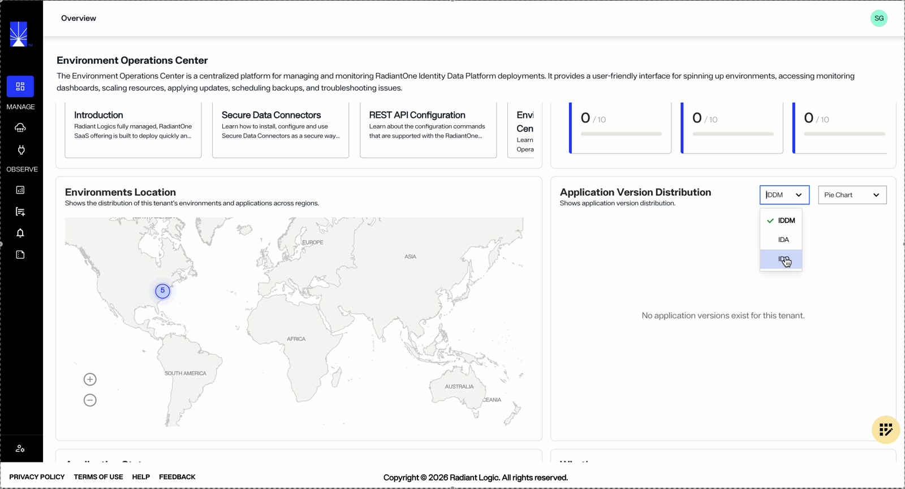
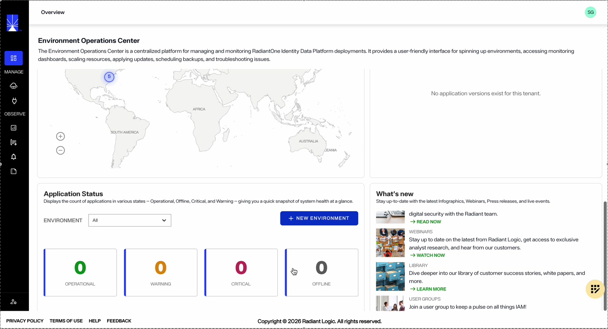
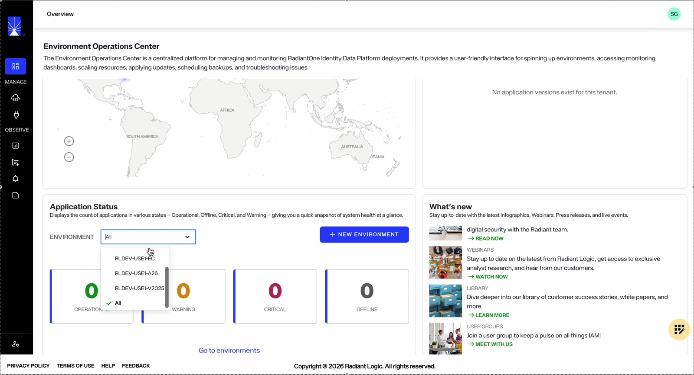

---
keywords:
title: Overview
description: Overview of EOC
---

# Getting started

Environment Operations Center allows you to control your RadiantOne implementation in a cloud environment. It provides all of the required tools to:
 
1. Create and manage RadiantOne [environments](../environments/environment-overview/environments.md) where you can install and manage RadiantOne applications in your environments. 
2. [Securely connect with on-premises data ](../secure-data-connector/configure-sdc-service.md). Note that this feature is currently supported in Identity Data Management applications only.
3. Observe usage and issues with [reporting](../reporting/reporting-overview.md), [dashboards](../dashboards/dashboards-overview.md), [logging](../environments/applications/logging/application-logs.md), and [alerting](../environments/applications/alerting/alert-management-overview.md) dashboards.
4. [Administrate](../admin/admin-overview.md) account settings, users, environment alerts and integrations depending on the user role.  
5. Customize the homepage with widgets and relevant links.  

This guide provides an overview of the Environment Operations Center home screen and how to navigate the user interface of this screen.

## Overview

After logging in to the Environment Operations Center, the *Overview* screen appears. This is the Environment Operations Center home screen. It displays a description of the platform along with a summary of your environments, applications, secure data connectors, and system health. You can customize the displayed layout of the screen.

A navigation bar is located to the left and is visible from all screens within Environment Operations Center. You can access your account settings by selecting the avatar in the upper right corner, also visible from all screens in the application. If you are an admin, you can access admin settings by selecting the admin icon in the bottom left corner of the page.

### Account settings
A user avatar is always located in the upper right corner of the Environment Operations Center user interface. Select the avatar to expand your account dropdown menu. 

The dropdown displays your name, email, and permissions associated with the account. From the dropdown menu you can navigate to your **Account Settings**, access the **Help** center, or **Logout** of Environment Operations Center.

For information on managing your account settings, see the [account settings](./account-settings/update-account.md) guide.

### Notification center

The bell icon in the top navigation bar shows alerts that are firing or fired recently, and the notification center lists every alert across the Environment Operations Center with its current status. Select an alert to open its alerts page, and select **Mark as read** to remove it from the list. For more detail, see the [alerting](../environments/applications/alerting/alert-management-overview.md) guide.

### Environment summary

At the top of the *Overview* screen, a summary bar displays high-level counts and health indicators across your tenant:

- **Environments** — The total number of environments that are created in your account, broken down by **Production** and **NonProduction** counts.
- **Applications** — The total number of applications registered, with a status breakdown showing counts for **Operational**, **Warning**, **Critical**, and **Offline** states.
- **Secure Data Connectors** — The total number of secure data connectors, with counts for **Active**, **Paused**, **Failed**, and **Inactive** states.
- **System Health** — An overall health percentage for the tenant, showing separate percentages for **Application** health and **Data Connector** health.

### Quick links

By default, the Quick Links section contains guides and resources to help you with your work in RadiantOne and Environment Operations Center. An admin can add or remove links to display relevant content in this section by using the **Add link** and **Manage Links** options. 

### Subscriptions

The **Subscriptions** section shows the number of used nodes and available nodes per application type. It displays separate tiles for **Identity Data Management**, **Identity Data Analytics**, and **Identity Observability**, each showing the current node usage out of the total available.

### Environments location

The **Environments Location** section displays a world map showing the geographic distribution of this tenant's environments and applications across regions. Each cluster on the map is labeled with the count of environments in that location. You can zoom in and out using the **+** and **−** controls.

### Application version distribution

The **Application Version Distribution** section shows the version distribution of applications within a selected application type. Use the dropdown menus to filter by application type (**IDDM**, **IDA**, or **IDO**) and to select the chart format. Available chart types are **Bar Chart**, **Line Chart**, **Pie Chart**, and **Area Chart**.

### Application status 

The *Application Status* section displays the count of applications in various states such as **Operational**, **Warning**, **Critical**, and **Offline** to give you a quick snapshot of application health at a glance.

Use the **Environment** dropdown to filter the status counts by a specific environment or view counts across **All** environments.

The **New Environment** button lets you create a new environment. The **Go to Environments** link at the bottom of the section takes you to the Environments page.

### What's new

The **What's new** section keeps you up to date with Radiant Logic's latest content, including:

- **Digital security articles** — Read the latest posts from the Radiant Logic team.
- **Webinars** — Stay up to date on Radiant Logic webinars and get access to exclusive analyst research.
- **Library** — Dive deeper into customer success stories, white papers, and more.
- **User Groups** — Join a user group to keep a pulse on all things IAM.

### Custom widgets

At the bottom right of the screen, you will see a customization icon as shown in the image below.

By clicking on it, you can change the layout of the home screen, add another widget to the screen or delete any existing widget. Once you perform any of these actions, click **Save** to save the changes in the layout or **Cancel** to cancel those changes. 

 

### Left navigation

The left navigation contains links to various screens, providing access to the following Environment Operations Center features:

- Overview: This is the landing page of the Environment Operations Center. To navigate to the *Overview* screen, select either **Overview** or the Radiant Logic logo. 

- Environments: The main *Environments* screen provides an overview of all the environments you have access to. Select **Environments** to navigate to the *Environments* overview. To learn more about the *Environments* section, see the [environments overview](../environments/environment-overview/environments.md) guide.

- Secure data connectors: You can manage connections to on-premise data connectors in the *Secure Data Connectors* section. Select **Secure Data Connectors** to navigate to the *Secure Data Connectors* screen. For details on managing data connections, see the [secure data connectors](../secure-data-connector/configure-sdc-service.md) guide. This feature is currently available only in the Identity Data Management application.

- Promotion Pipelines: The [configuration promotion pipeline](../promotion-pipelines/configuration-promotion.md) supports promotion of validated configurations across multiple Identity Data Management (IDDM) environments.

- Observe: The Observe section contains navigation items for [Reporting](../reporting/reporting-overview.md), [Monitoring](../dashboards/dashboards-overview.md), [Logging](../environments/applications/logging/application-logs.md), and [Alerting](../environments/applications/alerting/alert-management-overview.md) dashboards.

- Admin: From the *Admin* section you can perform various administrative actions in Environment Operations Center. Select **Admin** to navigate to the *Admin* home screen. For further details on operations available in the *Admin* section, see the [admin overview](../admin/admin-overview.md) guide.

### Scheduled maintenance notice

Periodically, you may see a scheduled maintenance notice at the top of the home screen. This serves to inform you about upcoming maintenance that could affect the applications in your Environment Operations Center. You may also receive email notifications ahead of the maintenance.

 

After you click on the "Know more" link and confirm you've read it by clicking on the "I acknowledge this notification" checkbox, the alert will be removed from the landing page.

As a tenant admin, you see and acknowledge the maintenance notice only. Scheduled maintenance — including the list of email recipients who receive maintenance notifications — is now configured at the super-admin level and is no longer available on the tenant **Admin > Settings** page.

## Next steps

After reading this guide you should have an understanding of the *Overview* screen components and how to navigate the Environment Operations Center user interface. To learn about role-based permissions that different users have, see the [role-based permissions](../role-based-permission/role-based-permissions.md) guide. To learn how to create an environment, see the [create an environment](../environments/environment-overview/create-environments.md) guide.
