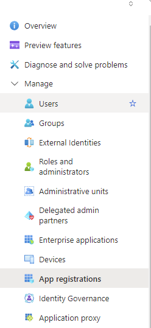
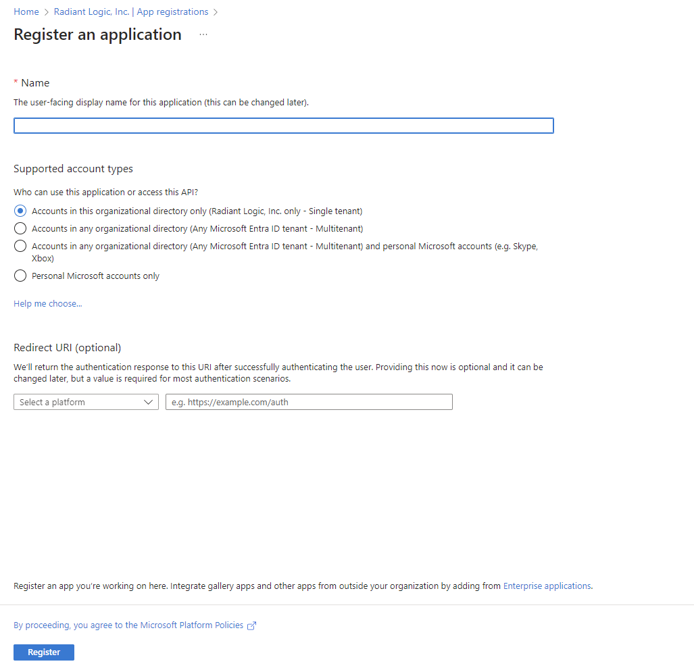
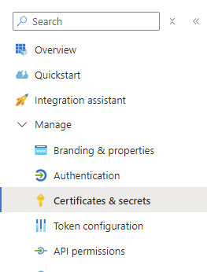
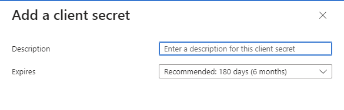
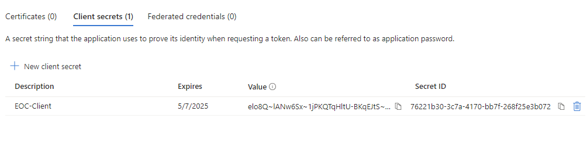
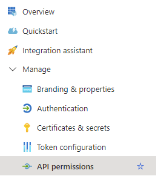
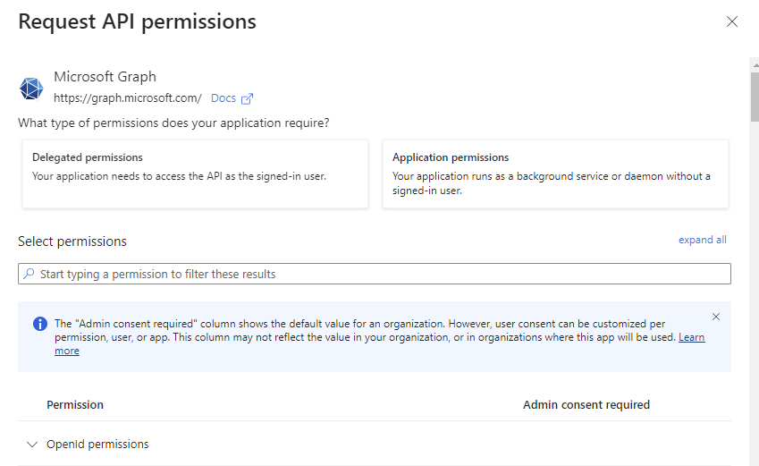
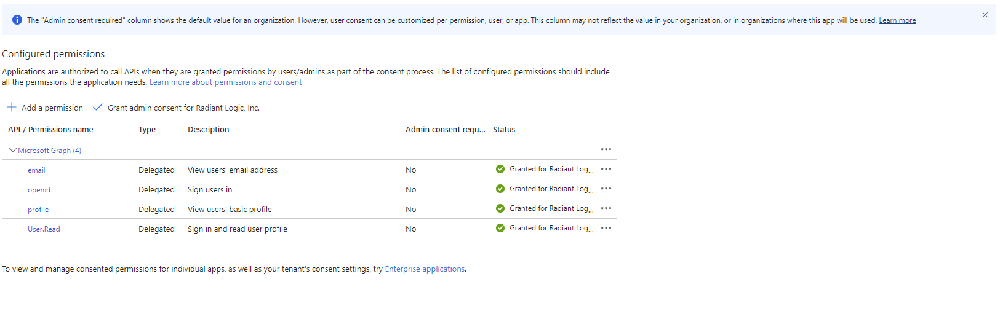

---
keywords:
title: Microsoft SSO
description: This Guide provides the information about configuring the SSO for microsoft
---

# Microsoft SSO

This guide describes the following topics required to configure Microsoft SSO.  

- [Registering Your Application in Azure AD](#registering-your-application-in-azure-ad)  
- [Creating a Secret for Authentication](#creating-a-secret-for-authentication)  
- [Assigning API Permissions](#assigning-api-permissions)  
- [Implementation and Testing](#implementation-and-testing)  

## Registering Your Application in Azure AD

This section describes how to establish your application as a recognized entity in Azure AD to facilitate secure interactions.  

1. Using an administrative account, log into the Azure AD portal.  
2. In the navigation pane on the left, select **App registrations**.  

3. At the top of the page, click **New Registration**.  
4. Enter a descriptive name that helps identify the application within your organization.  

5. In the Supported Account Types section, select one of the following options.  

    - **Single Tenant** - limits access to users within the organization.
    - **Multitenant** - allows users from any Azure AD directory to access the application.  

6. From the Select A Platform drop-down menu, select **Web**.  
7. Next to the Select A Platform menu, specify a URI to which Azure AD will send authentication responses.  
8. Click **Register**.  
9. Make note of the Application ID for future reference.  

## Creating a Secret for Authentication

This section describes how to generate a secret key that your application uses to authenticate itself with Azure AD.  

1. In the Azure AD portal, navigate to **Manage > Certificates & Secrets**.  
  
2. On the Client Secret tab, click **New Client Secret**. The Add a Client Secret window displays.  
  
3. Provide a meaningful description for the secret, i.e. "Production Key 2024".  
4. Select an option from the **Expires** drop-down menu.  
5. Note the value displayed on the Client Secrets tab.  
  

## Assigning API Permissions

This section describes how to specify which resources your application can access and which actions it can perform in Azure AD.

1. In the Azure AD Portal, navigate to **Manage > API Permissions**.  

2. Click **Add a Permission**.  
3. Select an API and click **Delegated Permissions**.  
  
4. Add permissions as needed.  

    >[!warning] These permissions must align with the functionality your application requires.  

5. To apply these permissions across all users in your directory, click **Grant admin consent for [your directory]"**.  
6. Click **Yes**.  
  

## Implementation and Testing

The section describes how to integrate and verify that SSO via Azure AD is functioning correctly in your application.  

1. In your application authentication settings, input the Application (Client) ID and the Client Secret.  
2. Configure the authentication library or framework you are using (such as Microsoft's Identity platform libraries) to interact with Azure AD using these credentials.  
3. Implement a login feature where users are redirected to Azure AD for authentication.  
4. Verify that after successful authentication, Azure AD redirects users back to your application's specified redirect URI.  

    >[!note] Your application should handle this response to authenticate the user internally.

5. After implementation, monitor the integration closely for any performance issues or errors.  
6. Review logs and user feedback to identify and troubleshoot any potential problems in the SSO process.  
