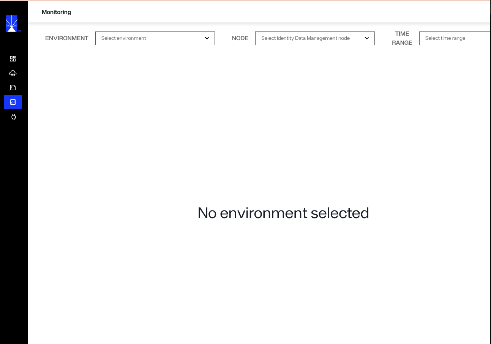
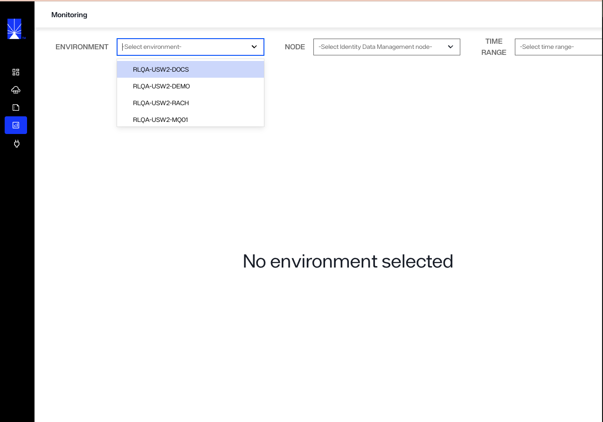
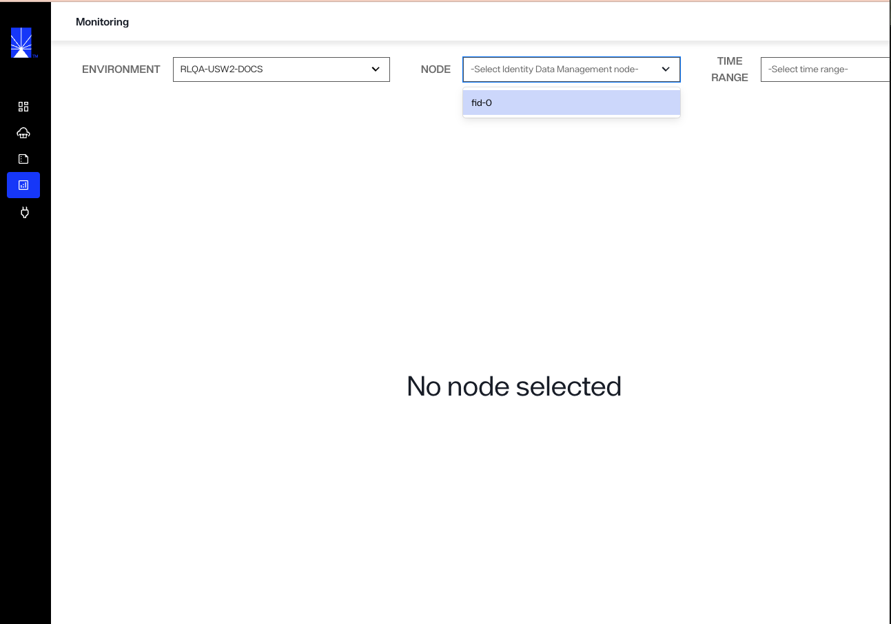
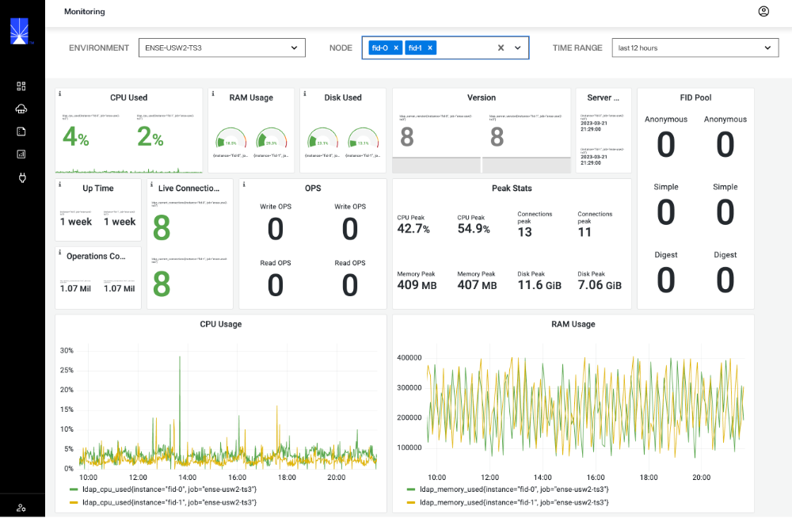
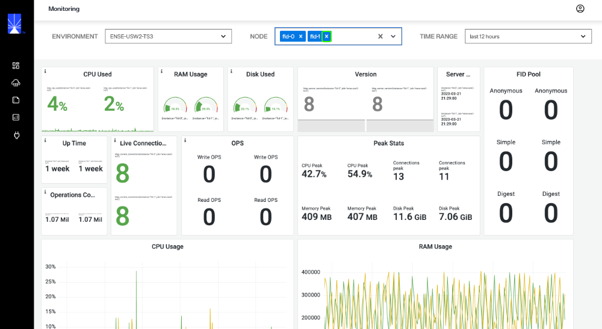
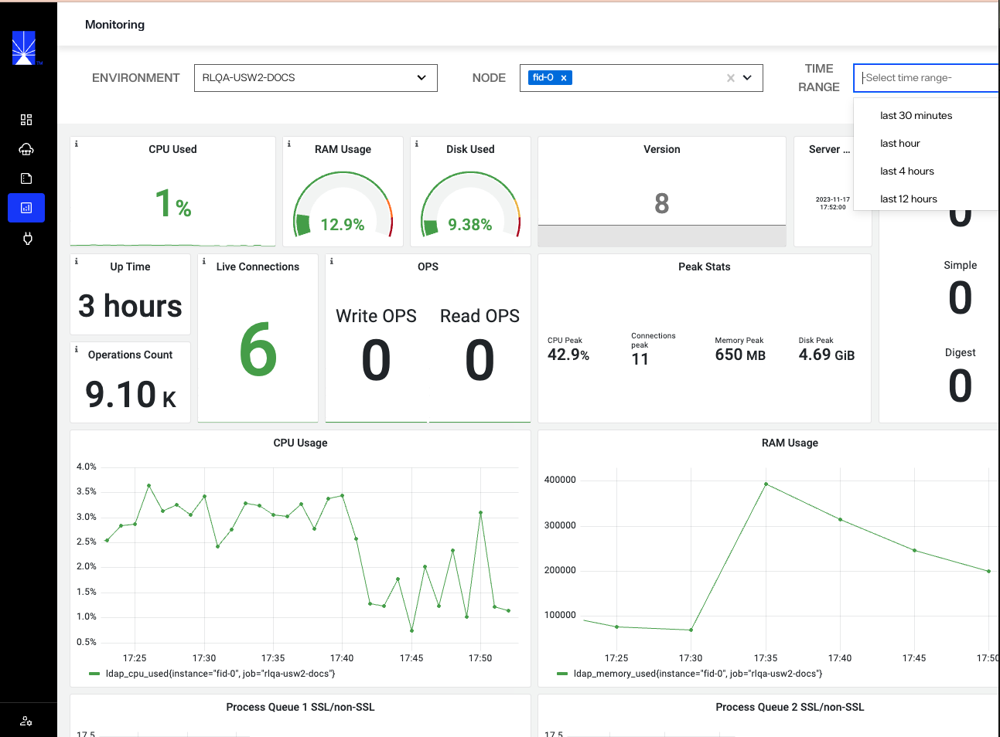
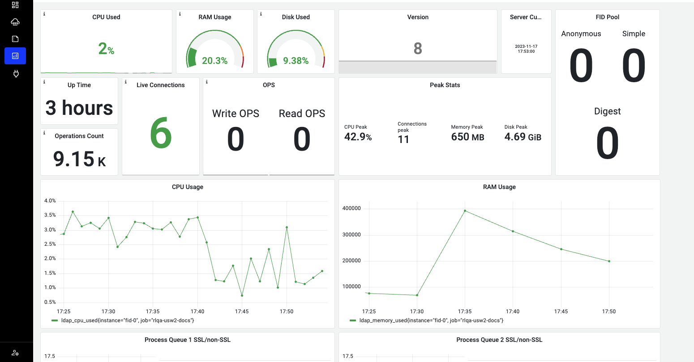

---
keywords:
title: Monitoring 
description: Learn how to use the Monitoring section in Environment Operations Center to view metrics associated with specific environments and RadiantOne FID Nodes. Default monitored metrics include CPU Usage, RAM Usage, Disk space used, connection pool usage, operations count since startup broken down by operation type, and current number of live connections.
---
# Monitoring

From the *Monitoring* screen, you can review the status and health of various RadiantOne components for each server. This guide provides an overview of the *Monitoring* section in Environment Operations Center and its features.

>[!warning] Monitoring is a crucial step in maintaining the health of RadiantOne and it is recommended that you monitor these components on a regular basis.

## Getting started

To navigate to the *Monitoring* screen, select **Monitoring** () from the left navigation.

## Monitor an environment

To generate monitoring metrics, an environment and at least one node must be selected.

To set the environment, select an environment from the **Environment** dropdown.

Select at least one node from the **Node** dropdown. 

If you would like to monitor more than one node, continue selecting all required nodes and then collapse the **Node** dropdown. The monitoring dashboard will update to display the component metrics for all nodes selected.

To remove a node, select the "X" associated with the node name.

### Filter data by time range

You can filter monitoring data by time range, allowing you to narrow down the targeted data to a specific time frame.

To filter by time, select a range from the **Time Range** dropdown.

## Monitored Metrics for Identity Data Management

The monitoring dashboard displays several node component metrics, allowing you to monitor the health of RadiantOne service.

Component metrics displayed include:

| Component | Definition |
|--------|------------|
| CPU Used | Current CPU usage of the machine hosting RadiantOne. |
| RAM Usage | JVM memory used. |
| Disk Used | Current disk usage of the drive on the machine hosting RadiantOne. |
| Version | Current version of RadiantOne installed on the node. |
| Server Current | Details about the server you connected to. |
| FID Pool | The number of connections in a pool organized by anonymous, digest, and simple. |
| Up Time | Time elapsed since the server started. |
| Operations Count | How many operations have ben performed on the connection. |
| Live Connections | The live number of concurrent connections to RadiantOne FID. |
| Ops | The type and number of operations performed. |
| Peak Stats | Peak statistics for various components, such as CPU, Connections, Memory, and Disk. |
| CPU Usage | A line graph that charts CPU usage over time. |
| RAM Usage | A line graph that charts RAM usage over time. |

