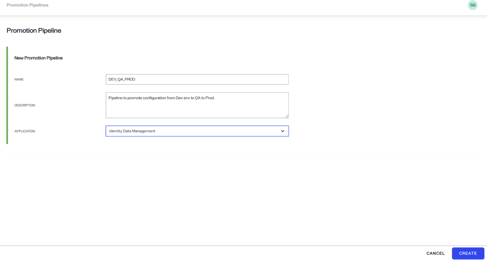
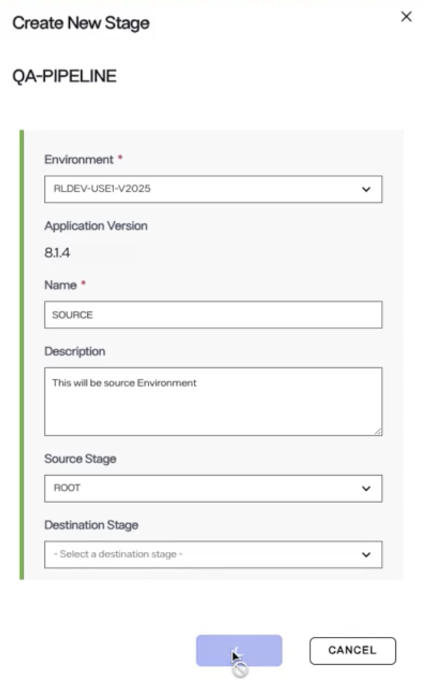
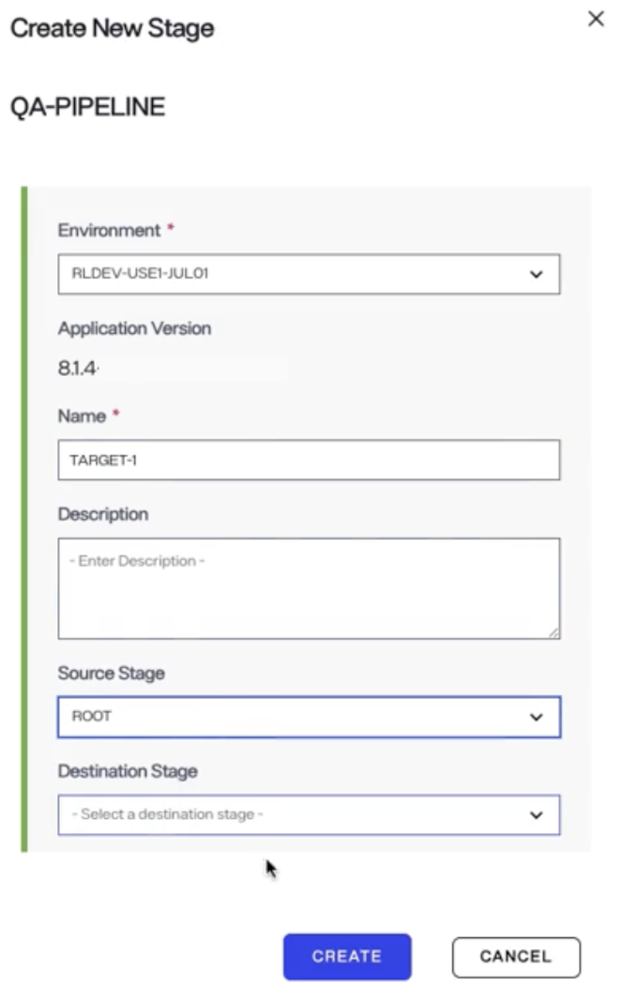
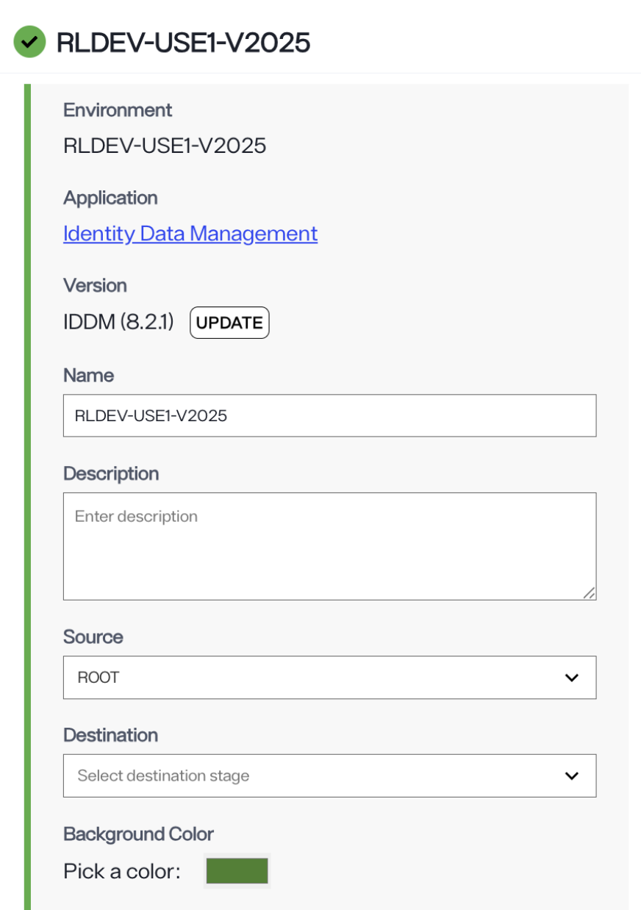
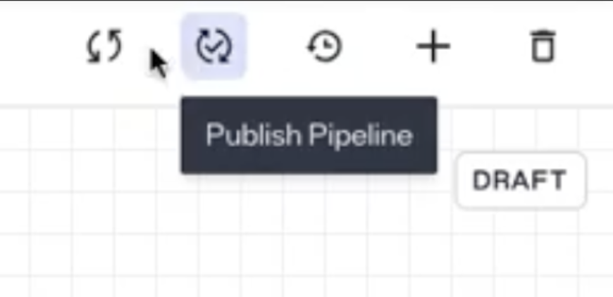

# Configuration Promotion Pipelines

Configuration pipeline supports the promotion of validated configurations across multiple Identity Data Management (IDDM) environments. 
 
This is particularly useful for promoting configuration updates from development to QA and/or production environments.  

> You must create a promotion pipeline by following the steps outlined here before making configuration changes in Identity Data Management that need to be promoted. Ensure that both the source and target environments are running the same version of Identity Data Management.

This feature is supported in Identity Data Management version 8.1.4 or higher and requires EOC version 1.4.0 or higher.

Through the Environment Operations Center, you can define the source and target environments. To create and configure a new promotion pipeline, follow these steps:

1. **Click the Promotion Pipelines icon** in the left-hand navigation bar.  
   Click the **New Pipeline** button. 

   
   

2. **Enter details about your pipeline**, then click **Create**.  
   
   

3. **Add a Source Stage**  
   Click the plus (+) icon to add a source stage (e.g., "demo stage").  
   This stage represents the environment from which configuration changes will be imported.  
  
    

   Fill in all required fields as prompted on the screen, then click the **Create** button.  
   
    

4. **Add target stages**  
   After adding the source stage, you can define one or more target stages.  
   For example, you might add:
   - QA as the first target stage
   - Production as the second target stage  
    
    

   To add a target stage, do the following:  
   Repeat the same step you used to add the source stage (by clicking the plus icon).  
      
    

   Provide all the required information.  
   Set the **Source Stage** to `ROOT` and leave the **Destination Stage** blank.  
   Click **Create**.

5. **Link the stages**  
   Edit the target stage you created.  
   Update the **Source Stage** value to match the name of the original source stage created in Step 3.  
   
6. **Add Additional Target Stages (if needed)**  
   Repeat Steps 4 and 5 to add more target stages if needed and link them properly.  
   For example, when adding the Production stage, set its **Source Stage** to the name of your first or the second target stage (e.g., "QA") depending on how you want the pipeline to be configured.

7. **Publish the Pipeline**  
   Once all stages are configured, click the **Publish** icon to activate the pipeline.  
   
   

8. **Start Promoting Configurations**  
   After publishing, you can begin exporting configurations from the source to the target environment. **Ensure that the source and target environments are running the same version of Identity Data Management before initiating promotion of configurations.** 

   
   Refer to this [linked documentation](../../../idm/v8.1/deployment/configuration-promotion.md) to learn the next steps.
