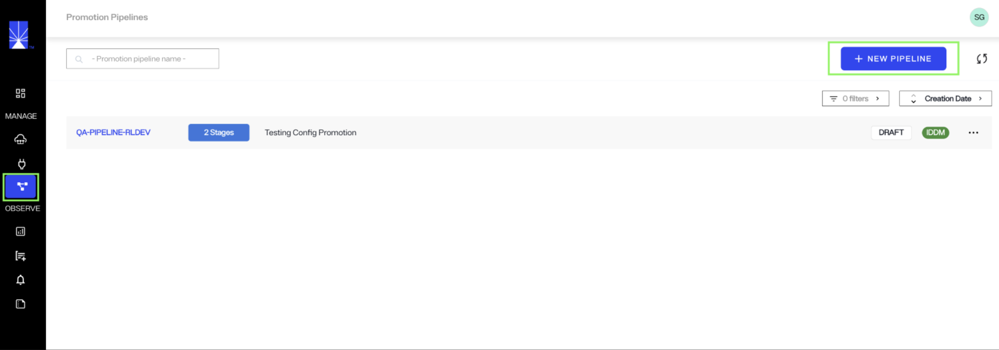
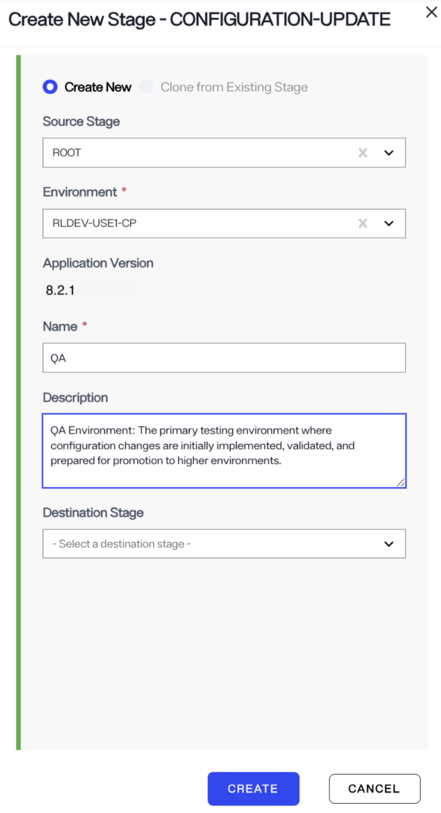
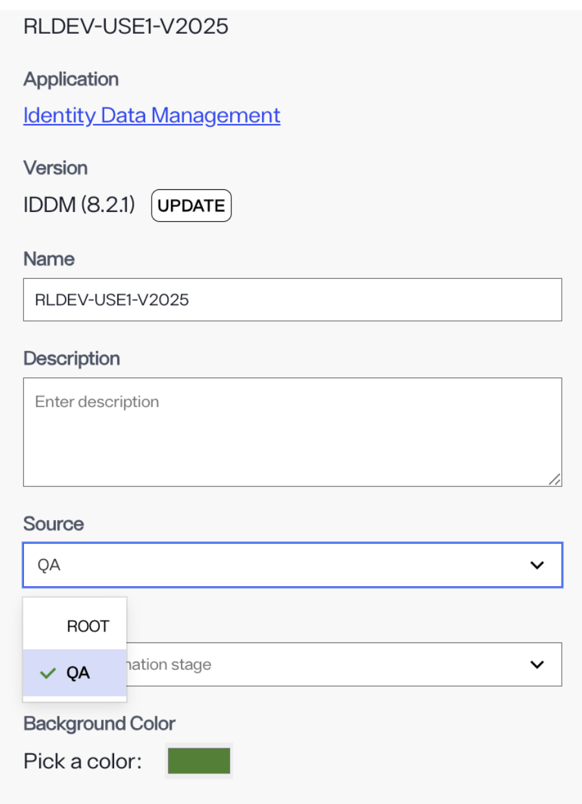
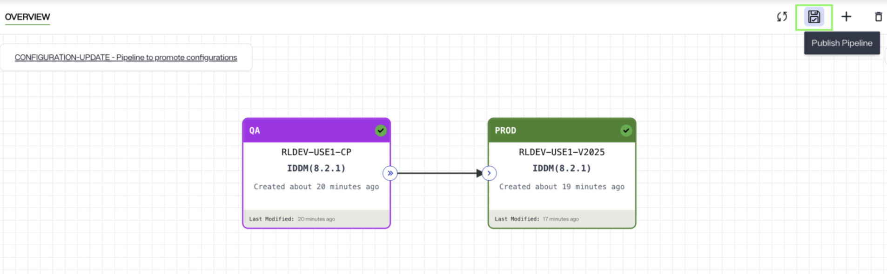
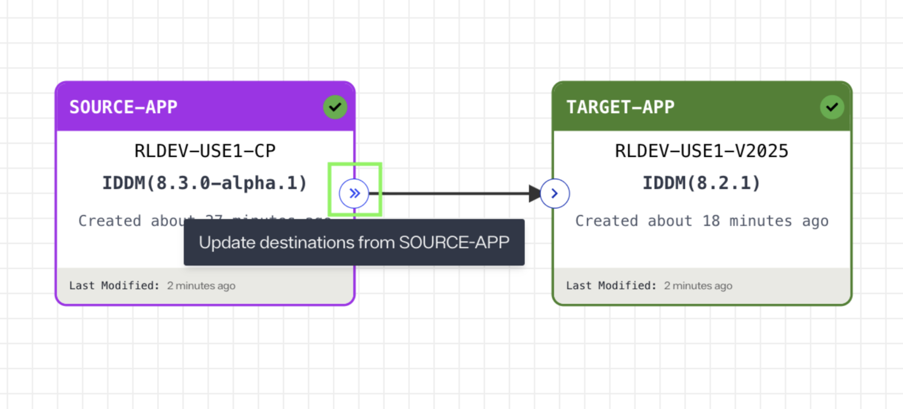

# Promotion Pipelines 

Promotion pipelines enable the transfer of updates between different application environments. In the Environment Operations Center, the following promotions are supported: 
 
* **Configuration Updates Promotion:** This supports promotion of validated configuration updates only for Identity Data Management applications.  
 
* **Version Updates Promotion:** This supports promotion of application version updates for all application types: Identity Data Management, Identity Analytics, and Identity Observability. 

## Configuration Updates Promotion 

The configuration promotion pipeline supports promotion of validated configurations across multiple Identity Data Management (IDDM) environments. 

This is particularly useful for promoting configuration updates from development to QA and/or production environments.  
 
> You must create a promotion pipeline by following the steps outlined here before making configuration changes in Identity Data Management that need to be promoted. Ensure that both the source and target environments are running the same version of Identity Data Management. 

This feature is supported in Identity Data Management version **8.1.4 or higher** and requires **EOC version 1.4.0 or higher**. 

Through the Environment Operations Center, you can define the source and target environments. To create and configure a new promotion pipeline, follow these steps: 

### Requirements 

- IDDM version 8.4.0+  
- EOC version 1.5.2+  
- The source and target environments must run the same Identity Data Management application version.  
- A promotion pipeline (like the one outlined in this document) must exist before configuration changes are made.  

### 1. Create a New Promotion Pipeline 

In the EOC, click the **Promotion Pipelines** icon on the left navigation bar.  

Click **New Pipeline**. Enter pipeline details and click **Create**.  

### 2. Add a Source Stage 

Click the plus (**+**) icon to add a source stage (e.g., QA stage). This stage represents the environment where configuration changes originate. Fill in the required fields and click **Create**. 

### 3. Add Target Stages 

Add one or more target stages (e.g., Demo/ Production). Click the plus (**+**) icon again and fill in the required fields.  
Set **Source Stage** to reference the correct upstream stage (e.g., QA or Demo Stage). Leave **Destination Stage** blank. Click **Create**. 

### 5. Publish the Pipeline 

Once all stages are configured, click the **Publish** icon to activate the pipeline.  

### 6. Start Promoting Configurations 

After publishing, you can export configurations from the source to target environments. Ensure both environments run the same Identity Data Management version before promoting. Refer to this [linked documentation](../../../idm/v8.1/deployment/configuration-promotion.md) to learn the next steps.

## Application Version Updates Promotion 
 

You can use the promotion pipeline to promote application version updates from source applications to its linked destination applications so that all linked applications in the pipeline have the same version. To accomplish this, create source and destination stages following the same process described earlier in this document. The steps are repeated below for reference. 

### 1. Create Source and Destination Stages 

i. Navigate to the **Promotion Pipeline** page and click **Create New Stage**.  

ii. Choose **Create New** to create a Source Stage with the following details:  

- Enter a name in the **Name** field.  
- (Optional) Add a description in the **Description** field.  
- Select the **Environment** from the dropdown menus.  
- Click **CREATE** to save your source stage.  

iii. To create a destination stage, choose a creation method:  

- **Create New** (default), or  
- **Clone from Existing Stage**.  

iv. Select a **Source Stage**. The **Source Stage** must reference the correct upstream stage (e.g., QA).     

v. Select the target **Environment** from the dropdown. Confirm the **Application Version** (automatically displayed after environment selection).  

vi. Enter a **Stage Name** and optionally add a description.  

vii. Click **CREATE** to save.  

### 3. Promote Application Version Updates 

i. Open the **Promotion Pipeline** interface.  

ii. Identify the Stage you want to promote from (typically your validated or tested version).  

iii. Click the double arrow (**>>**) button next to the source environment’s version.  

  

iv. Review all impacted stages in the confirmation dialog. Click **Confirm** to begin promotion. Once the promotion is applied, the downstream stage is updated to the same version as the source stage.  
