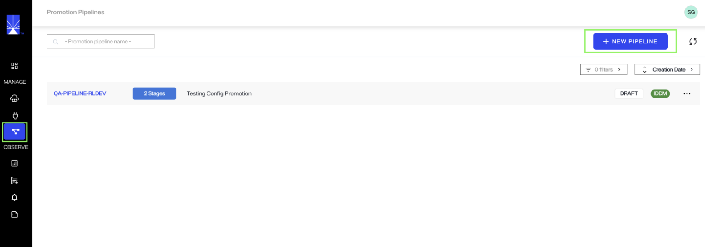
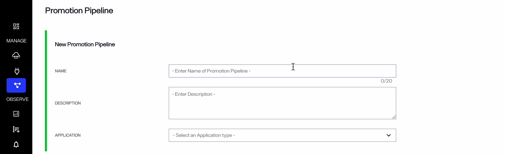
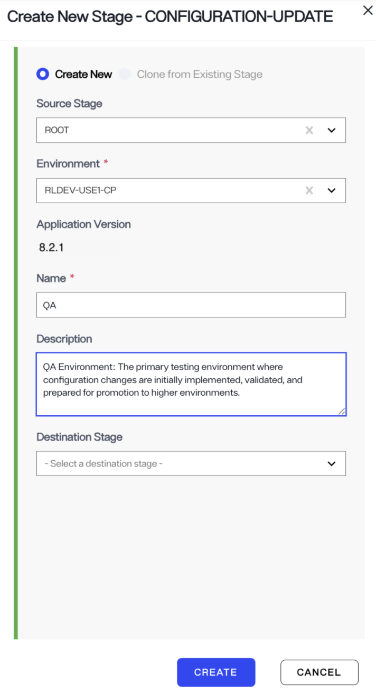
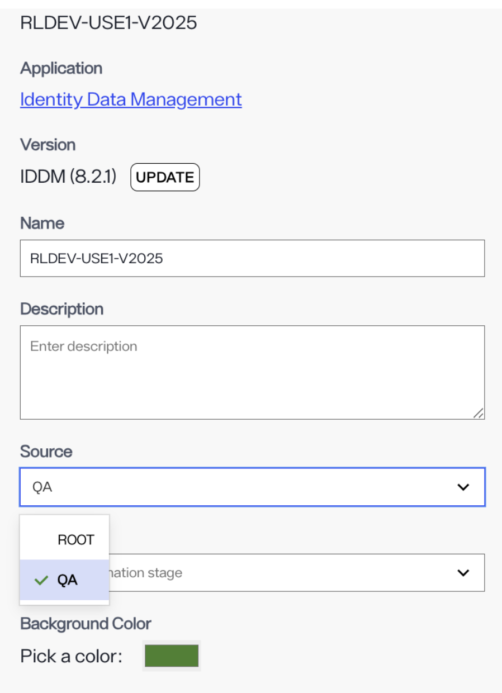
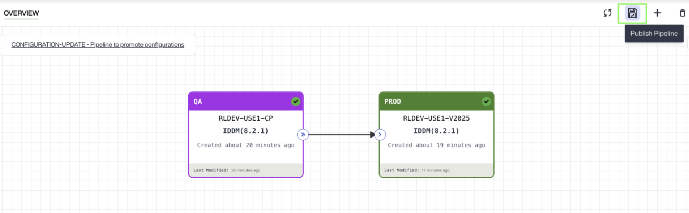
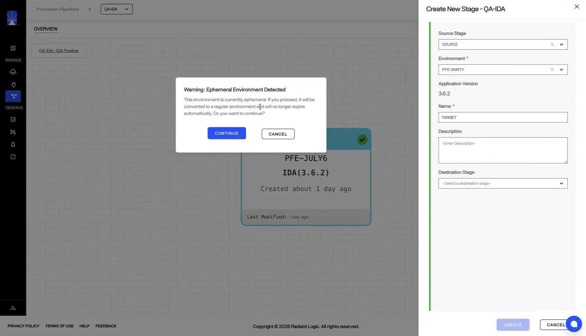

# Promotion Pipelines 

Use promotion pipelines to promote configuration or application version updates between environments. Environment Operations Center supports two types of promotion:

* **Configuration Updates Promotion:** promotes validated configuration updates. Available for Identity Data Management applications only. The applications in the pipeline must be on the same version before you can promote.

* **Version Updates Promotion:** promotes application version updates. Available for all application types: Identity Data Management, Identity Analytics, and Identity Data Platform.

The *Promotion Pipelines* page lists your pipelines. Use the filter options on the page to narrow the list.

## Configuration Updates Promotion 

The configuration promotion pipeline promotes validated configurations across multiple Identity Data Management environments, for example from development to QA or production.
 
> Create the promotion pipeline before you make the Identity Data Management configuration changes you want to promote. The source and target environments must run the same Identity Data Management version.

To create and configure a pipeline, define its source and target environments as described in the following steps.

### Requirements 

- Identity Data Management version 8.4.0+  
- Environment Operations Center version 1.5.2+
- The source and target environments must run the same Identity Data Management application version.  
- The promotion pipeline must exist before you make the configuration changes.

### 1. Create a New Promotion Pipeline 

Select **Promotion Pipelines** under **Manage** in the left navigation.

Select **New Pipeline** to open the *New Promotion Pipeline* form, then complete the following fields:

- **Name** — a name for the pipeline, up to 20 characters.
- **Description** — an optional description of what the pipeline promotes.
- **Application** — the application type the pipeline applies to.

Select **Create** to create the pipeline. If you select **Cancel**, a prompt asks you to confirm that you want to stop creating the pipeline and warns that you will lose your progress.

### 2. Add a Source Stage 

Select the plus (**+**) icon to add a source stage, for example a QA stage. The source stage is the environment where configuration changes originate. Fill in the required fields and select **Create**.

### 3. Add Target Stages 

Add one or more target stages, for example Demo or Production. Select the plus (**+**) icon again and fill in the required fields. Set **Source Stage** to the upstream stage, for example QA or Demo. Leave **Destination Stage** blank. Select **Create**.

### 4. Publish the Pipeline 

When all stages are configured, select the **Publish** icon to activate the pipeline.

After you publish the pipeline, you can view its publish and version history to see each published version of the pipeline and track changes over time.

### 5. Start Promoting Configurations 

After you publish the pipeline, you can export configurations from the source to the target environments. Make sure both environments run the same Identity Data Management version before you promote. For the next steps, see [configuration promotion](../../../idm/v8.1/deployment/configuration-promotion.md) in the Identity Data Management documentation.

## Application Version Updates Promotion 
 

Use a promotion pipeline to promote application version updates from a source application to its linked destination applications, so that all linked applications in the pipeline run the same version. Create the source and destination stages as described earlier; the steps are repeated here for reference.

### 1. Create Source and Destination Stages 

i. Open the **Promotion Pipelines** page and select **Create New Stage**.

ii. Choose **Create New** to create a Source Stage with the following details:  

- Enter a name in the **Name** field.  
- (Optional) Add a description in the **Description** field.  
- Select the **Environment** from the dropdown.
- Select **Create** to save the source stage.

iii. To create a destination stage, choose a creation method:  

- **Create New** (default), or  
- **Clone from Existing Stage**.  

iv. Select the upstream stage, for example QA, as the **Source Stage**.

v. Select the target **Environment** from the dropdown, then confirm the **Application Version** that appears after you select the environment.

vi. Enter a **Stage Name** and optionally add a description.  

vii. Select **Create** to save.

### 2. Promote Application Version Updates 

i. Open the **Promotion Pipeline** interface.  

ii. Find the stage you want to promote from, typically the one with your validated or tested version.

iii. Select the double arrow (**>>**) next to the source environment's version.

iv. Review the affected stages in the confirmation dialog, then select **Confirm** to start the promotion. When the promotion finishes, the downstream stages run the same version as the source stage.

## Adding an ephemeral environment to a pipeline

When you add an ephemeral environment to a promotion pipeline, a prompt warns you that the environment is ephemeral and that continuing converts it to a regular environment. If you continue, Environment Operations Center adds the environment to the pipeline and removes its ephemeral (auto-delete) property.

> You cannot add an environment that is already in a pipeline through one of its applications. Remove it from the pipeline first.

