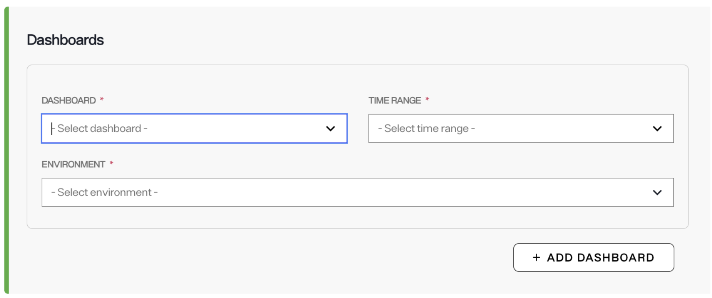
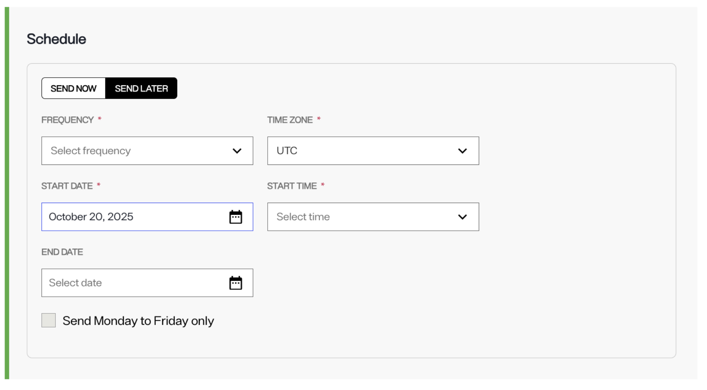
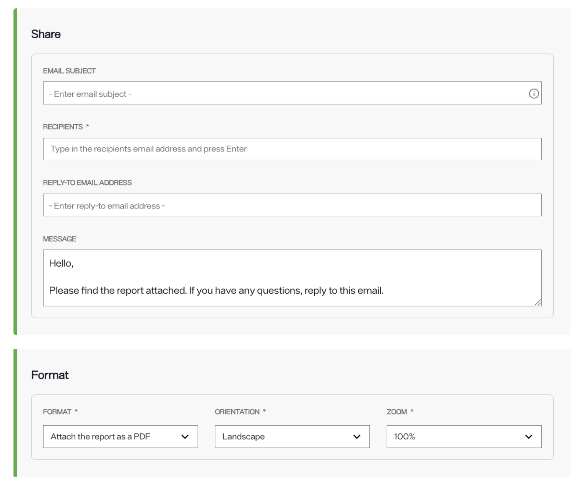
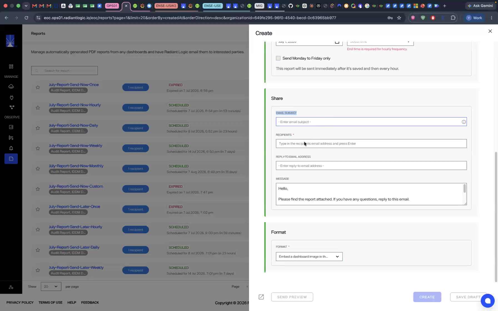
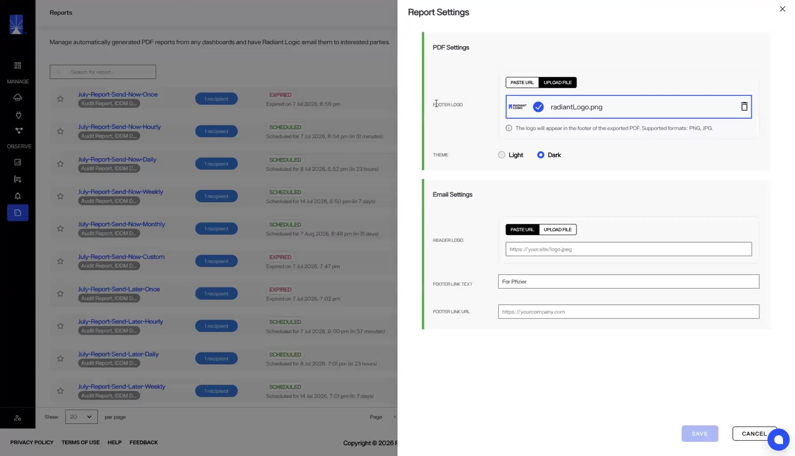
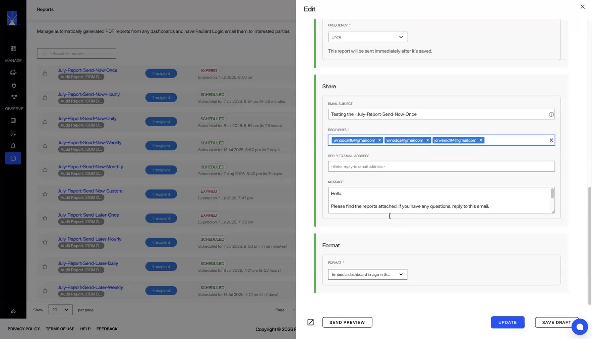

---
keywords:
title: Reporting Overview
description: Learn about the application reporting options available in the Environment Operations Center.
---

## Overview

The **Reports** feature allows users to create, schedule, share, and format operational reports based on dashboards within **Radiant Logic's Environment Operations Center**.

This document outlines how to create, preview,  and share reports.

## Creating a Report

To create a new report, select **Reports** under **Observe** in the left navigation and follow the steps below:

1. Select **New Report** to begin a new report. Enter a name for your report in the **Report Name** field. 

2. Under Dashboards, select the dashboard to include in the report.  Select the relevant period for the dashboard and specify the desired environment. Click ADD DASHBOARD if you would like to include more dashboards in the report. 

 

3. Under Schedule, choose whether to send the report immediately or schedule it for a later date and time. Next, specify how often you want the report to be sent using the options listed under Frequency. Select your time zone, then set the Start Date and Start Time. If needed, you can also set an End Date. To limit delivery to weekdays, check the box labeled “Send Monday to Friday only”. 

 

4. Under Share, specify the email information for the recipients of the report. Enter your Email Subject. In the Recipients field, add one or more email addresses and press Enter after each to select multiple recipients. Set the Reply-To Email Address. Customize the Message field as needed. 

 

5. Under Format, select the desired document options. In the **Format** dropdown you can choose to attach the report as an image or as a PDF, set the **Orientation** (for example, Landscape), and choose the **Zoom** percentage for how the report will be displayed. 

6. Use the Open Preview icon to review your report in a new tab. Click Send Preview to send a test copy and see what the report will look like. 

7. Select **Create** to finalize and send the report, or **Save Draft** to finalize it later.

## Managing existing reports

The **Reports** page lists every report you have created, along with its status and owner. From this screen you can edit, pause, and remove reports.

- **Update a report.** Open a report, change its settings, and select **Update** to save your changes. (**Update** replaces **Create** for reports that already exist.)
- **Pause a report.** Pause a scheduled report to stop it from sending, then resume it later when you need it again.
- **Delete a report.** Remove a report you no longer need.
- **Filter the list.** Use the filters to narrow the list by status or owner.

A report's status reflects where it is in its lifecycle:

- **Scheduled** — the report is active and sends on its configured frequency.
- **Expired** — the report has reached its end date and no longer sends.

Because reports draw on stored data, you can report over any time range. Select the period you need to generate reports for environments that are days or months old.

## Brand your reports

By default, reports display the Radiant Logic logo in the email body and at the bottom of the PDF. To use your own branding, open the report settings and either paste an image URL or upload an image.

- **PDF settings** control the images shown in the PDF.
- **Email settings** control the images shown in the email body.

## Share defaults

The **Share** step includes a couple of default behaviors worth noting:

- **Reply-To Email Address** — if you leave this field blank, replies default to the Radiant Logic SaaS address.
- **Message** — the default message text is *Please find the report attached.*

