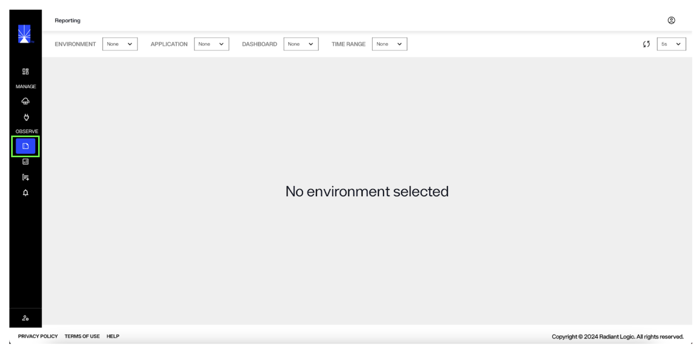
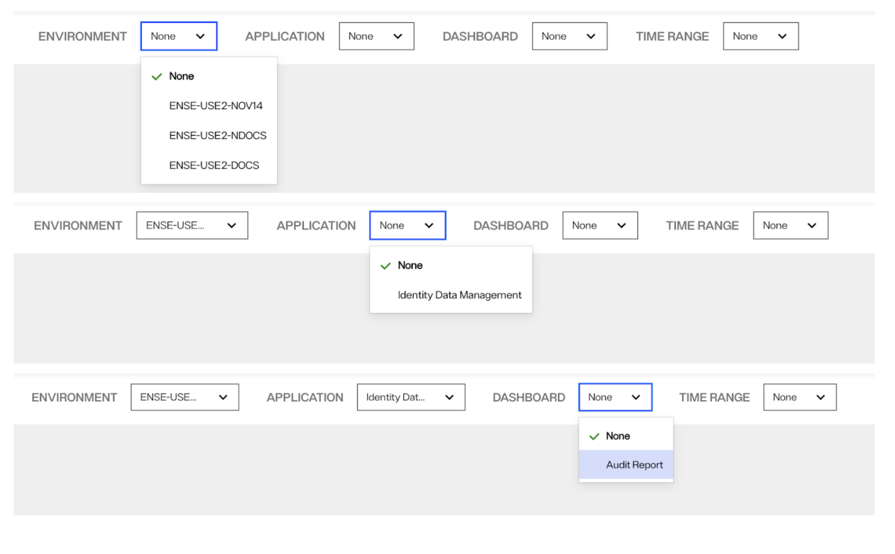
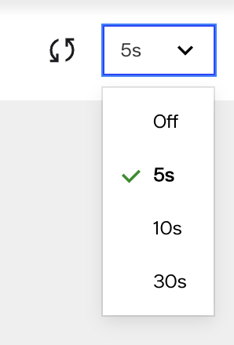

---
keywords:
title: Reporting Overview
description: Learn about the application reporting options available in the Environment Operations Center.
---
# Reporting Overview

From the *Reporting* screen, you can generate various reports to assist in monitoring performance and operations within your application. This guide provides an overview of the *Reporting* section in Environment Operations Center, including its features and how to generate reports. 

>[!note] Reports should be generated frequently to maintain a clear understanding of performance, load, configuration updates, and user activity. Currently, reports are only supported for Identity Data Management applications. 

## Getting started

To navigate to the *Reporting* screen, select **Reporting** () from the left navigation.

## Report Types

This guide outlines the types of reports available in Environment Operations Center for you to monitor activities and the overall health of your environments. Only Access Log Reports are currently available in Environment Operations Center. Additional report types will be added in future releases.

The reporting dashboards displayed in Environment Operation Center are a representation of the Kibana log monitoring user interface available. Every time any application or client accesses the server, that data is captured in log files available through Elastic Search. Logs can be searched or filtered in Environment Operations Center for particular events or activities.

### Access reports

Data is pulled from the Access Logs to build access reports. Information provided by these logs includes client requests to RadiantOne and the responses. The report outlines how long operations run and provides a summary of associated error codes.

**Operation types**

The types of operations included in Access Reports are:

- connections:
- bind: LDAP bind (authentication) requests received by RadiantOne.
- search: Search (base search, one level search, sub-tree search) requests received by RadiantOne.
- add: Add entry requests received by RadiantOne.
- modify: Update entry requests received by RadiantOne.
- compare: Compare requests received by RadiantOne.
- delete: Delete requests received by RadiantOne.

**Standard report details**

The Access Report lists the following details for all operation types:

- response time interval: how long the operation took to complete (in milliseconds)
- response time threshold: any operation that exceeds a specified response time.
- error codes: specified error codes to track
- date: 
- session ID
- connection ID
- operation ID

**Unique report details**

Details that are unique to each operation type include:

| Operation | Details |
| --------- | ------- |
| Bind | Bind DN (user the operation was issued by). |
| Base Search | Base DN (entry that was searched for) and the filter. |
| One Level Search | Base DN (entry where the one level search started from) and the filter. |
| Sub Tree Search | Base DN (entry where the sub tree search started from) and the filter. |
| Add | The Entry (DN) to be added. |
| Modify | The object (entry to be modified) and the modification details. |
| Delete | The Entry (DN) to be deleted. |
| Compare | Information about the compare operation. |

## Generate a report

To generate a report you must select an environment, an application in that environment and a dashboard.

Optionally, you can also select a time range to filter the data for a specified period of time. 

A detailed overview of the various components of the environment, their status, and operational health will display.

### Filter data by time range

Optionally, you can filter the report data by time range, allowing you to narrow down the data to target a specific time frame.

To filter by time, select a range from the **Time Range** dropdown.

### Set or disable auto-refresh

You can set a time range to auto-refresh the report with the latest data. To do so, select a time next to the refresh button. For instance, if you select 5 secons, the refresh will occur every five seconds. To disable auto-refresh, select "Off" from the dropdown options.

## Next steps

After reading this guide you should have an understanding of how to generate environment reports to review the operations and health of your applications. For details on reviewing detailed application logs, see the [application logs](../environments/applications/logging/application-logs.md) guide. To learn how to monitor RadiantOne components, see the [monitoring](../monitoring/monitoring-overview.md) guide.
