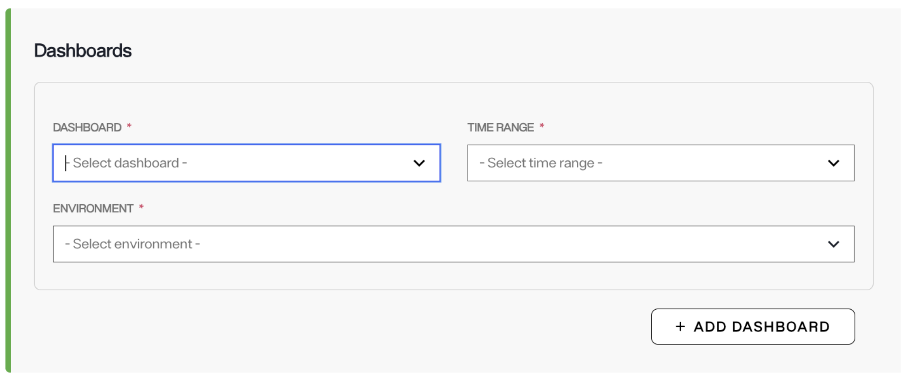
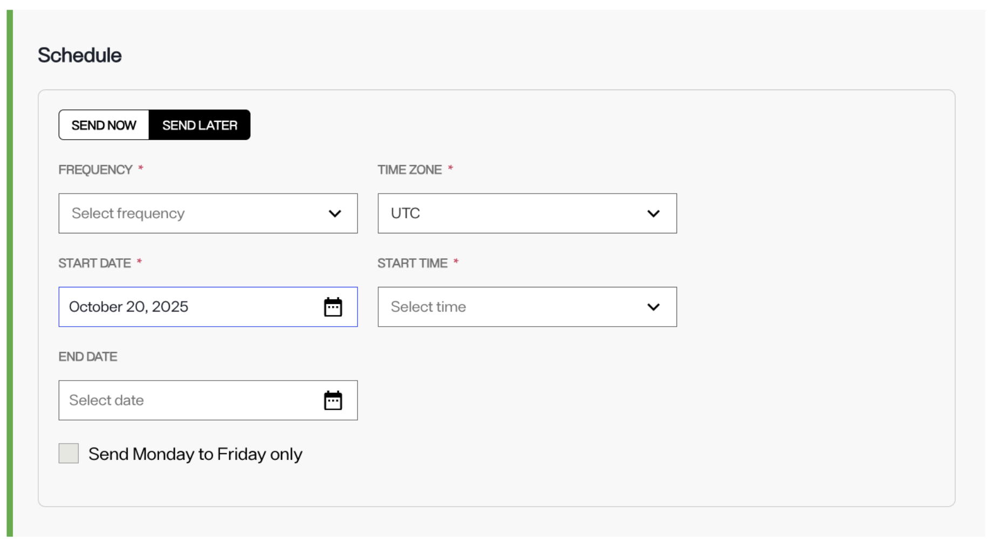
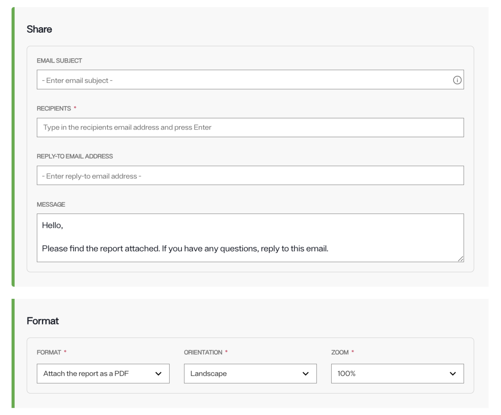
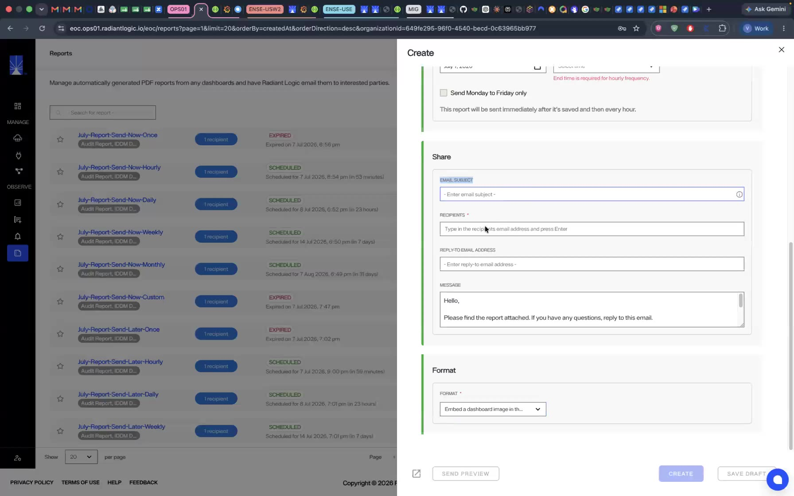
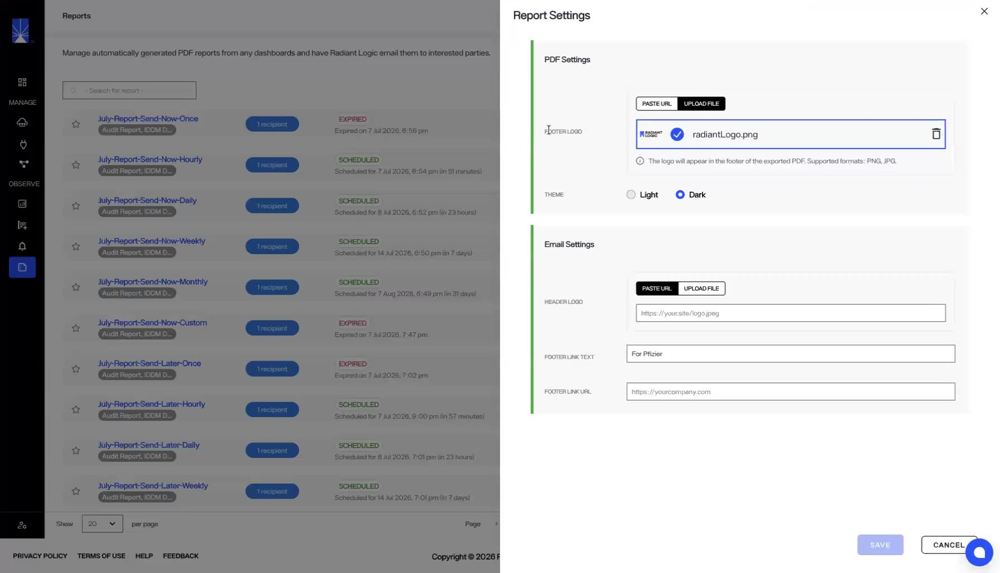

---
keywords:
title: Reporting Overview
description: Learn about the application reporting options available in the Environment Operations Center.
---

## Overview

Use **Reports** to create PDF or image reports from dashboards and have Radiant Logic email them to the people who need them. You choose the dashboards, environment, period, schedule, recipients, and format.

This guide explains how to create, preview, share, and manage reports.

## Creating a Report

To create a report, select **Reports** under **Observe** in the left navigation, then follow these steps:

1. Select **New Report**. The *Create* panel opens. Enter a name of up to 70 characters in the **Report Name** field.

2. Under **Dashboards**, select a **Dashboard**, a **Time Range**, and an **Environment**. Each dashboard in the list shows the application it belongs to, for example *IDDM Dashboard - (Identity Data Management)*. Time ranges run from *Last 5 Mins* to *Last 1 Year*. The **Environment** dropdown lists the environments where the selected dashboard is available, so select the dashboard first. To include more dashboards in the report, select **Add Dashboard**. For the dashboards available, see [types of reports](report-types.md).

 

3. Under **Schedule**, select **Send Now** to send the report immediately, or **Send Later** to schedule it. For a scheduled report, set the following:
   - **Frequency**: **Once**, **Hourly**, **Daily**, **Weekly**, **Monthly**, or **Custom**.
   - **Time Zone**: the time zone for the schedule. The default is UTC.
   - **Start Date** and **Start Time**: when the first report is sent. The start date defaults to today.
   - **End Date** (optional): when the report stops sending.
   - **Send Monday to Friday only**: select this check box to limit delivery to weekdays.

 

4. Under **Share**, enter the email details:
   - **Email Subject**: the subject line of the report email.
   - **Recipients**: type an email address and press Enter. Repeat to add more recipients.
   - **Reply-To Email Address** (optional): where replies go. If you leave it blank, replies go to the Radiant Logic SaaS address.
   - **Message**: the email body. Edit the default message as needed.

 

5. Under **Format**, choose how the report looks:
   - **Format**: **Attach the report as a PDF** or **Embed a dashboard image in the email**.
   - **Orientation**: **Landscape** or **Portrait**.
   - **Zoom**: from **50%** to **200%**. The default is 100%.

6. To check the report, select the **Open Preview** icon in the lower-left corner to open it in a new tab, or select **Send Preview** to email yourself a test copy.

7. Select **Create** to create the report, or **Save Draft** to finish it later. To close the panel without saving, select the close (**X**) icon.

## Managing existing reports

The **Reports** page lists your reports with their status and owner, sorted by creation date. Use it to edit, pause, and delete reports.

- **Update a report.** Open a report, change its settings, and select **Update** to save your changes. (**Update** replaces **Create** for reports that already exist.)
- **Pause a report.** Pause a scheduled report to stop it from sending, then resume it later when you need it again.
- **Delete a report.** Remove a report you no longer need.
- **Filter the list.** Use the filters to narrow the list by status or owner, or select **Favorites Only** to show only your favorite reports.

A report's status reflects where it is in its lifecycle:

- **Scheduled** — the report is active and sends on its configured frequency.
- **Expired** — the report has reached its end date and no longer sends.

Reports draw on stored data, so you can report on any time range up to a year. Select the period you need, even for environments that are days or months old.

## Brand your reports

By default, reports show the Radiant Logic logo in the email body and at the bottom of the PDF. To use your own branding, open the report settings and paste an image URL or upload an image.

- **PDF settings** control the images shown in the PDF.
- **Email settings** control the images shown in the email body.

