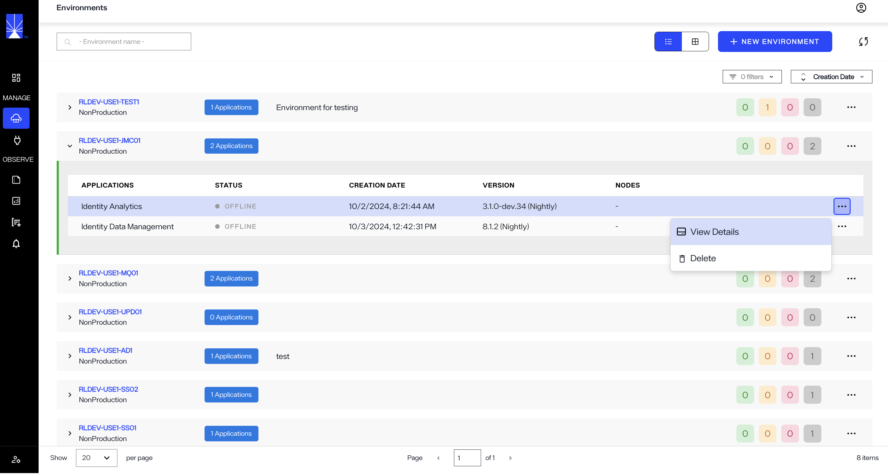
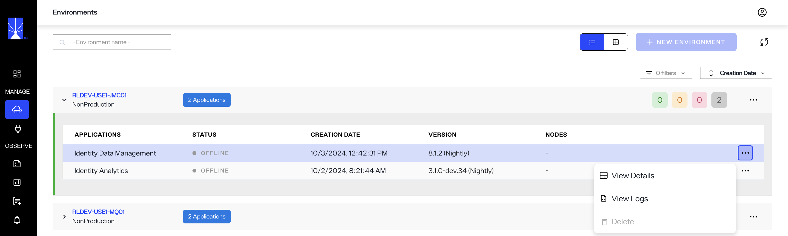
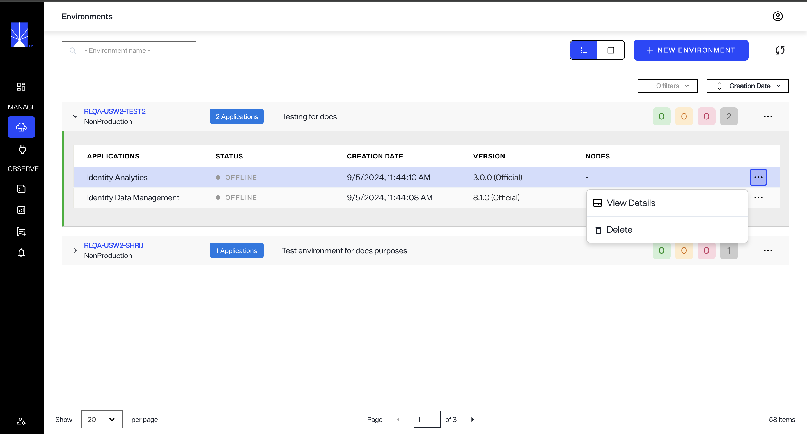
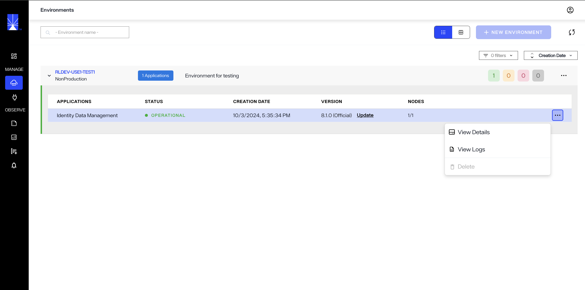

# Role-based permissions

The operations a user can perform and what they can view in Environment Operations Center differ based on their assigned role. Environment Operations Center has three levels of user roles: Tenant Administrator, Environment Administrator, and Environment User. This guide outlines the permissions for each user role.

The following table provides an overview of user permissions for each role:

|   | [Tenant Administrator](#tenant-administrator) | [Read-Only](#read-only) | [Environment Administrator](#environment-administrator) | [Environment User](#environment-user) | [Environment Creator](#environment-creator) |
| -- | ------------------- | ------------------------- | ---------------- | ---------------- | ---------------- |
| Environment Details | View and edit all environment details | View all environment details | View and edit assigned environments | View assigned environments | View and edit assigned environments, and create new ones. |
| User Details | View and edit all user details | View all user details | View and edit their own details only | View and edit their own details only | View and edit their own details only |

## Tenant administrator

A Tenant Administrator is granted permission to access all possible operations and views for all of the organization's environments. A Tenant Administrator can view and edit all environments and users, and can edit their own user details.

From the Environment Operations Center home page, the Tenant Administrator can view and access operations for all of the organization's environments.

## Read-Only

A Read-Only user is granted permission to access all possible views for all of the organization's environments. A user with this role can view all environments and users, but can not edit any of those details.

From the Environment Operations Center home page, the Read-Only user can view all of the organization's environments.

## Environment administrator

An Environment Administrator has access only to the environments they have been assigned to. Within those environments, an Environment Administrator can add applications and has read, write, and delete permissions.

An Environment Administrator cannot:

- Create new environments.
- Create Secure Data Connector groups or connectors.
- Use promotion pipelines or reporting, because both are tied to environments.

From the Environment Operations Center home page, the Environment Administrator can view and access operations only for the environments they have been assigned to.

## Environment creator

An Environment creator is granted permission to access all operations and views for the environments they have been assigned to. In addition to managing existing environments, they can also create and manage new environments. They cannot view or edit environments that have not been assigned to them. 

## Environment user

An Environment User has read-only access to the environments they have been assigned to and cannot create, delete, or perform other actions on them. Certain administrative functions are hidden, such as editing other users or updating environment authentication.

From the Environment Operations Center home page, the Environment User can view all of the environments they have been assigned to. An Environment User cannot perform operations on the environment and the  **Delete** button is disabled in the **Options** (**...**) drop down menu.

> **Coming soon:** A custom roles feature is planned. The restrictions above may change once it is available.

## Next steps

After reading this guide you should have an understanding of the different role assignments in Environment Operations Center and their permissions within the application. For details on user management, see the guides to [create a user](../admin/user-management/create-user.md) or [edit a user](../admin/user-management/edit-user.md).
