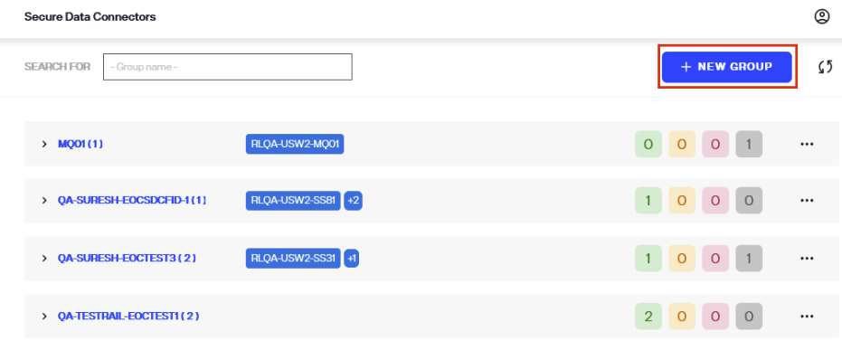
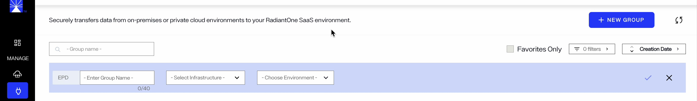
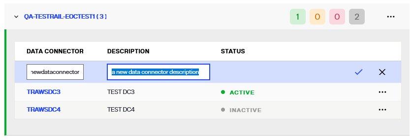
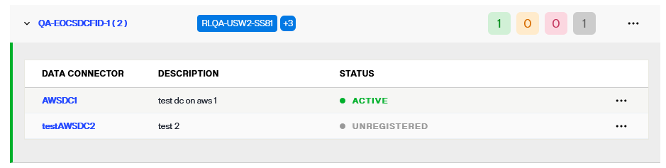
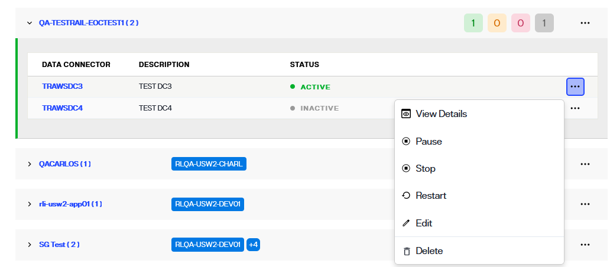
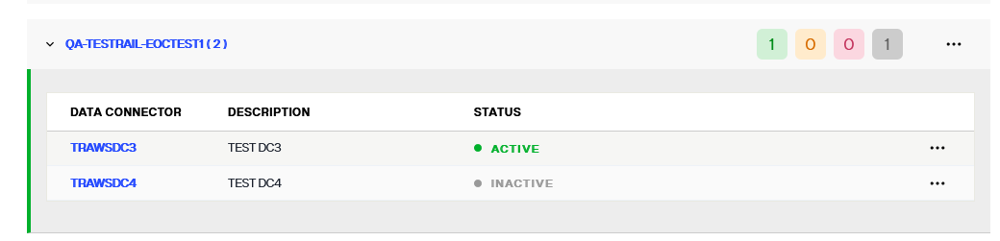
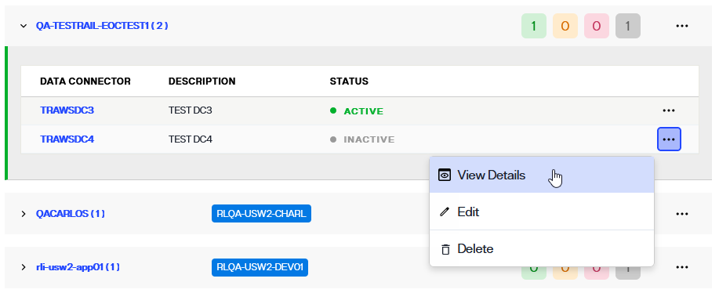
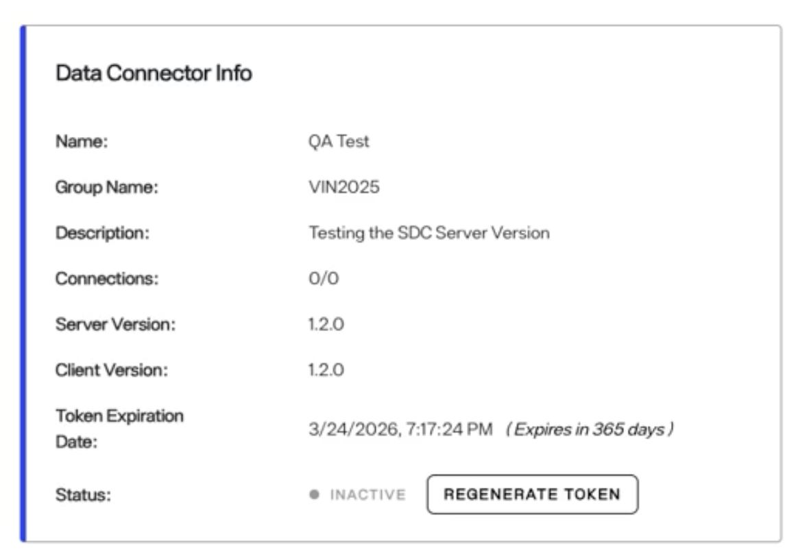
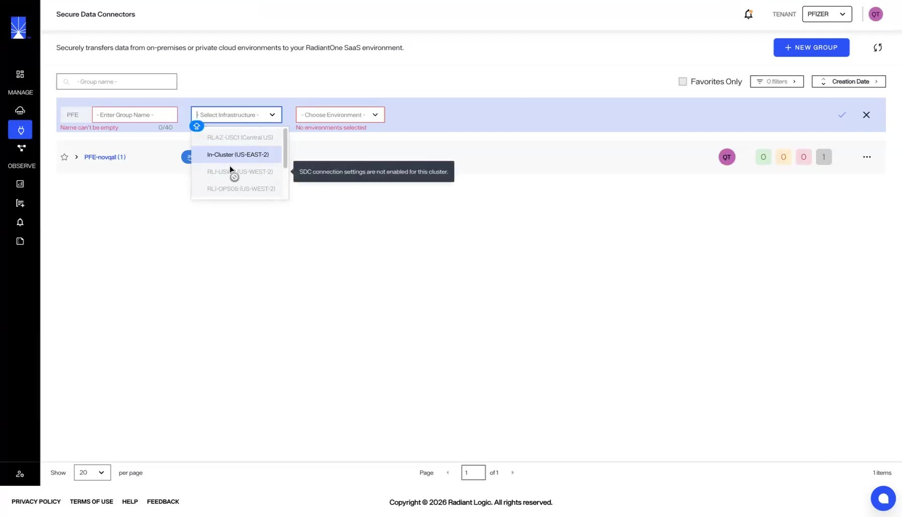

# Overview

Secure data connectors(SDCs) allow data to flow from your on premises or private cloud environments to your RadiantOne SaaS environment. This guide explains the concepts related to SDC, SDC home screen in the Environment Operations Center (EOC), its features, and how to manage these connectors. 

To navigate to the *Secure Data Connectors* home screen, select **Secure Data Connectors** () from the left navigation bar.

## Concepts

This section describes secure data connectors and groups.

### Secure Data Connector

A secure data connector (SDC) provides a secure channel for all TCP-based communication (LDAP, SQL, etc.) between your cloud-based RadiantOne environments and your on-premise or private cloud data sources. One or more secure data connectors can be deployed in your on-premises network.The SDC has been designed and architected with security as its first concern. Here are a few key points concerning security:

- All communications between the SDC and the RadiantOne cloud environments occur over a TLS-only secured WebSocket tunnel using HTTPS (port 443). Ensure that your network and firewall rules allow outbound HTTPS traffic on port 443 from the host where the SDC client is deployed. The data exchanged over this channel is encrypted and protected from unauthorized access. No inbound ports need to be opened on your network.
- The initial connection between the SDC and the RadiantOne cloud environments must be initiated from the SDC (on-premise client). The RadiantOne cloud environment cannot initiate this connection.
- The connection between the SDC and the RadiantOne cloud environment requires authentication based on a token generated from the EOC. Attempts at establishing unauthenticated connections from unrecognized SDCs or other clients are rejected. 

### Group

Secure data connectors are organized in **groups**. A group is a logical grouping of one or more secure data connectors that connect to the same set of data sources. By adding more than one secure data connector to a group, you can ensure high availability. Traffic is load-balanced equally to all data connectors that belong to the same group. If one or more secure data connectors within a group fail or become unresponsive, the remaining secure data connectors will automatically ensure connectivity is not interrupted. 

## Secure Data Connector Home Screen

The *Secure Data Connectors* home screen provides an overview of all your organization's configured data connectors and allows you to manage them. Use the search bar to find a group by name, select **Favorites Only** to show only your favorite groups, and use the **filters** and sort controls to narrow and order the list.

The list of data connectors is organized by group. Each group has a set of RadiantOne environments that are allowed to use the data connectors belonging to that group.
Each group row shows the group name with its number of data connectors, the infrastructure badge (for example *aws US-EAST-1 (local)*), the environments the group is associated with, the group's owner, and a count of its data connectors by status. Select the star next to a group to add it to your favorites, and select the refresh icon in the upper-right corner to reload the list.

Expand a group to list its data connectors. For each connector, the list shows its name, description, status, version, creation date, and last modified date. Select the arrow next to a group name to expand or collapse it.

### Adding a new data connector

The process to create a new secure data connector and establish a connection with a data source requires the following high-level steps.

- The data connector group must be created in Environment Operations Center.
- At least a data connector must be added to the group.
- The secure data connector client must be deployed on the local machine.
- The data source must be defined in the Identity Data Management Control Panel.

This guide outlines the steps to add a new secure data connector in Environment Operations Center. For details on deploying the secure data connector client, see the [configure a secure data connector client](configure-sdc-client.md) guide. For details on connecting to an on-premise backend from the control panel, see the [Managing Data Sources](../../../../idm/v8.1/configuration/data-sources/data-sources/) guide.

To establish a connection between Environment Operations Center and an on-premises network, a data connector must first be created in Environment Operations Center.

To add a new group, select **New Group** from the *Secure Data Connectors* home screen.

#### Add a group 

Before you can add new data connectors, you must first add a **group**. This can be done by clicking **New Group**.

In the new row, enter the group name, then select the infrastructure and one or more environments.

>[!note] Group name, infrastructure, and environment are required to create the group.

| Group Info | Description |
| ------------------- | ----------- |
| Group Name | Provide a group name that is relevant to how secure data connectors will be grouped under this group. Groups provide failover and load balancing for the network. The name is appended to your tenant's read-only prefix, shown to the left of the field, and can be up to 40 characters long. |
| Infrastructure | Select the infrastructure the group belongs to. The environments offered in the next field are filtered by this selection. See [Select an infrastructure](#select-an-infrastructure) below. |
| Environment | Select one or more environments from the dropdown. A group must be associated with at least one environment. |

Once you have entered these fields, select :white_check_mark: to add the new group.

Once the group is successfully created, it is displayed in the list of available groups on the *Secure Data Connectors* home screen.

#### Add data connector information

After you create the group, add a data connector to it. Select **Options** (**...**) at the end of the group row, then select **Add Data Connector**. A new row opens in the group's connector list.

Enter the data connector's name and description in the row.

>[!note] Name is required. The name is appended to your tenant's read-only prefix, shown to the left of the field, and can be up to 40 characters long.

| Data Connector Info | Description |
| ------------------- | ----------- |
| Name | Provide a name that is relevant to the network being connected to. |
| Description | The description field is optional but is recommended to provide any details that are relevant about the network. This helps with maintaining data connectors. |

Select :white_check_mark: to add the connector, or **X** to discard the row.

When Environment Operations Center creates the connector, the message "Successfully added the Data Connector" appears and the connector appears in the group's list.

The new data connector's status is "UNREGISTERED". The connector becomes "Active" after you deploy the secure data connector client and it connects to Environment Operations Center. For details on deploying the secure data connector client, see the [configure a secure data connector client](configure-sdc-client.md) guide.

### Manage data connectors

Each data connector has an **Options** (**...**) menu for managing the connector. For details, see the [manage data connectors](configure-sdc.md) guide.

## View data connector details

A detailed view is available for each data connector and provides additional data connector information, registration status, and connection statuses.

Data connector details can be accessed in two ways. One way is to select the data connector name from the list shown on the Secure Data Connectors screen.

Another way to access data connector details is to select **View Details** from the **Options** (**...**) menu of the corresponding data connector.

### Data connector info

The data connector's detailed view has two tabs: **View Details** and **Alerts**. The *Data Connector Info* section on the **View Details** tab shows the following information about the connector:

| Data Connector Information | Description |
| ------------------- | ----------- |
| Name | The unique name provided for the connector during setup. |
| Group Name | The group the connector was assigned to during set up. There are a minimum of two connectors per network environment to enable load balancing.|
| Description | Additional details about the data connector provided during setup. |
| Connections | The number of on-prem or cloud backend connections made to the data connector, shown as connected out of total, for example *0/0*. |
| Server Version | Indicates the current server version of the data connector. |
| Client Version | Indicates the current client version of the data connector. |
| Compatibility | Whether the client version is compatible with the server version. See [Version compatibility status](#version-compatibility-status). |
| Creation Date | When the data connector was created. |
| Last Modified Date | When the data connector was last changed. |
| Token Expiration Date | When the token associated with the data connector expires. |
| Status | Whether the data connector is "Active", "Paused", "Inactive", or "Unregistered". An unregistered connector also shows a **Register** button, which opens the registration token you use to deploy the client. |

### Connection details

All of the on-premise or cloud connections made to the data connector are listed on the data connector details tab. The information listed for each connection includes:

| Connection details | Description |
| ------------------ | ----------- |
| Environment Name | The name of the Environment Operations Center environment the connector is associated with. |
| Data Source Name | The given name of the on-premise or cloud data source connected to the data connector. |
| Tunnel Port | The high port where the connection is initiated. |
| Server Name/IP | The IP of the on-prem or cloud data source that has been connected. |
| Server Port | The port of the on-prem or cloud data source where the connection was made. |
| Last Known Status | Whether the connection was last "Connected" or "Disconnected". |

## Version compatibility status

Starting with **SDC Server version 1.4.0**, the **Compatibility** field in the *Data Connector Info* section shows whether the SDC client and server versions are compatible.

| Indicator | Meaning |
|-----------|---------|
| **Compatible** | The client version is confirmed compatible with the server version. |
| **Incompatible** | The client version is **not** compatible with the server version. [Update your SDC client](./manage-sdc-client/#update-the-secure-data-connector-client) to the latest available version.|
| **Not Available** | Environment Operations Center cannot determine compatibility yet, for example because the connector is not registered and has no client version. |

## Select an infrastructure

Each environment is tied to an infrastructure. When you create a Secure data connector group, select the infrastructure first, then select an environment. Only environments deployed in the selected infrastructure appear, which keeps connector configuration consistent within an infrastructure.

To create data groups and connectors, the infrastructure must have valid Secure data connector settings. These settings are configured when the infrastructure is created.

If the settings are missing or invalid for a cluster, you can still create environments, but you cannot create Secure data connector groups or connectors for that environment.

