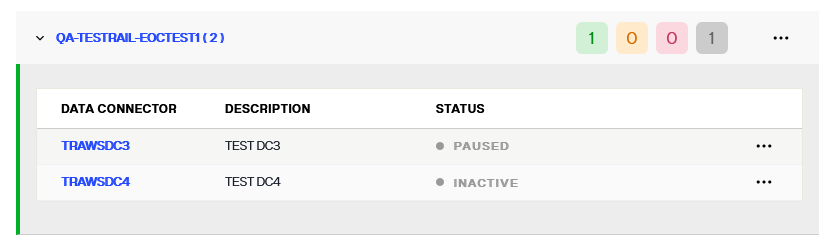

## Overview

This guide describes the following topics.

- [Managing Groups](#managing-groups)
- [Managing Secure Data Connectors](Managing-secure-data-connectors)

### Managing Groups

This section describes how to add, edit, and delete SDC groups.

#### Adding Groups

To add an SDC group:

1. In the navigation pane on the left, select **Secure Data Connectors**.

1. In the upper-right corner, click **New Group**.

1. Enter a group name.

1. From the drop-down menu, select an environment.

1. Click .

The new group is displayed. 

#### Editing Groups

1. In the navigation pane on the left, select **Secure Data Connectors**.

1. Click "..." next to the group you want to edit.

    .

1. Edit the group name and/or change the group's environment.

1. Click .

#### Deleting Groups

1. In the navigation pane on the left, select **Secure Data Connectors**.

1. Click "..." next to the group you want to edit.

  .

1. In the Delete Group dialog box, enter the name of the group and click Delete.

  .

### Managing Secure Data Connectors

Secure data connectors can be managed from the *Secure Data Connectors* screen. From here, you can edit, enable or disable, and delete connectors. This guide outlines the steps to manage data connectors.

## Getting started

All of the operations to manage secure data connectors are available in the **Options** (**...**) dropdown for each connector. To begin managing a connector, select the **Options** (**...**) menu of the specific connector you wish to modify.

## Edit a data connector

The name and description of a data connector can be updated. To edit connector details, select **Edit** from the associated **Options** (**...**) dropdown.

This enables the **Data Connector** row editable. In the provided name and description fields, update the connector details as needed. Select :white_check_mark: to update the connector details.

The connectors list will display updated  details for the updated *Secure Data Connector*.

## Enable or disable a connector

To disable a data connector, select **Pause** from the **Options** (**...**) dropdown.

The connector status will update to "Paused" and all associated connections will be disabled.

To reactivate a data connector, select **Start** from the **Options** (**...**) dropdown.

The connector status will update to "Active" and all associated connections will be enabled.

## Restart a data connector

To restart a data connector, select **Restart** from the **Options** (**...**) dropdown.

The connector will completely stop and get started. This action is similar to starting a data connector for the first time, which does pulling all latest configurations, stops, and starts all the required processes.

## Delete a data connector

To delete a data connector, select **Delete** from the **Options** (**...**) dropdown.

[!warning] Deleting a data connector is a permanent action and cannot be undone.

A confirmation dialog will appear asking you to confirm that you would like to delete the selected data connector. Select **Delete** to proceed and delete the connector.

If you would like to keep the connector, select **Cancel** to exit out of the workflow to delete the connector.

If the connector is successfully deleted, you will receive a confirmation message on the *Secure Data Connectors* home screen and the connector will no longer be available in the lits of connectors.
