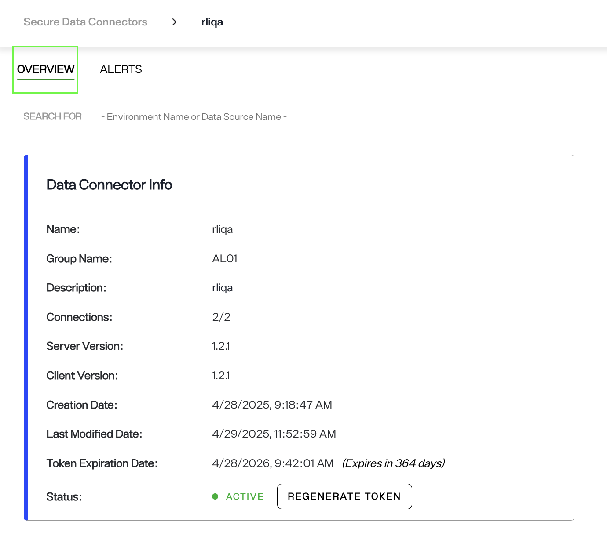
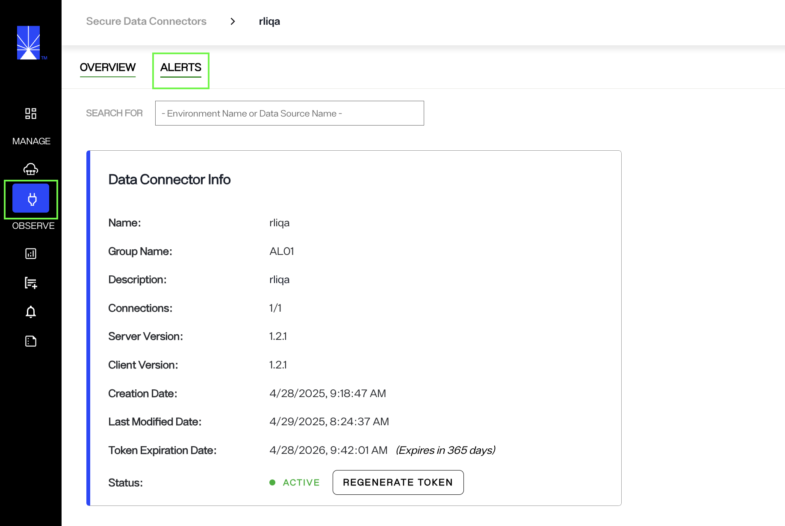
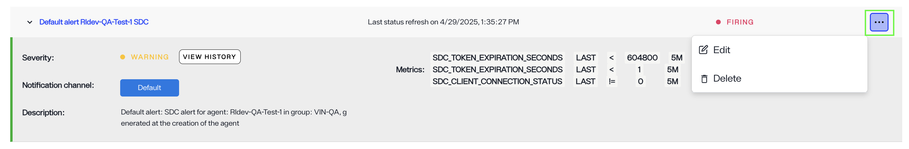
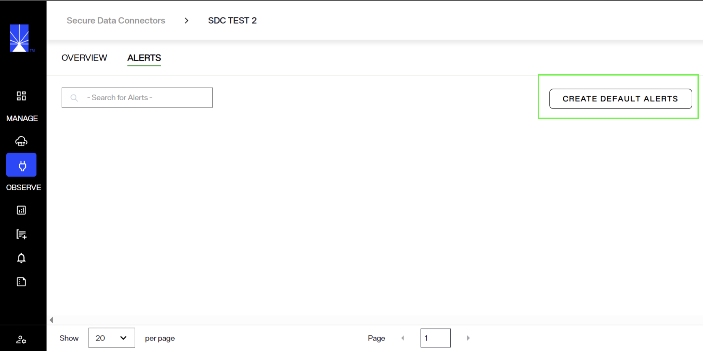
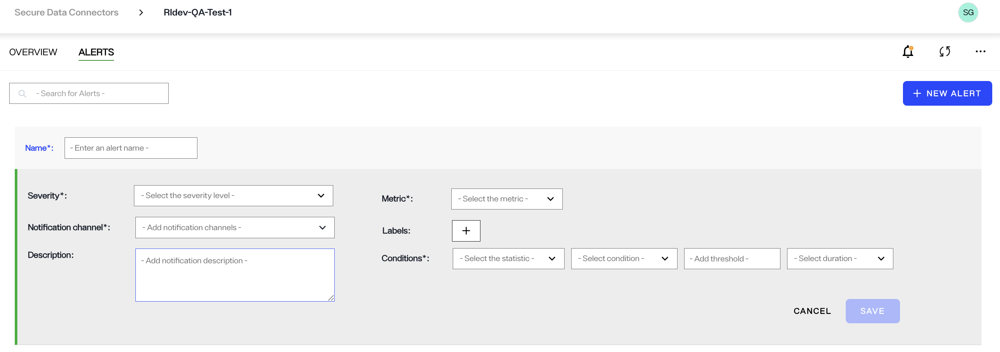

## Secure Data Connector Alerts

Radiant Logic automatically generates **token expiry alerts** when you create a new **Secure Data Connector**. These alerts are sent both **one week before** the token expires and **immediately after** expiration, ensuring you're promptly informed about your connector’s token status.

> **Note:** Alerts are only triggered if the connector’s status is **active**. Inactive or stopped connectors will **not** send any alerts.

You can check the token expiration date and connector status by navigating to **Secure Data Connectors > Overview**.

---

## Managing Default Alerts

To view the default alerts, go to **Secure Data Connectors > Alerts** in your Environment Operations Center.

You can edit or delete a default alert by clicking the "..." menu and selecting the corresponding option. Clicking **Edit** allows you to customize the conditions of the alert by modifying the metric values.

| Metric                         | Default Alert Values             | Description                                                                 |
|-------------------------------|----------------------------------|-----------------------------------------------------------------------------|
| `sdc_token_expiration_seconds` | Newest value is either `"604800 seconds"` or `"< 1 second"`. Duration is five minutes.  | Sends an alert if the token is set to expire within a week. You can modify this value to adjust the alert timing. The alert conditions are checked every five minutes by default.|
| `sdc_client_connection_status` | `1`                              | Alerts are triggered only when the Secure Data Connector is active.         |

If you're using a connector with **Server version 1.2.0 or earlier**, you may need to manually enable default alerts to receive token expiry notifications. 
 
To do so, navigate to the **Alerts** screen of the Secure Data Connector and click the **Create default alerts** button. 

This will automatically set up the default alert for you.

## Creating New Alerts

You can also create a new alert by choosing a predefined template for common alert types such as SDC status, SDC expiration, etc. Selecting a template will automatically populate the relevant fields, which you can still edit if needed. Alternatively, select 'custom' to create an alert with metrics and conditions of your choice.

To create a new alert, click the **New Alert** button and populate all required fields.

Fill in the required fields. The **Label** field is optional and can be used to add an additional filter to the selected metric. Save the changes to activate your alert. 

